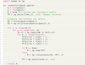

# Inline Code

```latex
\lstinline``
```

# Code Snippet

```latex
\begin{lstlisting}[language=Python, caption=Python example]
import numpy as np
    
def incmatrix(genl1,genl2):
    m = len(genl1)
    n = len(genl2)
    M = None #to become the incidence matrix
    VT = np.zeros((n*m,1), int)  #dummy variable
    
    #compute the bitwise xor matrix
    M1 = bitxormatrix(genl1)
    M2 = np.triu(bitxormatrix(genl2),1) 

    for i in range(m-1):
        for j in range(i+1, m):
            [r,c] = np.where(M2 == M1[i,j])
            for k in range(len(r)):
                VT[(i)*n + r[k]] = 1;
                VT[(i)*n + c[k]] = 1;
                VT[(j)*n + r[k]] = 1;
                VT[(j)*n + c[k]] = 1;
                
                if M is None:
                    M = np.copy(VT)
                else:
                    M = np.concatenate((M, VT), 1)
                
                VT = np.zeros((n*m,1), int)
    
    return M
\end{lstlisting}
```




```latex
    \code{my_code}{python}{
    # Mauris viverra massa id lorem pretium gravida.

    if num == 1:
      print(num, "is not a prime.")
    elif num > 1:
      for i in range(2, num):
        if (num % i) == 0:
          print(num, "is a prime.")
          break
    }
    {This is some code.}
```


# Algorithmus

```latex
    \algo{my_alg}{
    let $x \in \Z$
    if $x = 1$
      do stuff
    else
      do another thing
    }
    {This is an algorithm described in pseudo-code.}
```


