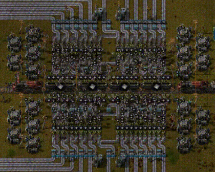

Logistic bots complement trains and belts in transporting supplies and products. There is no best practice on when to use them and when not to. However, some use cases are more suitable than others, which I will outline here. The further you read, the less suitable construction robots become.

Should bots supply the player **character**?

- [x] Allow you to build continuously as robots replenish your used building items

Should bots **unload trains** into buffer chests?

- [ ] Makes designing train stations less interesting
- [x] Allows higher throughput than direct insertion into buffer boxes

Should bots supply **wall defence** and **turret ammo**?

- [x] Walls and turrets need a logistic network anyway to be repaired by construction robots

Should bots supply the **player mall**?

- [x] Large variety items is needed and produced, but only in small quantities

Should bots **supply the factory** in general?

- [ ] Eliminates the need to transport, design and route inputs and outputs from the game
- [x] Teleports items anywhere you want
- [x] Inserters and bots theoretically fulfil all logistics requirements you will ever have
- [x] Increases space efficiency as only building provider and requester chests, not belts

Should bots supply **smelting** or **bulk item production**?

- [ ] Belts are way more cost and power efficient

# Summary

Too often I found myself just quickly flying those supposedly rarely used resources in and out, with the demand quickly spiraling out of control and frustratingly having to fix in an ugly way. It's difficult for me to set clear rules for appropriate use cases and dead ends for the future. I only use them to supply the player. To enforce this, I mod requester, buffer and active provider chests as unplaceable using [Remove requester buffer activer provider chests](Remove%20requester%20buffer%20activer%20provider%20chests.md). Storage and passive provider chests can still easily limit global resource reserves and supply the player.

---
Sources:
- 2023-03-03: [Logistic network - Factorio Wiki](https://wiki.factorio.com/Logistic_network)
- 2023-03-03: [Am I missing out by not liking/using logistic robots? :: Factorio Obecné diskuze](https://steamcommunity.com/app/427520/discussions/0/1696043806563019837/?l=czech)
- 2023-03-03: [Friday Facts #224 - Bots versus belts | Factorio](https://www.factorio.com/blog/post/fff-224)
- 2023-03-03: [Friday Facts #225 - Bots versus belts (part 2) | Factorio](https://www.factorio.com/blog/post/fff-225)
- 2023-03-03: [Remove requester, buffer, activer provider chests - Factorio Mods](https://mods.factorio.com/mod/remove-requester-chest)

Related:

Tags:

