| Formel                                        | Title                                                                                                                                                                         |
| --------------------------------------------- | ----------------------------------------------------------------------------------------------------------------------------------------------------------------------------- |
|  | [Abgeleitetes Attribut](Abgeleitetes%20Attribut.md)                                                                                                                           |
|  | [Mengenwertiges Attribut, Multivalued Attribute](Mengenwertiges%20Attribut,%20Multivalued%20Attribute.md)                                                                         |
|  | [Schwaches Entity](Schwaches%20Entity.md)                                                                                                                                     |
|  | [Zusammengesetztes Attribut](./zusammengesetztes%20attribut.md)                                                                                                                 |
|  | [n-äre Relationship](n-%C3%A4re%20Relationship.md)                                                                                                                                 |
|  | [Aggregation - Abstrahiere mit Objektklassen mit dem ERR-Modell](./aggregation.md)                                         |
|  | [Generalisiere und Spezialisiere Objektklassen im ERR-Modell](./generalisiere%20und%20spezialisiere%20objektklassen%20im%20err-modell.md)                                               |
|                                               | [Konzeptionelles Datenmodell - Modelliere Datenbanken konzeptionell und schematisch](Konzeptionelles%20Datenmodell%20-%20Modelliere%20Datenbanken%20konzeptionell%20und%20schematisch.md) |
|                                               | [Aggregiere Objektklassen mit dem ERR-Modell](Aggregiere%20Objektklassen%20mit%20dem%20ERR-Modell.md)                                                                               |

# Begriffserklärungen

Glossar
- 
Entity
- ein einzelnes "Ding" aus der realen oder Vorstellungswelt
Entity-Typ
- Klasse von real existierenden Dingen / Menge gleichartiger Objekte

Relationship
- einzelne Beziehung zwischen Entities
Relationship-Typ
- Menge gleichartiger Beziehung

Attribut
- Eigenschaften von Entitys und Relationships

Integritätsbedingung
- dazu gehören Kardinalität, Totalität, Nebenbedingungen
- Kardinalität (1:1, 1:n, n:m)
- Nebenbedingungen ( z.B. Schlüssel, Referentielle Integrität)

Entity Relationship Modell (ER-Modell)

Erweitertes Entity Relationship Modell (ERR-Modell)
- erweitert um Aggregation und Generalisierung/Spezialisierung

---
Sources:

Related:
- [Modelliere Datenbanken konzeptionell und schematisch](Konzeptionelles%2520Datenmodell%2520-%2520Modelliere%2520Datenbanken%2520konzeptionell%2520und%2520schematisch.md#)

Tags:
[ISDA Klausur](ISDA%20Klausur.md)