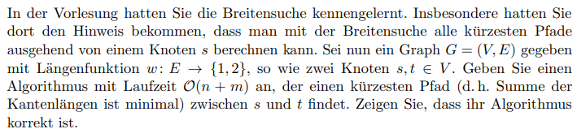
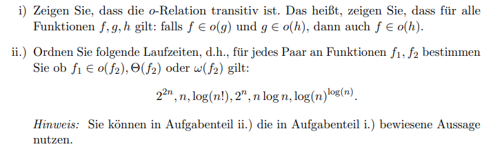

!Gruppenmitglieder AlgTheo
# Aufgabe 1



Graph $​G =( V,E )​$
Kantenlängen sind immer 1 oder 2

## Algorithmus

Der Dijkstra Algorithmus mit Komplexität $O(V +V)$ findet den kürzesten Pfad zwischen $s$ und $t$:

> ```
> M <- {s}
> while M != ⌀
>     v <- element of M with minimum dist
>     delete v from M
>     for each w with v->w in E
>         relax(v->w)
>     end
> end
> ---
> procedure relax(v->w)
> if dist[w] > dist[v] + weight(v->w)
>     parent[w] = v
>     dist[w] = dist[v] + weight(v->w)
>     add w to M
> end
> ```
- Quelle: Buch Algorithmen und Datenstrukturen von Benjamin Blankertz und Vera Röhr Seite 202

Um den Pfad auszulesen, läuft man den `parent` array vom Zielknoten $t$ aus stufenweife zurück, bis man den Startknoten $s$ erreicht:

```
t <- parent[t] <- parent[parent[t]] <- ... <- s
```

##  Korrektheit des Algorithmus

Der Dijkstra Algorithmus arbeitet mit dem Optimalitätsprinzip und der Greddy Strategie. Das Optimalitätsprinzip besagt, dass wenn der kürzeste Pfad von A nach C über B führt, dann ist auch der Teilpfad von A nach B der kürzeste Pfad. Der Dijkstra Algorithmus aktualisiert die besuchten Knoten immer auf den kürzesten Pfad, mittels des `parent` arrays. Mit der Greedy-Strategie, die besagt, dass immer der Knoten mit der geringsten Entfernung zum Startknoten ausgewählt wird, stellt sicher, dass zu jedem Zeitpunkt der kürzeste Pfad zu einem Knoten bestimmt wird. Die Aufgabenstellung beschränkt die Kantengewichte auf 1 oder 2. Damit ist sichergestellt, dass ein Teilpfad die Distanz nur verlängern, nicht verkürzen kann, um somit immer der kürzeste Pfad gefunden wird.

# Aufgabe 2



Zu zeigen:
$$
f \in o(g) \land g \in o(h) \implies f \in o(h)
$$
Laut Definition der o-Notation gilt:
Für hinreichend große n gilt $​f(n) < c_{1} \cdot g(n)​$ und $​g(n) < c_{2} \cdot h(n)​$, formell:
$$
\begin{gather*}
\forall\, c_{1}  > 0 : \exists\, n_{1} \ge 0 : \forall\, n \ge n_{1} : f(n) < c_{1} \cdot g(n) \tag{1} \\
\forall\, c_{2}  > 0 : \exists\, n_{2} \ge 0 : \forall\, n \ge n_{2} : g(n) < c_{2} \cdot h(n) \tag{2} \\
\end{gather*}
$$

Wir betrachten für hinreichend große $n_{0} = \max {(n_{1},n_{2})}$, sodass beide Ungleichungen kombiniert werden können. Wir wählen eine neue Konstante $​c_{3} = c_{1} \cdot c_{2} > 0​$.
$$
f(n) < c_{1} \cdot g(n) \overset{ \text{Laut (2)} }{<} c_{1} \cdot c_{2} \cdot h(n) \overset{ \text{neue Konstante} }{=} c_{3} \cdot h(n) 
$$
Daraus folgt:
$$
\forall\, c_{3}  > 0 : \exists\, n_{0} > 0 : \forall\, n \ge n_{0}   : g(n) < c_{3} \cdot h(n) \implies f \in o(h)
$$

## Aufgabe 2.ii)

| $f_{1}$             | $f_{2}$             | $f_1\in o(f_2)$ | $f_1\in\Theta(f_2)$ | $f_1\in\omega(f_2)$ |
| ------------------- | ------------------- | --------------- | ------------------- | ------------------- |
| $2^{2n}$            | $2^{2n}$            | falsch          | wahr                | falsch              |
| $2^{2n}$            | $2^{n}$             | falsch          | falsch              | wahr                |
| $2^{2n}$            | $\log(n)^{\log(n)}$ | falsch          | falsch              | wahr                |
| $2^{2n}$            | $n \log(n)$         | falsch          | falsch              | wahr                |
| $2^{2n}$            | $\log(n!)$          | falsch          | falsch              | wahr                |
| $2^{2n}$            | $n$                 | falsch          | falsch              | wahr                |
| $2^{n}$             | $2^{2n}$            | wahr            | falsch              | falsch              |
| $2^{n}$             | $2^{n}$             | falsch          | wahr                | falsch              |
| $2^{n}$             | $\log(n)^{\log(n)}$ | falsch          | falsch              | wahr                |
| $2^{n}$             | $n \log(n)$         | falsch          | falsch              | wahr                |
| $2^{n}$             | $\log(n!)$          | falsch          | falsch              | wahr                |
| $2^{n}$             | $n$                 | falsch          | falsch              | wahr                |
| $\log(n)^{\log(n)}$ | $2^{2n}$            | wahr            | falsch              | falsch              |
| $\log(n)^{\log(n)}$ | $2^{n}$             | wahr            | falsch              | falsch              |
| $\log(n)^{\log(n)}$ | $\log(n)^{\log(n)}$ | falsch          | wahr                | falsch              |
| $\log(n)^{\log(n)}$ | $n \log(n)$         | falsch          | falsch              | wahr                |
| $\log(n)^{\log(n)}$ | $\log(n!)$          | falsch          | falsch              | wahr                |
| $\log(n)^{\log(n)}$ | $n$                 | falsch          | falsch              | wahr                |
| $n \log(n)$         | $2^{2n}$            | wahr            | falsch              | falsch              |
| $n \log(n)$         | $2^{n}$             | wahr            | falsch              | falsch              |
| $n \log(n)$         | $\log(n)^{\log(n)}$ | wahr            | falsch              | falsch              |
| $n \log(n)$         | $n \log(n)$         | falsch          | wahr                | falsch              |
| $n \log(n)$         | $\log(n!)$          | falsch          | falsch              | wahr                |
| $n \log(n)$         | $n$                 | falsch          | falsch              | wahr                |
| $\log(n!)$          | $2^{2n}$            | wahr            | falsch              | falsch              |
| $\log(n!)$          | $2^{n}$             | wahr            | falsch              | falsch              |
| $\log(n!)$          | $\log(n)^{\log(n)}$ | wahr            | falsch              | falsch              |
| $\log(n!)$          | $n \log(n)$         | wahr            | falsch              | falsch              |
| $\log(n!)$          | $\log(n!)$          | falsch          | wahr                | falsch              |
| $\log(n!)$          | $n$                 | falsch          | falsch              | wahr                |
| $n$                 | $2^{2n}$            | wahr            | falsch              | falsch              |
| $n$                 | $2^{n}$             | wahr            | falsch              | falsch              |
| $n$                 | $\log(n)^{\log(n)}$ | wahr            | falsch              | falsch              |
| $n$                 | $n \log(n)$         | wahr            | falsch              | falsch              |
| $n$                 | $\log(n!)$          | wahr            | falsch              | falsch              |
| $n$                 | $n$                 | falsch          | wahr                | falsch              |


| $​f_{1}​$              | $​f_{2}​$              | $​f_{1} \in o(f_{2})​$ | $​f_{1} \in \Theta(f_{2})​$ | $f_{1} \in ​\omega(f_{2})​$ |
| ---------------------- | ---------------------- | ---------------------- | --------------------------- | --------------------------- |
| $​2^{2n}​$             | $​2^{n}​$              | falsch                 | falsch                      | wahr                        |
| $​2^{2n}​$             | $​\log(n)^{\log (n)}​$ | falsch                 | falsch                      | wahr                        |
| $​2^{2n}​$             | $​n \log (n)​$         | falsch                 | falsch                      | wahr                        |
| $​2^{2n}​$             | $​\log (n!)​$          | falsch                 | falsch                      | wahr                        |
| $​2^{2n}​$             | $​n​$                  | falsch                 | falsch                      | wahr                        |
| $​2^{n}​$              | $​2^{2n}​$             | wahr                   | falsch                      | falsch                      |
| $​2^{n}​$              | $​\log(n)^{\log (n)}​$ | falsch                 | falsch                      | wahr                        |
| $​2^{n}​$              | $​n \log (n)​$         | falsch                 | falsch                      | wahr                        |
| $​2^{n}​$              | $​\log (n!)​$          | falsch                 | falsch                      | wahr                        |
| $​2^{n}​$              | $​n​$                  | falsch                 | falsch                      | wahr                        |
| $​\log(n)^{\log (n)}​$ | $​2^{2n}​$             | wahr                   | falsch                      | falsch                      |
| $​\log(n)^{\log (n)}​$ | $​2^{n}​$              | wahr                   | falsch                      | falsch                      |
| $​\log(n)^{\log (n)}​$ | $​n \log (n)​$         | falsch                 | falsch                      | wahr                        |
| $​\log(n)^{\log (n)}​$ | $​\log (n!)​$          | falsch                 | falsch                      | wahr                        |
| $​\log(n)^{\log (n)}​$ | $​n​$                  | falsch                 | falsch                      | wahr                        |
| $​n \log (n)​$         | $​2^{2n}​$             | wahr                   | falsch                      | falsch                      |
| $​n \log (n)​$         | $​2^{n}​$              | wahr                   | falsch                      | falsch                      |
| $​n \log (n)​$         | $​\log(n)^{\log (n)}​$ | wahr                   | falsch                      | falsch                      |
| $​n \log (n)​$         | $​\log (n!)​$          | falsch                 | falsch                      | wahr                        |
| $​n \log (n)​$         | $​n​$                  | falsch                 | falsch                      | wahr                        |
| $​\log (n!)​$          | $​2^{2n}​$             | wahr                   | falsch                      | falsch                      |
| $​\log (n!)​$          | $​2^{n}​$              | wahr                   | falsch                      | falsch                      |
| $​\log (n!)​$          | $​\log(n)^{\log (n)}​$ | wahr                   | falsch                      | falsch                      |
| $​\log (n!)​$          | $​n \log (n)​$         | wahr                   | falsch                      | falsch                      |
| $​\log (n!)​$          | $​n​$                  | falsch                 | falsch                      | wahr                        |

---
Sources:

Related:
```dynamic-embed
[[List related notes]]
```
Tags:
Algorithmentheorie