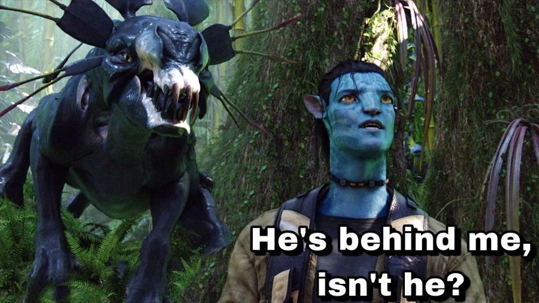

[Avatar: The Way of Water](https://www.imdb.com/title/tt1630029) is a 2022 movie about Action, Adventure, Fantasy. It is  from the United States directed by [James Cameron](https://en.wikipedia.org/wiki/James_Cameron) written by [James Cameron](https://en.wikipedia.org/wiki/James_Cameron), [Rick Jaffa](https://en.wikipedia.org/wiki/Rick_Jaffa), [Amanda Silver](https://en.wikipedia.org/wiki/Amanda_Silver) starring [Sam Worthington](https://en.wikipedia.org/wiki/Sam_Worthington), [Zoe Saldaña](https://en.wikipedia.org/wiki/Zoe_Saldaña), [Sigourney Weaver](https://en.wikipedia.org/wiki/Sigourney_Weaver).

> Jake Sully lives with his newfound family formed on the extrasolar moon Pandora. Once a familiar threat returns to finish what was previously started, Jake must work with Neytiri and the army of the Na'vi race to protect their home. 

    It runs for 3 hours, 12 minutes in English. On IMDb, 529,170 people gave it an average rating of 7.5 out of 10 stars.

# Thoughts

## Visuelles

- unbestreitbar die beste **Grafik**, die je ein Film hatte
- Personen sind unglaublich **realistisch**
    - Lichtberechnungen sehr schöne und werten die Szenen stark auf
    - Haut ist sehr detailliert, mit ebeindruckendem sub-surface-rendering
    - Tsireya ist extrem gut animiert
- CGI
    - CGI ergänzt das Erlebnis und fokusiert nicht auf sich selbst
    - wirkt nicht künstlich wie in Marvel Filmen
    - keine ablenkenden Effekte wie in Superhelden Filmen
- Perpesktiven
    - Unterwasseraufnahmen sind atemberaubend
    - Lumineszenz unter Wasser ist wunderschön
    - Perspektivwahl ist großartig
    - Schwimmen von knapp unter der Wasseroberfläche
    - *Tulkune* ähneln Walen

## Filmabschnitte

- sehr **facettenreich**
    - Familienfilm
    - BBC Earth Doku
    - Kampf ohne ablenkenden Humor wie
    - Titanik

## Handlung

- wenig Handlung, vergleichbar mit [Titanic](./Titanic.md)

Sources:
- 2023-01-14: [If Marvel had made Avatar : Avatar](https://www.reddit.com/r/Avatar/comments/101n4e5/if_marvel_had_made_avatar/)
- 2023-01-14: [The creatures of Avatar & Avatar: The Way of Water | Space](https://www.space.com/creatures-of-avatar-movies)
