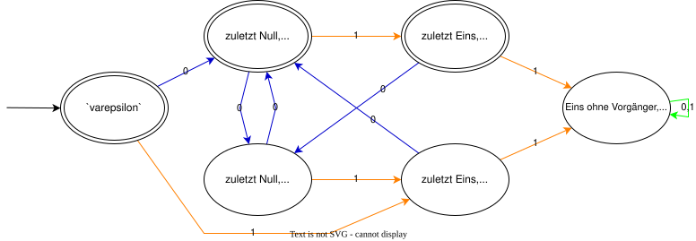

# Abgabe

$$
\begin{align*}
[ \varepsilon  ]_{ \equiv A} & = \{ \varepsilon \} \\
[ 0 ]_{ \equiv_{A} } & = \{ x0 \mid x \in \Sigma^{*} \land \left| x \right|_{0} \bmod 2 = 1  \} \\
[ 01 ]_{ \equiv_{A} } & = \{ x1 \mid x \in \Sigma^{*} \land \left| x \right|_{0} \bmod 2 = 1  \} \\
[ 00 ]_{ \equiv_{A} } & = \{ x0 \mid x \in \Sigma^{*} \land \left| x \right|_{0} \bmod 2 = 0   \} \\
[ 1 ]_{ \equiv_{A} } & = \{ x1 \mid x \in \Sigma^{*} \land \left| x \right|_{0} \bmod 2 = 0  \} \\
[ 11 ]_{ \equiv_{A} } & = \{ x11y \mid x,y \in \Sigma^{*} \} 
\end{align*}
$$
$M_{A} = \{ [ \varepsilon  ], [ 0 ], [ 01 ], [ 00 ], [1], [11] \}, \Sigma, \delta_{A}, [ \varepsilon ], \{ [ \varepsilon ], [0], [01] \}$, wobei $\delta_{A}$ durch den folgenden Graphen gegeben ist:

```tex
\begin{figure}[hp]
    \centering
\tikzstyle{alter}=[circle, minimum size=16pt, draw, inner sep=1pt] 
\tikzstyle{majarr}=[draw=black]
\begin{tikzpicture}[auto, >=stealth']
    \tikzstyle{majarr}=[draw=black,->,shorten <=1.5pt, shorten >=1.5pt]
    \node[alter, initial, accepting, initial text=] at (0,0) (e) {$[\varepsilon]$};
    \node[alter, accepting] at (2,0) (0) {$[0]$};
    \node[alter] at (0,-2) (1) {$[1]$};
    \node[alter, accepting] at (4,0) (01) {$[01]$};
    \node[alter] at (2,-2) (00) {$[00]$};
    \node[alter] at (4,-2) (11) {$[11]$};

    \draw[majarr] (e) edge node[midway, anchor=south] {$\scriptstyle 0$} (0);
    \draw[majarr] (e) edge node[midway, anchor=east] {$\scriptstyle 1$} (1);
    \draw[majarr] (0) edge[bend left=10] node[midway, anchor=west] {$\scriptstyle 0$} (00);
    \draw[majarr] (0) edge node[midway, anchor=south] {$\scriptstyle 1$} (01);
    \draw[majarr] (01) edge node[midway, anchor=west] {$\scriptstyle 0$} (00);
    \draw[majarr] (01) edge node[midway, anchor=west] {$\scriptstyle 1$} (11);
    \draw[majarr] (00) edge[bend left=10] node[midway, anchor=east] {$\scriptstyle 0$} (0);
    \draw[majarr] (00) edge node[midway, anchor=south] {$\scriptstyle 1$} (1);
    \draw[majarr] (1) edge node[midway, anchor=east] {$\scriptstyle 0$} (0);
    \draw[majarr] (1) edge[bend right=43] node[midway, anchor=south] {$\scriptstyle 1$} (11);
    \draw[majarr] (11) edge[loop right] node {$\scriptstyle 0,1$} (11);
\end{tikzpicture}
\end{figure}
```

# Aufgabenstellung

Sei $​\mathbb{N}_{ \ge 2} = \{ n \in \mathbb{N} \mid n \ge 2 \} ​$.
Gegeben seien das Alphabet $​\Sigma = \{ 0, 1 \}​$ und die Sprache 
$$
\begin{multline*}
A = \Big\{ w \in \Sigma^{*} \mid \Big( \big( \forall\, n \in \mathbb{N}_{ \ge 2}  \,.\, \big( n \le \left| w \right| \land (w)_{n} = 1 \big) \to (w)_{n - 1} = 0 \big) \\ 
\land \left| w \right|_{0} \bmod 2 = 1 \Big) \lor \left| w \right| = 0 \Big\}
\end{multline*}
$$

# Eigenschaften der Sprache in natürlichem Deutsch

Ein Wort $w$ gehört zu $A$, wenn entweder
- es das Wort leer $​\varepsilon ​$ ist, oder
- jede $\textcolor{magenta}{\text{Eins in w von einer Null vorangegangen}}$ wird und die Anzahl der Nullen ungerade ist.

# Beispiele für Wörter

$$
\varepsilon, 
\textcolor{magenta}{01}, 
00\textcolor{magenta}{01}, 
0\textcolor{magenta}{01}0,
0\textcolor{magenta}{0101},
\textcolor{magenta}{01}0\textcolor{magenta}{01}00
$$

# Darstellung als Automat




$$
\begin{align*}
[ \varepsilon  ]_{ \equiv A} & = \{ \varepsilon \} \\
[ 0 ]_{ \equiv A} & = \{ x0 \mid x \in \Sigma^{*} \land \left| x \right|_{0} \bmod 2 = 1  \} \\
[ 01 ]_{ \equiv A} & = \{ x1 \mid x \in \Sigma^{*} \land \left| x \right|_{0} \bmod 2 = 1  \} \\
[ 00 ]_{ \equiv A} & = \{ x0 \mid x \in \Sigma^{*} \land \left| x \right|_{0} \bmod 2 = 0   \} \\
[ 1 ]_{ \equiv A} & = \{ x1 \mid x \in \Sigma^{*} \land \left| x \right|_{0} \bmod 2 = 0  \} \\
[ 11 ]_{ \equiv A} & = \{ x11y \mid x,y \in \Sigma^{*} \} 
\end{align*}
$$

$​M_{A} = \{ [ \varepsilon  ], [ 0 ], [ 01 ], [ 00 ], [1], [11] \}, \Sigma, \delta_{A}, [ \varepsilon ], \{ [ \varepsilon ] \}​$, wobei $​\delta_{A}​$ durch den folgenden Graphen gegeben ist:

# Äquivalenzklassen

$$
\textcolor{magenta}{\text{Weg zum Zustand}} \qquad
\textcolor{limegreen}{\text{Rundweg vom Zustand}} 
$$

 Das Wort ist leer. Es gibt nur ein leeres Wort und der $​\varepsilon​$-Zustand kann nicht anders erreicht werden:
$$
[ \varepsilon ]_{ \equiv_{A} } = \{ \varepsilon \}
$$
Die letzte Ziffer ist $​0​$ und $​\left| w \right|_{0}​$ ist ungerade. Wir kommen nur direkt über $​0​$ dort hin:
$$
[ 0 ]_{ \equiv_{A} } = \operatorname{L} \big( \textcolor{magenta}{0} \textcolor{limegreen}{(00 + 010 + 100)^{*}}  \big)
$$
Die letzte Ziffer ist $​0​$ und $​\left| w \right|_{0}​$ ist gerade:
$$
[ 00 ]_{ \equiv_{A} } = \operatorname{L} \big( \textcolor{magenta}{0 (0 + 10)} \textcolor{limegreen}{(00 +  010 +  100)^{*}}  \big)
$$
Die letzte Ziffer ist $​1$ und $​\left| w \right|_{0}​$ ist ungerade:
$$
[ 01 ]_{ \equiv_{A} } = \operatorname{L} \Big( \textcolor{magenta}{0 (00)^{*} 1}  \textcolor{limegreen}{\big( 0(00 + 100)^{*} 01 \big)^{*}}  \Big)
$$
Die letzte Ziffer ist $​1$ und $​\left| w \right|_{0}​$ ist gerade:
$$
[ 001 ]_{ \equiv_{A} } = \operatorname{L} \Big( \textcolor{magenta}{0 (0 + 10) (00 + 010)^{*} 1} \textcolor{limegreen}{\big( 0(00 + 100)^{*} 01 \big)^{*}} \Big)
$$
Es gibt eine Eins ohne Null als Vorgänger. Wir müssen zum $​\varepsilon​$-Zustand, oder zu einem Eins-zuletzt-Zustand und ggf. dort kreisen. Mit einer $​1​$ kommen wir in diesen Zustand. Dort bleiben wir ewig:
$$
\begin{multline*}
[ 1 ]_{ \equiv_{A} } = \operatorname{L} \Bigg( \textcolor{magenta}{\bigg( \varepsilon  + \Big( 0 (00)^{*} 1  \big( 0(00 + 100)^{*} 01 \big)^{*}  \Big) +} \\
\textcolor{magenta}{\Big( 0 (0 + 10) (00 + 010)^{*} 1 \big( 0(00 + 100)^{*} 01 \big)^{*} \Big) \bigg) 1} \textcolor{limegreen}{(0 + 1)^{*}}  \Bigg) 
\end{multline*}
$$

ForSA HA2 Aufgabe5 Notizen

---
Sources:

Related:

Tags:
ForSA HA2 zum 2023-07-13
