Beziehungen, die generalisieren und spezialisieren, werden mit zwei Entscheidungeneigenschaften gekennzeichnet.

graphic:: 

# Spezialisiere Objektklassen

- eine Objektklasse in mehrere **spezialisierte Subklassen** aufteilen

# Generalisiere Objektklassen

- generalisiere mehrere Klassen in eine **abstrakte Klasse**
- abstrakte Klasse beinhaltet alle Objekte der zu generalisierenden Klassen
- Umkehrung zur Spezialisierung
- Sprechweise "*Subklasse* ist eine *generalisierte Klasse*" 

> Das Abstraktionskonzept der Generalisierung ermöglicht es, eine Menge "speziellerer„ (Oder: "zu generalisierender") Entity-Typen zu einem "allgemeineren" (Oder: "generalisierten") Entity-Typ zu abstrahieren.

# Decken Spezialisierungen alle Möglichkeiten ab?

## total (t)

- **alle Möglichkeiten** durch Spezialisierungen **abgedeckt**
- Spezialisierungen schöpfen Bereich vollständig aus

## partiell (p)

- **kann** noch **weitere** Spezialisierungen **geben**

# Schließen sich Spezialisierungen gegenseitig aus?

## disjunkt (d)

- Spezialisierungen **schließen sich** gegenseitig **aus**

## overlapping (o)

- generalisierter Entity-Typ **kann** zugleich **mehreren** Spezialisierungen **angehören**

---
Sources:
- 2023-05-03: [Datenbankmoddellierung II (Video)](https://isis.tu-berlin.de/mod/videoservice/view.php/cm/1591026/video/167510/view)

Related:

Tags:
[(Erweiterte) Entity-Relationship-Modellierung](./-Erweiterte-Entity-Relationship-Modellierung.md)