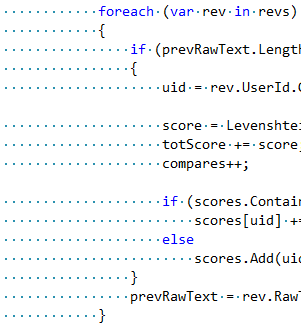
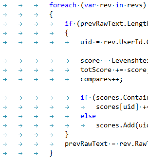
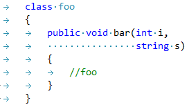

# Conclusion

- create an indentation **workflow** that works **regardless of** the indentation **style**
    - use `[Tab]` to create indentation
    - use `[Ctrl + Arrow right]` to skip indentation
- IDE's make **difference negligible** 
- it's a **project decision** not a developer one
- you will have to use both

Nevertheless, people love to argue especially about highly controversial topics like this one. So despite it being mainly irrelevant, here are a few points for project decisions

# Default implementation

Pressing `[Tab]` in different environments has different affects.

Move to the right until...

1. the current column is a **multiple of 8** (Unix systems, Ecams, Vim)
3. the current column is a **multiple of 4** (Windows)
4. the **next tab stop** (Microsoft Word)

# Spaces

- can be entered and pasted in **all environments** like terminals, publishings and browsers
- **consistent cursor speed** when going through

# Tabs

- a character **specifically meant for indentation**
- **customize indentation visualization** according to developer's preferences without changing the code thus separating data and presentation
- **seamlessly import code** without half-indenting or misalignment due to different indentation sizes
- **noticeable mistakes** in the level of indentation
- **don't micro manage** spaces
- are consistent, they are only used for indentation, unless you are commenting wrong.
- less **storage size**
- take less **time to go through**

## Secondary indentation using spaces

---
Sources:
- 2022-06-14: [Style Guide for Python Code (PEP8)](https://peps.python.org/pep-0008/#indentation)
- 2022-06-14: [Death to the Space Infidels!](https://blog.codinghorror.com/death-to-the-space-infidels/)
- 2022-06-14: [Tabs versus Spaces: An Eternal Holy War](https://www.jwz.org/doc/tabs-vs-spaces.html)
- 2022-06-14: [Tabs versus spaces — What is the proper indentation character?](https://softwareengineering.stackexchange.com/questions/57/tabs-versus-spaces-what-is-the-proper-indentation-character-for-everything-in-e)

Related:

Tags:
[Discussions](./Discussions.md)
