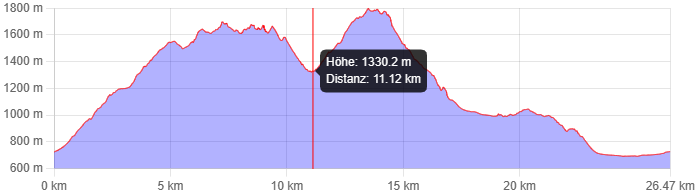
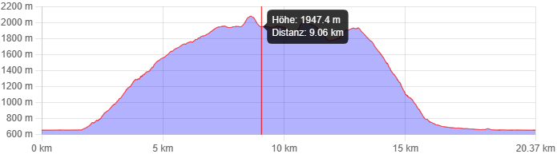

# Benediktenwand von Lengries

- [Blogeintrag mit Bildern](https://mehr-berge.de/von-lenggries-zur-benediktenwand/#infos)

## Anfahrt von München

- 1:15h mit der Bahn BRB RB56 [Bahn.de](https://reiseauskunft.bahn.de/bin/query.exe/dn?start=1&existOptimizePrice=1&REQ0JourneyStopsS0A=1&S=M%C3%BCnchen+Hbf&REQ0JourneyStopsSID=A%3D1%40O%3DM%C3%BCnchen+Hbf%40X%3D11558339%40Y%3D48140229%40U%3D80%40L%3D008000261%40B%3D1%40p%3D1684783417%40&REQ0JourneyStopsZ0A=1&Z=Lenggries&REQ0JourneyStopsZID=A%3D1%40O%3DLenggries%40X%3D11573540%40Y%3D47680395%40U%3D80%40L%3D008003643%40B%3D1%40p%3D1682362737%40&date=Sa.%2C+24.06.2023&time=06%3A00&timesel=depart&returnDate=&returnTime=&auskunft_travelers_number=1&tariffTravellerType.1=E&tariffTravellerReductionClass.1=0&tariffClass=2&optimize=0&externRequest=yes&HWAI=JS%21js%3Dyes%21ajax%3Dyes%21#hfsseq1|he.015796104.1686829304)
- 1:15h mit dem Auto [Google maps](https://www.google.com/maps/dir/M%C3%BCnchen/Parkplatz+Draxlhang,+Unnamed+Road,+83661+Lenggries/@47.9019265,11.29563,137589m/data=!3m2!1e3!4b1!4m13!4m12!1m5!1m1!1s0x479e75f9a38c5fd9:0x10cb84a7db1987d!2m2!1d11.5819805!2d48.1351253!1m5!1m1!1s0x479d9150f41bb775:0xfe59f02411985291!2m2!1d11.5660789!2d47.6621173?entry=ttu)

## Aufstieg am Sa, 24.06.2023

- 1 188 m hoch, 569 m runter, ≈4:51 h

## Übernachtung in Tutzinger Hütte
- Jessica (DAV-Mitglied): 11€ / 15 €
- Anton: 22 € / 30 €
- nach 9 Plätze verfügbar [Verfügbare Plätze](https://www.alpsonline.org/reservation/calendar?hut_id=212&lang=de_DE&header=yes)

## Abstieg am So, 25.06.2023

- 415 m hoch, 1 042 m runter, ≈4:52 h

## Höhenprofil und Karte

- [Route](https://en.mapy.cz/s/pugogenejo)

<iframe style="border:none" src="https://en.frame.mapy.cz/s/nonajecuvu" width="700" height="466" frameborder="0"></iframe>

---

# Krottenkopf und Hoher Fricken von Oberau

- [Blogeintrag mit Bildern](https://mehr-berge.de/hoch-hinaus-im-alpenvorland-krottenkopf-bischof-und-hoher-fricken-von-oberau/#Karte)

## Anfahrt aus München

- 1:00h mit dem Auto [Google Maps](https://www.google.com/maps/dir/M%C3%BCnchen/82496+Oberau/@47.8538613,10.6916885,9z/data=!3m1!4b1!4m13!4m12!1m5!1m1!1s0x479e75f9a38c5fd9:0x10cb84a7db1987d!2m2!1d11.5819805!2d48.1351253!1m5!1m1!1s0x479da995ca584c11:0x41e48add78b9cf0!2m2!1d11.138331!2d47.55995?entry=ttu)
- 1:45h mit den Öffentlichen RB 65, Bus EV, RB 6 [bahn.de](https://reiseauskunft.bahn.de/bin/query.exe/dn?start=1&existOptimizePrice=1&REQ0JourneyStopsS0A=1&S=M%C3%BCnchen+Hbf&REQ0JourneyStopsSID=A%3D1%40O%3DM%C3%BCnchen+Hbf%40X%3D11558339%40Y%3D48140229%40U%3D80%40L%3D008000261%40B%3D1%40p%3D1681931321%40&REQ0JourneyStopsZ0A=1&Z=Bahnhof%2C+Oberau&REQ0JourneyStopsZID=A%3D1%40O%3DBahnhof%2C+Oberau%40X%3D11138255%40Y%3D47559121%40U%3D80%40L%3D000590378%40B%3D1%40p%3D1686598167%40&date=Sa.%2C+24.06.2023&time=06%3A00&timesel=depart&returnDate=&returnTime=&auskunft_travelers_number=1&tariffTravellerType.1=Y&tariffTravellerReductionClass.1=2&tariffClass=2&optimize=0&externRequest=yes&HWAI=JS%21js%3Dyes%21ajax%3Dyes%21#hfsseq1|b5.016149104.1686832005)

## Aufstieg am Sa, 24.06.2023

- 1 581 m hoch, 157 m runter, ≈4:53 h

## Übernachtung in der Weilheimer Hütte (DAV)
- [Hütteninformation](https://dav-weilheim.de/huetten/weilheimer-huette/)
- Jessica: 8 € / 13 €
- Anton: 20 € / 26 €
- verfügbarkeit unklar, Reservierungen über +49 170 270 805 2

## Abstieg am So, 25.06.2023

- 20 m hoch, 1 313 m runter, ≈4:28 h

## Höhenprofil und Karte

- [Route](https://en.mapy.cz/s/mocoruzona)

<iframe style="border:none" src="https://en.frame.mapy.cz/s/pogufelase" width="700" height="466" frameborder="0"></iframe>
