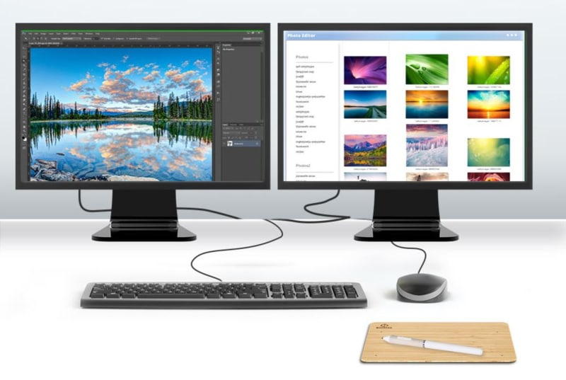

# Ultrawide monitors

Monitors that utilize a 21:9 aspect ratio

- flexible **workspace layouts** without a bezel gap between the monitors
    - three columns in 7:9 with 33% each
    - two columns in 10.5:9 with 50% each
    - priority grid
- **integrates docking station** without incompatibilities, disconnects, cable clutter and expenses
- **watch movies in full size** without letterboxing by utilizing the Cinematic Aspect Ratio
- **consistent screen size** and resolution compared to different monitors
- **consistent color and brightness** compared to same monitor models
- **adjusting calibration** and settings takes half the time
- can be **curved** to keep peripheral vision engaged

# Dual monitors

Two monitors next to each other usually at an angle

- larger **used market**

---
Sources:
- 2022-12-30: [Ultrawide vs. dual monitors: The best screen setup | PCWorld](https://www.pcworld.com/article/395110/ultrawide-vs-dual-monitors.html)
- 2023-03-02: [UltraWide vs Dual Monitors - The Complete Guide - DisplayNinja](https://www.displayninja.com/ultrawide-vs-dual-monitors/)
- 2023-03-02: [Ultrawide vs dual monitors – which setup is right for you? | Creative Bloq](https://www.creativebloq.com/features/ultrawide-vs-dual-monitors)

Related:

Tags:
[Discussions](./Discussions.md)
