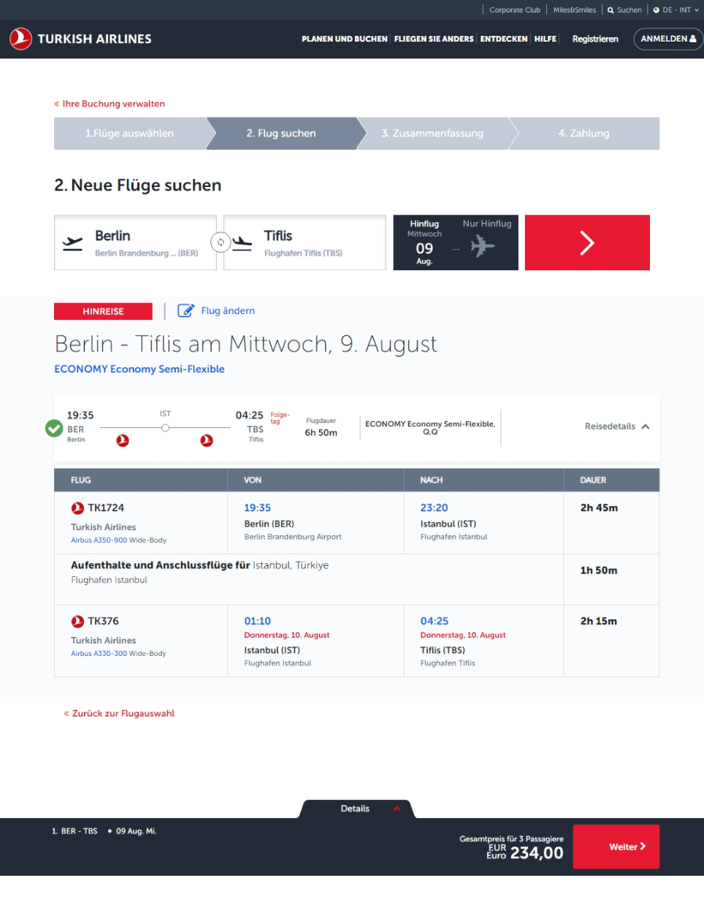

separater Flug mit wizz Air

- Flüge für die Georgienreise

# Hinflug für Anton von Berlin nach Tiflis

| Flugnummer(n)                                                                | Abflug           | Ankunft          | Dauer    | Preis |
| ---------------------------------------------------------------------------- | ---------------- | ---------------- | -------- | ----- |
| [TK 1724, TK 376](https://www.google.com/travel/flights/s/SafkcdZEwXfzV2n96) | Mi, 09.08. 19:35 | Do, 10.08. 04:25 | 6h 50min | 237 € |
| [TK 1728, TK 382](https://www.google.com/travel/flights/s/d9mN2Gpm9xDKe9yP6) | Do, 10.08. 07:00 | Do, 10.08. 16:40 | 7h 40min | 236 € |

# Flüge umbuchen

- [Turkish Airlines: Flüge umbuchen](https://www.turkishairlines.com/de-int/flights/manage-booking/)
- Buchungsreferenz: `RJSYSZ`

# Gepäck zubuchen

- Hinflug 30kg + 8kg pro Person
    - je 3kg Extra 48 €
- Rückflug 20kg + 8kg pro Person
    - je 3kg Extra 27 €

# Hinflug umbuchen für Anton

