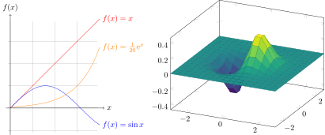
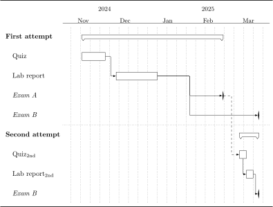

[Plots - Dynamically plot mathematical functions, values as a vector graphic](./plots/index.md)

[Networks, Commutative diagrams - Dynamically draw graph networks as a vector graphic](./latex/math/Networks-Commutative-diagrams.md)

[Electrical circuit - Dynamically draw electronic circuit diagrams as a vector graphic](./latex/Electrical-circuit.md)

[Molecules - Dynamically draw structural formulas of chemical molecules as a vector graphic](./latex/Molecules.md)

[Heatmaps](./latex/Heatmaps.md)

[Gantt chart](./latex/Gantt-chart.md)

