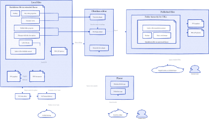

1. Clone clean template

```powershell
git clone git@github.com:jackyzha0/quartz.git
```

# Edit config

Edit pageTitle, pageTitleSuffix, baseUrl in [quartz.config.ts](D:\DEV\notes-quartz\quartz.config.ts)
```ts
pageTitle: "Anton's Digital Garden",
pageTitleSuffix: " - Anton's DG",
baseUrl: "antonpusch.de",
```
```ts
Plugin.CrawlLinks({ markdownLinkResolution: "relative" }),
```

# Change Layout

Disable graph, edit footer in [quartz.layout.ts](D:\DEV\notes-quartz\quartz.layout.ts)
```ts
// Component.Graph(),
```
```ts
Component.Footer({
  links: {
    GitHub: "https://github.com/yetenol",
    RSS: "https://antonpusch.de/index.xml",
  },
}),
```

# Calculate frontmatter

## Generate sanitized filenames

Open *Obsidian Setting > Enveloppe >File path*
- **Set the key where to get the value of the filename**: `dg-filename`

Edit [Enveloppe > data.json](D:\Notes\.obsidian\plugins\obsidian-mkdocs-publisher\data.json)
```json
"censorText": [
  {
    "entry": "/(?<!\\n)^---/",
    "replace": "---\ndate: \"2025-03-24T01:38:20.837+01:00\"\ntitle: \"Setup my digital garden\"\ndescription: \"-\"\ndg-filename: \"setup my digital garden\"",
    "flags": "", "after": false
  },
  {
    "entry": "/\\[\\[([^\\|\\]]*)\\]\\]/",
    "replace": "[[$1|$1]]",
    "flags": "", "after": false
  }
],
```
```json
"replaceTitle": [
    {"regex":"/ - .+/","replacement":"","type":"title"},
    {"regex":"/\\W+/g","replacement":" ","type":"title"},
    {"regex":"/\\s+/g","replacement":"-","type":"title"},
    {"regex":"A","replacement":"a","type":"title"},
    {"regex":"B","replacement":"b","type":"title"},
    {"regex":"C","replacement":"c","type":"title"},
    {"regex":"D","replacement":"d","type":"title"},
    {"regex":"E","replacement":"e","type":"title"},
    {"regex":"F","replacement":"f","type":"title"},
    {"regex":"G","replacement":"g","type":"title"},
    {"regex":"H","replacement":"h","type":"title"},
    {"regex":"I","replacement":"i","type":"title"},
    {"regex":"J","replacement":"j","type":"title"},
    {"regex":"K","replacement":"k","type":"title"},
    {"regex":"L","replacement":"l","type":"title"},
    {"regex":"M","replacement":"m","type":"title"},
    {"regex":"N","replacement":"n","type":"title"},
    {"regex":"O","replacement":"o","type":"title"},
    {"regex":"P","replacement":"p","type":"title"},
    {"regex":"Q","replacement":"q","type":"title"},
    {"regex":"R","replacement":"r","type":"title"},
    {"regex":"S","replacement":"s","type":"title"},
    {"regex":"T","replacement":"t","type":"title"},
    {"regex":"U","replacement":"u","type":"title"},
    {"regex":"V","replacement":"v","type":"title"},
    {"regex":"W","replacement":"w","type":"title"},
    {"regex":"X","replacement":"x","type":"title"},
    {"regex":"Y","replacement":"y","type":"title"},
    {"regex":"Z","replacement":"z","type":"title"},
    {"regex":"Ä","replacement":"ä","type":"title"},
    {"regex":"Ö","replacement":"ö","type":"title"},
    {"regex":"Ü","replacement":"ü","type":"title"}
],
```

## Generate folder structure

Change [quartz.config.ts](D:\DEV\notes-quartz\quartz.config.ts)
```ts
Plugin.CrawlLinks({ markdownLinkResolution: "relative" }),
```

Open *Obsidian Setting > Enveloppe >File path*
- **Default folder**: `content`
- **File tree in repository**: Property key
- **Property key**: `dg-folder`
- **Root folder**: `content`

## Frontmatter playground

- **modified**: 2025-03-24T00:00:00.000+01:00
- **title**: Setup my digital garden
- **description**: 
- **title js**: Setup my digital garden
- **description js**: -
- **filename js**: setup my digital garden
- **folder js**: computer/apps

# Expand dynamic dataview embeds


Edit [Enveloppe > data.json](D:\Notes\.obsidian\plugins\obsidian-mkdocs-publisher\data.json)
```json
"censorText": [
  {
    "entry": "/```dynamic-embed\\n\\[\\[Describe this app and list installation sources\\]\\]\\n```/",
    "replace": "", 
    "flags": "", "after": false, "inCodeBlocks": true
  },
  {
    "entry": "/```dynamic-embed\\n\\[\\[Describe this movie\\]\\]\\n```/",
    "replace": "", 
    "flags": "", "after": false, "inCodeBlocks": true
  },
  {
    "entry": "/```dynamic-embed\\n\\[\\[List apps of this category\\]\\]\\n```/",
    "replace": "", 
    "flags": "", "after": false, "inCodeBlocks": true
  },
  {
    "entry": "/```dynamic-embed\\n\\[\\[List related movies\\]\\]\\n```/",
    "replace": "", 
    "flags": "", "after": false, "inCodeBlocks": true
  }
],
```
- add template file contents as escaped json in **replace** key


Or add with Enveloppe UI
```
```dynamic-embed\n\[\[List related notes\]\]\n```
```


# Digital Obsidian Garden

All my markdown notes to be published are uploaded on [Github](https://github.com/yetenol/digital-garden/) and automatically built as my [homepage](https://antonpusch.de/) with [Vercel](https://vercel.com/yetenols-projects/digitalgarden).

The [Digital Garden](https://obsidian.md/plugins?id=digitalgarden) plugin for Obsidian exports exactly all notes with property `dg-publish: true` and deletes old ones. Included live queries of the [Dataview](https://obsidian.md/plugins?id=dataview) plugin are converted to static Markdown. Executable code blocks of the [Execute Code](https://obsidian.md/plugins?id=execute-code) plugin are relabeled for correct syntax highlighting.

The note export, the configuration of the website, and the update of this build template by a pull request are set in the [Digital Garden](https://github.com/oleeskild/obsidian-digital-garden) plugin, see [documentation](https://dg-docs.ole.dev/). 

# Static Site Generator

After each commit, the homepage is automatically regenerated with Vercel, see [template](https://github.com/oleeskild/digitalgarden). The static site generator [Eleventy](https://github.com/11ty/eleventy) installed there reads the folder of Markdown files, and applies their metadata object embedded in the frontmatter. Markdown gets pre-processed as Liquid templates, and build to HTML, see [documentation](https://www.11ty.dev/docs/languages/markdown/).

A Github webhook triggers the rebuild after each commit. Netlify provides the name servers and web hosting for my domain, and therefore updates the website directly on the Internet.

# How to publish dataview queries

The Digital Garden plugin automatically prints all [Dataview](obsidian://show-plugin?id=dataview) queries to markdown. Use [Dynamic Embed](obsidian://show-plugin?id=obsidian-dynamic-embed) plugin to use the same dataview query in multiple notes and every time from their own perspective. Digital Garden doesn't support Dynamic Embed natively but you can create a custom replace filter to publish the same output. For each embedded file replace like *List related notes* replace

```
```dynamic-embed\n\[\[List related notes\]\]\n```
```

with the content of the file and use `$1` to add a line break.

# Custom Filters

- Change [Execute Code](./computer/apps/Execute-Code.md)'s executable codeblocks to their regular language for syntax highlighting
- Replace [Dynamic Embed](./computer/apps/Dynamic-Embed.md)'s blocks with the note's content. Use to following regex pattern and replace the note name

```
```dynamic-embed\n\[\[Describe this app and list installation sources\]\]\n```
```

Use `$1` to add a line break with pastes the grouped `(\n)` from the pattern
- If you paste text with line breaks, they get replaces with spaces
- Don't put a line break behind the `$1`

```
Setup my digital garden is a note$1- [[(Erweiterte) Entity-Relationship-Modellierung.md|(Erweiterte) Entity-Relationship-Modellierung]]

```

Custom CSS

```css
// Prevent horizontal scroll bar on numbered equations in katex
.katex-display>.katex>.katex-html {
    display: flex !important;
    align-items: baseline;
    // flex-wrap: wrap;
}

// Don't overlay the equation number in KaTeX displays
.katex-display>.katex>.katex-html>.tag {
    overflow-x: hidden;
    position: static !important;
    margin-left: auto;
}

.katex-display>.katex>.katex-html>.base:first-child {
    margin-left: auto;
}

.katex-display>.katex>.katex-html>.base:last-child {
    margin-right: auto;
}

// Prevent array's topmost \hline to get clipped
.katex-display {
    padding-top: 2px;
}


// Center SVGs
article>*>img[src$=".svg"] {
    display: block;
    margin-left: auto;
    margin-right: auto;
    max-width: 100%;
}

// Invert SVGs in dark mode
:root[saved-theme="dark"] article>*>img[src$=".svg"] {
    filter: invert(1);
}

// Center tables
.table-container>table {
    margin-left: auto;
    margin-right: auto;
}

// Style inline code like codeblocks
pre {
    border: unset !important;
}

code {
    border: 1px solid var(--lightgray);
    background: unset !important;
}

// Float thumbnail in the top left corner next to the installation instruction
img[alt="thumbnail"] {
    float: right;
    margin-left: 16px;
    max-height: 160px
}

// Hide Created with Quatz
footer>p {
    display: none;
}

// Wrap codeblocks in tables
td>pre>code {
    word-wrap: break-word;
    white-space: pre-wrap;
    display: block;
    line-height: 1.2rem;
}

td>pre {
    padding: unset;
}
```

Workflow to create, collaborate, publish notes in my knowledge base



# Alternative publishing ideas

Obsidian Publish
- [c] expensive 
- [p] reliable
- [p] supprts graph view, canvas view 

11ty Vercel
- [p] free
- [p] supports Dataview, Math, regex replacements

Hugo
- [c] Doesn't support wikilinks
- https://quantick.dev/posts/obsidian-hugo
