!Hausaufgabengruppe in Stochastik für Informatik

# Aufgabe 1)

## a)

$$
X_1(\omega) = \omega_2 \qquad X_1(\Omega)=\{1,2,3 \}  
$$
$$
\begin{align*}
p_{X_1}(k) &= \mathbb{P}(\{\omega \in \Omega : X_1(\omega)=k\}) = \mathbb{P}(\omega_1) + \ldots + \mathbb{P}(\omega_n) \\
p_{X_1}(1) &= \mathbb{P}(\{ (1,1),(2,1),(3,1) \} ) = 0,13+0,11+0,07 =0,31 \\
p_{X_1}(2) &= \mathbb{P}(\{ (1,2),(2,2),(3,2) \} ) = 0,16+0,16+0,08 = 0,4\\
p_{X_1}(3) &= \mathbb{P}(\{ (1,3),(2,3),(3,3) \} ) = 0,12+0,12+0,05 = 0,29 \\
\end{align*} 
$$

## b)

$$
X_2(\omega) = \omega_1 \qquad X_2(\Omega)=\{ 1,2,3 \}  
$$

$$
\begin{align*}
p_{X_2}(1) &= \mathbb{P}(\{ (1,1),(1,2),(1,3) \} ) = 0,13+0,16+0,12 = 0,41 \\
p_{X_2}(2) &= \mathbb{P}(\{ (2,1),(2,2),(2,3) \} ) = 0,11+0,16+0,12 = 0,39 \\
p_{X_2}(3) &= \mathbb{P}(\{ (3,1),(3,2),(3,3) \} ) = 0,07+0,08+0,05 = 0,2 \\
\end{align*} 
$$

## c)

$$
X_3(\omega) = \omega_1 \, \omega_2 \qquad X_3(\Omega) = \{ 1,2,3,4,6,9 \}  
$$

$$
\begin{alignat*}{3}
p_{X_3}(1) &= \mathbb{P}(\{ (1,1) \} ) && && = 0.13 \\
p_{X_3}(2) &= \mathbb{P}(\{ (1,2),(2,1) \} ) && = 0.16+0.11 && = 0.27 \\
p_{X_3}(3) &= \mathbb{P}(\{ (1,3),(3,1) \} ) && = 0.12+0.07 && = 0.19 \\
p_{X_3}(4) &= \mathbb{P}(\{ (2,2) \} ) && && = 0.16 \\
p_{X_3}(6) &= \mathbb{P}(\{ (2,3),(3,2) \} ) && = 0.12+0.08 && = 0.20
\end{alignat*}
$$

$$
\begin{alignat*}{3}
p_{X_3}(1) &= \mathbb{P}(\{ (1,1) \} ) &&= 0,13 \\
p_{X_3}(2) &= \mathbb{P}(\{ (1,2),(2,1) \} ) = 0,16+0,11 &&= 0,27 \\
p_{X_3}(3) &= \mathbb{P}(\{ (1,3),(3,1) \} ) = 0,12+0,07 &&= 0,19 \\
p_{X_3}(4) &= \mathbb{P}(\{ (2,2) \} ) &&= 0,16 \\
p_{X_3}(6) &= \mathbb{P}(\{ (2,3),(3,2) \} ) = 0,12+0,08 &&= 0,2 \\
p_{X_3}(9) &= \mathbb{P}(\{ (3,3) \} ) &&= 0,05 \\
\end{alignat*} 
$$

## d)

$$
X_4(\omega) = \max\{ \omega_1,\omega_2 \} - \min\{ \omega_1,\omega_2 \} \qquad X_4(\Omega) = \{ 0,1,2 \}  
$$

$$
\begin{alignat*}{3}
p_{X_4}(0) &= \mathbb{P}(\{ (1,1),(2,2),(3,3) \}) &&= 0,13+0,16+0,05 &&= 0,34 \\
p_{X_4}(1) &= \mathbb{P}(\{ (1,2),(2,1),(2,3),(3,2) \}) &&= 0,16+0,11+0,12+0,08 &&= 0,47 \\
p_{X_4}(2) &= \mathbb{P}(\{ (1,3),(3,1) \}) &&= 0,12+0,07 &&= 0,19 \\
\end{alignat*} 
$$

## e)

$$
X_5(\omega) = |\{ \omega_1,\omega_2 \}| \qquad X_5(\Omega) = \{ 1,2 \}  
$$

$$
\begin{align*}
p_{X_5}(1) &= \mathbb{P}(\{ (1,1),(2,2),(3,3) \}) = 0,13+0,16+0,05 = 0,34 \\
p_{X_5}(2) &= 1 - p_{X_5}(1) = 0,66
\end{align*}
$$

# Aufgabe 2)

## a)

$$
X(\Omega) = \{ -4,0,4,12 \}  
$$

$$
\begin{alignat*}{3}
F_X(x) &= \mathbb{P}(X \le x) \\
F_X(-4) &= \frac{1}{4} = 0,25 \\
F_X(0) &= \frac{1}{4} + \frac{1}{6} = \frac{5}{12} \approx 0,417 \\
F_X(4) &= \frac{1}{4} + \frac{1}{6} + \frac{1}{4} = \frac{2}{3} \approx 0,667 \\
F_X(12) &= 1
\end{alignat*} 
$$

## b)

$$
Y := 2X + 4 \qquad Y(\Omega) = \{ -4,4,12,28 \}  
$$

| $y$      | -4                       | 4                       | 12                      | 28                       |
| -------- | ------------------------ | ----------------------- | ----------------------- | ------------------------ |
| $p_Y(y)$ | $p_X(-4) = \dfrac{1}{4}$ | $p_X(0) = \dfrac{1}{6}$ | $p_X(4) = \dfrac{1}{4}$ | $p_X(12) = \dfrac{1}{3}$ |

$$
Z := |X| \qquad Z(\Omega) = \{ 0,4,12 \}  
$$

|   $z$    |            0            |                 4                 |            12            |
| :------: | :---------------------: | :-------------------------------: | :----------------------: |
| $p_Z(z)$ | $p_X(0) = \dfrac{1}{6}$ | $p_X(-4) + p_X(4) = \dfrac{1}{2}$ | $p_X(12) = \dfrac{1}{3}$ |

## c)

$$
\begin{align*}
F_Y(x) &= \mathbb{P}(Y \le x) \\
F_Y(-4) &= \frac{1}{4} = 0,25 \\
F_Y(4) &= \frac{1}{4} + \frac{1}{6} = \frac{5}{12} \approx 0,417 \\
F_Y(12) &= \frac{1}{4} + \frac{1}{6} + \frac{1}{4} = \frac{2}{3} \approx 0,667 \\
F_Y(28) &= 1
\end{align*} 
$$

$$
\begin{align*}
F_Z(x) &= \mathbb{P}(Z \le x) \\
F_Z(0) &= \frac{1}{6} = 0,25 \\
F_Z(4) &= \frac{1}{6} + \frac{1}{2} = \frac{2}{3} \approx 0,667 \\
F_Z(12) &= 1
\end{align*} 
$$

# Aufgabe 3)

$A=$ Zug fällt aus
$F=$ Zug fährt
$t$ = Anzahl der Tage bzw. Wiederholungen der Zufallsexperiments
$$
\mathbb{P}(A) = p \qquad \mathbb{P}(F) = 1-p 
$$

## a)

### i)

Wir betrachten $t=5$ Tage.
Wie viele Möglichkeiten gibt es den **einen** Zugausfall auf **fünf** Tage zu **verteilen**?
$$
\binom{5}{1} 
$$
Wie wahrscheinlich **fährt** der Zug an **vier** Tagen und **fällt** an **einem** aus, wobei der Zugausfall auf einen beliebigen Tag **verteilt** wird?
$$
\binom{5}{1} \cdot \mathbb{P}(F)^4 \, \mathbb{P}(A) = 5 \cdot (1-p)^4 \cdot p  
$$

### ii)

Wir betrachten $t=4$ Tage.
Wie wahrscheinlich **fährt** der Zug an **drei** Tagen und **fällt** an **einem** aus, wobei der Zugausfall **nicht verteilt** wird?
$$
\mathbb{P}(F)^3 \, \mathbb{P}(A) = (1-p)^3 \cdot p 
$$

## b)

$Y:$ Anzahl der Tage bis zum ersten Zugausfall
$$
Y(\Omega) = \{ 1, \ldots, t \}  
$$
Wie wahrscheinlich fällt der Zug am 1. Tag aus? Dafür muss er am 1. Tag ausfallen:
$$
\mathbb{P}(Y = 1) = \mathbb{P}(A) = p 
$$
Wie wahrscheinlich fällt der Zug erst am 2. Tag aus? Dafür muss er am 1. Tag fahren und am 2. ausfallen:
$$
\mathbb{P}(Y = 2) = \mathbb{P}(F) \, \mathbb{P}(A) = (1-p) \cdot p 
$$
Wie wahrscheinlich fällt der Zug erst am $k$-ten Tag aus, wobei $k \in \mathbb{N}^+$? Dafür muss er am 1. bis $(k-1)$-ten Tag fahren und am $t$-ten Tag ausfallen:
$$
\mathbb{P}(Y=k) =\mathbb{P}(F)^{k-1} \, \mathbb{P}(A) = (1-p)^{k-1} \cdot p, \qquad k \in \mathbb{N}^+ 
$$
Wie wahrscheinlich fällt der Zug frühestens am $k$-ten Tag aus? Dafür muss er am 1. bis $(k-1)$-ten Tagen fahren. Was danach passiert, ist uns egal:
$$
\mathbb{P}(Y \ge k) = \mathbb{P}(F)^{k-1} = (1-p)^{k-1} , \qquad k \in \mathbb{N}^+ 
$$

$$
\Rightarrow  \mathbb{P}(Y \ge (k+1)) = \mathbb{P}(F)^{(k+1)-1} = (1-p)^{(k+1)-1} 
$$

$$
\iff \mathbb{P}(Y \gt k) = \mathbb{P}(F)^k = (1-p)^k
$$
Falls $k=0$ ergibt, sich $(1-p)^0 = 1$. Also können wir $k$ auf den ganzen $\mathbb{N}$ erweitern.
$$
\mathbb{P}(Y \gt k) = \mathbb{P}(F)^k = (1-p)^k , \qquad k \in \mathbb{N}
$$

Dass an den vergangenen $m=4$ Tagen kein Zug ausgefallen ist, beeinflusst nicht die Wahrscheinlichkeit, dass die nächsten drei Tage kein Zug ausfällt, da Zugausfälle an unterschiedlichen Tagen unabhängig voneinander sind. Somit ergibt sich:

Wie wahrscheinlich fällt die nächsten drei Tage kein Zug aus? Dafür darf der Zug frühestens am 4. Tag ausfallen:
$$
\mathbb{P}(Y \ge 4) = \mathbb{P}(F)^3 = (1-p)^3 
$$
Diese Wahrscheinlichkeit hängt nicht von $m$ ab, da die Formel unabhängig von $m$ ist.

## c)

Wir setzen $p = 0,11$
$k \in \mathbb{N}^+ =$ Anzahl der Tage

Wie wahrscheinlich sind nur Zugausfälle an $k$ Tagen?
$$
\mathbb{P}(A)^k 
$$
$$
\begin{align*}
0,99 < 1 - \mathbb{P}(A)^k &
= 1 - p^k 
\xRightarrow{+p^k - 0,99} p^k < 0,01
\xRightarrow{\log_p()} k > \log_p(0,01) \\&
\xRightarrow{p=0,11} k > \log_{0,11}(0,01) \approx 2,086 
\xRightarrow{k \in \mathbb{N}^+} k \ge 3
\end{align*} 
$$

# Nachträgliche Anmerkungen

## 3a)

nutze Verteilung und Verteilungsfunktion mit einer Zufallsvariable

## 3b)

Ereignis, dass $m$ Tage land kein Zugausfall war
$$
\{ Y > m \}  
$$
Ereignis, dass 3 weitere Tage kein Zug ausfällt
$$
\{ Y > m +3 \}
$$
$$
\begin{align*}
\mathbb{P}(Y > m+3 | Y > m) &
= \frac{\mathbb{P}(\{ Y > m+3 \} ) }{\{ Y > m \}}
= \frac{\mathbb{P}(Y>m+3)}{\mathbb{P}(Y>m)} \\&
= \frac{(1-p)^{m+3}}{(1-p)^m} = (1-p)^3
\end{align*}
$$

Beweise, dass das für alle gilt

$$
\begin{align*}
\mathbb{P}(Y > n) &
= \sum_{k=n+1}^{\infty} \mathbb{P}(Y=k)
= \sum_{k=n+1}^{\infty} p \cdot (1-p)^{k-1} \\&
= \sum_{k=0}^{\infty} p \cdot (1-p)^{n+k}
= p \cdot (1-p)^n \sum_{k=0}^{\infty} (1-p)^k \\&
= p (1-p)^n \frac{1}{1-(1-p)}
= (1-p)^n \\ \,\tag*{$\Box$} 
\end{align*}
$$

> [!NOTE] Nachträgliche Anmerkungen
