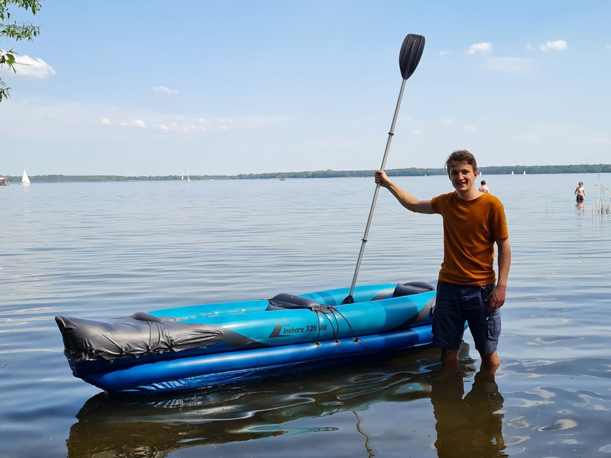
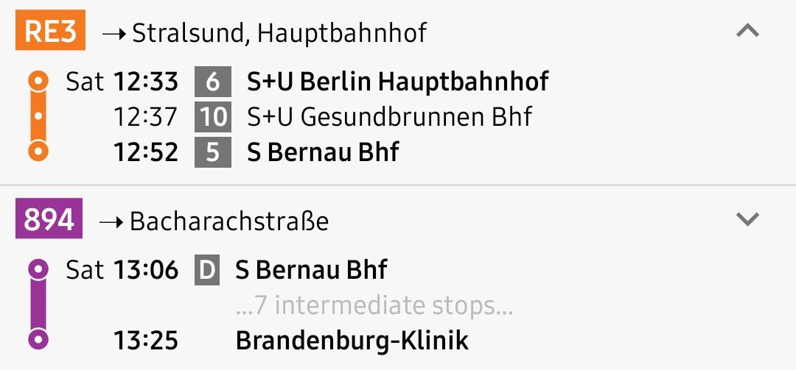

Für Samstag schlage ich vor, dass wir das Fahrradfahren weglassen. Anna hat wahrscheinlich kein Fahrrad und es erleichtert den Transport. Stattdessen fahren wir um 12:30 Uhr mit Regio und Bus und laufen ein Stück zum Liepnitzsee. Dort werden wir mein Mini-Schlauch-Kanu aufblasen, das ich mitbringe. Wir packen unsere Sachen in meinen wasserdichten Packsack und legen ihn ins Boot. Dann schwimmen wir zu dritt los und ziehen das Boot am Seil hinter uns her. Wir schwimmen die 200 Meter zur Insel des Liepnitzsees, Großer Werder genannt, herüber und beginnen dann in Ufernähe um die Insel herum zu schwimmen. Wenn jemand nicht mehr kann, steigt er/sie ins Boot ein und paddelt neben den anderen her oder geht ans Ufer. Ins Boot passen zwei Leute. Wenn zwei Leute nicht mehr schwimmen wollen, gehen wir alle ans Ufer und lassen unser Boot mit den Sachen auf der Insel stehen. Wir joggen 2,6 km um die Insel herum oder mehrmals, wenn Interesse besteht. Danach schwimmen/kanufahren wir wieder ans Festland zurück und fahren mit den öffentlichen Verkehrsmitteln zurück.

# Mein Boot

# Anfahrt

Ihr könnt am Hauptbahnhof oder am Gesundbrunnen einsteigen. Gleis siehe Bild

# Laufstrecke

<iframe style="border:none" src="https://en.frame.mapy.cz/s/mavenubaku" width="400" height="280" frameborder="0"></iframe>

- [Routendetails](https://en.mapy.cz/s/ragesacafe)

---
Sources:

Related:

Tags:
Wolf Hahn
Anna Klaus