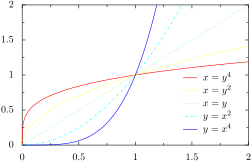
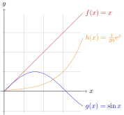
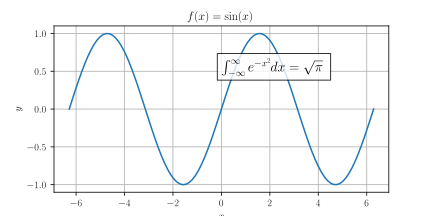
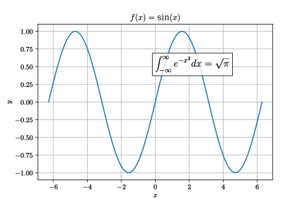

[PyX](./computer/apps/PyX.md)

PGFplots

[PyPlot](./PyPlot.md)

PyPlot from MathPlotLib

[tikzplotlib](tikzplotlib.md)

- [Create publication ready figures with Matplotlib and TikZ | Martin’s blog](https://blog.martisak.se/2019/09/29/publication_ready_figures/)