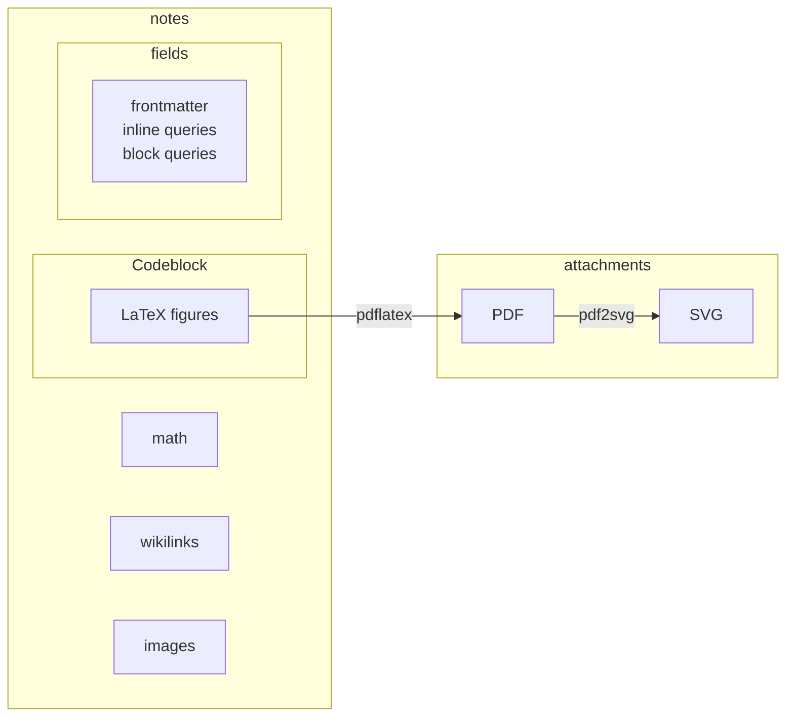
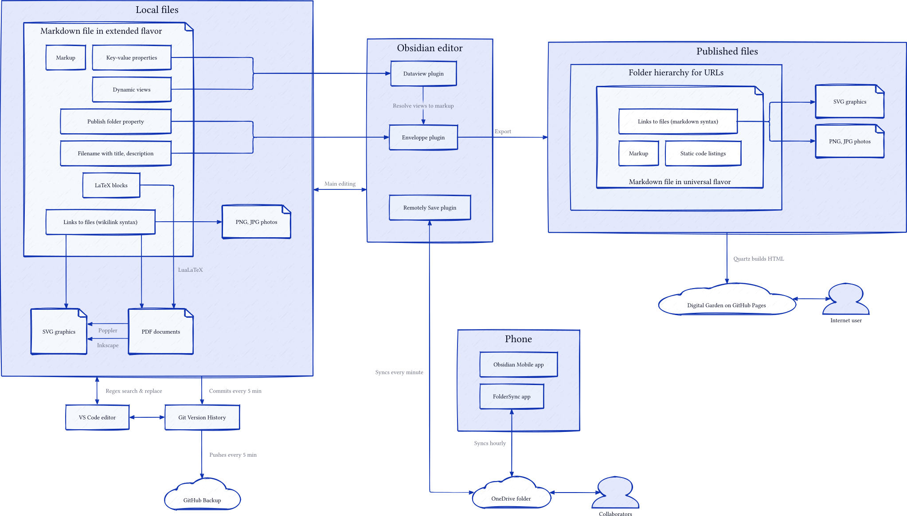

```d2
local: Local files {
  md: Markdown files in extended flavor {
    markup: Markup
    frontmatter: Key-value properties
    folder: Publish folder property
    filename: Filename with title, description
    links: Links to files (wikilink syntax)
    latex: LaTeX blocks
    views: Dynamic views
    shape: page
  }
  pdf: PDF documents {
    shape: page
  }
  svg: SVG graphics {
    shape: page
  }
  png: PNG, JPG photos {
    shape: page
  }
  md.latex -> pdf: LuaLaTeX
  pdf -> svg: Poppler
  pdf -> svg: Inkscape
  md.links -> svg
  md.links -> png
}
obsidian: Obsidian editor {
  dataview: Dataview plugin
  enveloppe: Enveloppe plugin
  remotely: Remotely Save plugin
  dataview -> enveloppe: Resolve views to markup
}
vscode: VS Code editor
git: Git Version History
backup: GitHub Backup {
  shape: cloud
}
collab: Collaborators {
  shape: person
}
phone: Phone {
  obsidian: Obsidian Mobile app
  sync: FolderSync app
}

onedrive: OneDrive folder {
  shape: cloud
}
remote: Published files {
  folder: Folder hierarchy for URLs {
    md: Markdown files in universal flavor {
      markup: Markup
      links: Links to files (markdown syntax)
      codeblocks: Static code listings
      shape: page
    }
  }
  svg: SVG graphics {
    shape: page
  }
  png: PNG, JPG photos {
    shape: page
  }
  folder.md.links -> svg
  folder.md.links -> png
}

garden: Digital Garden on GitHub Pages {
  shape: cloud
}
anyone: Internet user {
  shape: person
}

local <-> obsidian: Main editing
local <-> vscode: Regex search & replace
local -> git: Commits every 5 min
local.md.views -> obsidian.dataview <- local.md.frontmatter
git <-> vscode
git -> backup: Pushes every 5 min

obsidian.enveloppe <- local.md.folder
obsidian.enveloppe <- local.md.filename
obsidian.enveloppe -> remote: Export
obsidian.remotely <-> onedrive: Syncs every minute
onedrive <-> collab
onedrive <-> phone.sync: Syncs hourly
remote -> garden: Quartz builds HTML
garden <-> anyone
```

```latex
\documentclass[border=10pt]{standalone}
\usepackage{tikz}
\usetikzlibrary{shapes.geometric, shapes.symbols, shapes.misc, positioning, fit, arrows.meta, backgrounds, calc, shadows, shadows.blur}

\begin{document}
% Define custom styles
\tikzset{
    % Node styles
    cloud/.style={
        draw, 
        cloud, 
        cloud puffs=16, 
        aspect=2, 
        inner sep=0.3cm, 
        minimum width=3cm, 
        minimum height=2cm,
        fill=blue!10,
        font=\small\sffamily,
        align=center
    },
    
    file/.style={
        draw, 
        shape=file, 
        minimum width=2.5cm, 
        minimum height=1.5cm, 
        fill=yellow!10,
        font=\small\sffamily,
        align=center
    },
    
    container/.style={
        draw, 
        rounded corners, 
        minimum width=4cm, 
        minimum height=2cm, 
        fill=gray!10,
        font=\sffamily,
        align=center
    },
    
    application/.style={
        draw, 
        rectangle, 
        rounded corners, 
        minimum width=3cm, 
        minimum height=1.5cm, 
        fill=green!10,
        font=\small\sffamily,
        align=center
    },
    
    person/.style={
        draw,
        circle,
        minimum size=1.5cm,
        fill=red!10,
        font=\small\sffamily,
        align=center
    },
    
    submodule/.style={
        draw, 
        rectangle, 
        rounded corners, 
        minimum width=2cm, 
        minimum height=1cm, 
        fill=blue!5,
        font=\footnotesize\sffamily,
        align=center
    },
    
    item/.style={
        draw, 
        rectangle, 
        minimum width=1.8cm, 
        minimum height=0.8cm, 
        fill=yellow!5,
        font=\tiny\sffamily,
        align=center
    },
    
    % Connection styles
    connection/.style={
        -Stealth,
        thick
    },
    
    bidirectional/.style={
        Stealth-Stealth,
        thick
    },
    
    label/.style={
        font=\tiny\sffamily,
        align=center,
        midway
    }
}

\begin{tikzpicture}[node distance=2cm, auto]
    % Main containers
    \node[container] (local) {Local files};
    \node[container, right=4cm of local] (obsidian) {Obsidian editor};
    \node[application, above=of obsidian] (vscode) {VS Code editor};
    \node[application, left=of vscode] (git) {Git Version History};
    \node[cloud, above=of git] (backup) {GitHub Backup};
    \node[person, right=of obsidian] (collab) {Collaborators};
    
    \node[container, below=4cm of obsidian] (phone) {Phone};
    \node[cloud, right=4cm of phone] (onedrive) {OneDrive folder};
    
    \node[container, right=6cm of local] (remote) {Published files};
    \node[cloud, right=of remote] (garden) {Digital Garden\\on GitHub Pages};
    \node[person, below=of garden] (anyone) {Internet user};
    
    % Local files submodules
    \begin{scope}[local/.style={}, shift={($(local) + (-1.5,-0.2)$)}]
        \node[submodule] (md) at (0, 0) {Markdown files};
        \node[submodule, below=0.8cm of md] (pdf) {PDF documents};
        \node[submodule, below=0.8cm of pdf] (svg) {SVG graphics};
        \node[submodule, below=0.8cm of svg] (png) {PNG, JPG photos};
        
        % MD file details
        \node[item, right=0.6cm of md] (markup) {Markup};
        \node[item, right=0.6cm of markup] (frontmatter) {Frontmatter};
        \node[item, below=0.4cm of markup] (folder) {Folder property};
        \node[item, below=0.4cm of folder] (filename) {Filename};
        \node[item, below=0.4cm of frontmatter] (links) {Links};
        \node[item, below=0.4cm of links] (latex) {LaTeX blocks};
        \node[item, below=0.4cm of filename] (views) {Dynamic views};
        
        % Internal connections within local
        \draw[connection] (md.south) -- (pdf.north) node[label, right] {LuaLaTeX};
        \draw[connection] (pdf.south) -- (svg.north) node[label, right] {Poppler/\\Inkscape};
        \draw[connection] (md) -- (links);
        \draw[connection] (links) -- (svg);
        \draw[connection] (links) -- (png);
    \end{scope}
    
    % Obsidian plugins
    \begin{scope}[obsidian/.style={}, shift={($(obsidian) + (0,-0.8)$)}]
        \node[submodule] (dataview) {Dataview plugin};
        \node[submodule, below=0.6cm of dataview] (enveloppe) {Enveloppe plugin};
        \node[submodule, below=0.6cm of enveloppe] (remotely) {Remotely Save plugin};
        
        % Connections
        \draw[connection] (dataview) -- (enveloppe) node[label, right] {Resolve views\\to markup};
    \end{scope}
    
    % Phone components
    \begin{scope}[phone/.style={}, shift={($(phone) + (0,-0.5)$)}]
        \node[submodule] (mobile) {Obsidian Mobile app};
        \node[submodule, below=0.6cm of mobile] (sync) {FolderSync app};
    \end{scope}
    
    % Remote files structure
    \begin{scope}[remote/.style={}, shift={($(remote) + (0,-0.5)$)}]
        \node[submodule] (rfolder) {Folder hierarchy};
        \node[submodule, below=0.6cm of rfolder] (rsvg) {SVG graphics};
        \node[submodule, below=0.6cm of rsvg] (rpng) {PNG, JPG photos};
        
        % Folder details
        \node[item, right=0.6cm of rfolder] (rmd) {Markdown files};
        \node[item, right=0.6cm of rmd] (rmarkup) {Markup};
        \node[item, below=0.4cm of rmd] (rlinks) {Links};
        \node[item, below=0.4cm of rmarkup] (rcodeblocks) {Static code};
        
        % Internal connections
        \draw[connection] (rlinks) -- (rsvg);
        \draw[connection] (rlinks) -- (rpng);
    \end{scope}
    
    % Main connections between containers
    \draw[bidirectional] (local) -- (obsidian) node[label, above] {Main editing};
    \draw[bidirectional] (local) -- (vscode) node[label, sloped, above] {Regex search};
    \draw[connection] (local) -- (git) node[label, sloped, above] {Commits every 5 min};
    
    \draw[connection] (git) -- (backup) node[label, right] {Pushes every 5 min};
    \draw[bidirectional] (git) -- (vscode);
    
    \draw[connection] (views) to[bend left] (dataview);
    \draw[connection] (frontmatter) to[bend left] (dataview);
    
    \draw[connection] (folder) to[out=0, in=180] (enveloppe);
    \draw[connection] (filename) to[out=0, in=180] (enveloppe);
    \draw[connection] (enveloppe) -- (remote) node[label, sloped, above] {Export};
    
    \draw[bidirectional] (remotely) -- (onedrive) node[label, sloped, above] {Syncs every minute};
    \draw[bidirectional] (onedrive) -- (collab);
    \draw[bidirectional] (onedrive) -- (sync) node[label, sloped, above] {Syncs hourly};
    
    \draw[connection] (remote) -- (garden) node[label, above] {Quartz builds HTML};
    \draw[bidirectional] (garden) -- (anyone);
    
    % Background highlights
    \begin{pgfonlayer}{background}
        \node[fit=(local)(md)(png)(markup)(views), fill=gray!5, rounded corners, draw=gray!30, dashed, inner sep=0.4cm] {};
        \node[fit=(obsidian)(dataview)(remotely), fill=gray!5, rounded corners, draw=gray!30, dashed, inner sep=0.4cm] {};
        \node[fit=(remote)(rfolder)(rpng)(rmarkup)(rcodeblocks), fill=gray!5, rounded corners, draw=gray!30, dashed, inner sep=0.4cm] {};
        \node[fit=(phone)(mobile)(sync), fill=gray!5, rounded corners, draw=gray!30, dashed, inner sep=0.4cm] {};
    \end{pgfonlayer}
\end{tikzpicture}

\end{document}
```
