- beschreibe komplexe Strukturen in ihrem Aufbau aus Einzelkomponenten
- abstrahiere Aufbau zusammengesetzter Komponenten zu seinen Objekten
- Sprechweise: "*aggregiere Klasse* ist Teil von *abstrahierende Klasee*"

graphic:: 

 

> Ziel der Aggregationsabstraktion ist es, "Komplexe Strukturen' in ihrem Aufbau aus Einzelkomponenten (Teilen) zu beschreiben. Die korrespondierende vertikale Beziehung Wird ddemzufolge als „lst- Teil-von" - Relationship-Typ (part-of) bezeichnet.

---
Sources:
- 2023-05-03: [Datenbankmoddellierung II (Video)](https://isis.tu-berlin.de/mod/videoservice/view.php/cm/1591026/video/167510/view)

Related:

Tags:
[(Erweiterte) Entity-Relationship-Modellierung](./erweiterte-entity-relationship-modellierung.md)