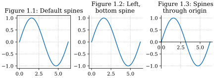
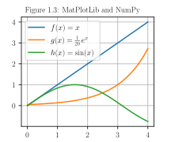

 MatPlotLib PyPlot is a [Python](./Python.md) extension about visualisation. Generate GUI, SVG, PDF figures with an implicit, MATLAB-like interface

- Install extension via <pre><code class='language-powershell'>pip install matplotlib</code></pre>
- Download it from the [publisher's website](https://matplotlib.org/stable/gallery/index.html)


> Matplotlib is a comprehensive library for creating static, animated, and interactive visualizations.

- Source: [Matplotlib documentation — Matplotlib 3.10.0 documentation](https://matplotlib.org/stable/)

> The fundamental package for scientific computing with Python

- Source: [NumPy -](https://numpy.org/)

Example plot





```python
import numpy as np
import matplotlib.pyplot as plt

# Enable LaTeX rendering
plt.rcParams['text.usetex'] = True
plt.rcParams['font.family'] = 'serif'

# Create data
x = np.linspace(0, 4, 100)
f = x
g = np.exp(x)/20
h = np.sin(x)

# Create the plot
plt.figure(figsize=(3, 2.5))
plt.plot(x, f, label=r"$f(x) = x$")
plt.plot(x, g, label=r"$g(x) = \frac{1}{20}\, e^x$")
plt.plot(x, h, label=r"$h(x) = \sin(x)$")

# Style the plot
plt.title("Figure 1.3: MatPlotLib and NumPy", fontsize=10)
plt.legend()
plt.grid(True)

# Export static vector graphics
plt.savefig(@vault_path + '/attachments/figure plot plt.svg', transparent=True)
plt.savefig(@vault_path + '/attachments/figure plot plt.pdf', transparent=True)
plt.show()
```

Minimalized example plot


```python
def export_plt_figure(plt_graph, outfile=None, crop=False):
    basename = @vault_path + '/attachments/' + outfile
    if (not outfile):
        return
    if (crop):
        plt.savefig(basename + '.svg', transparent=True, \
            bbox_inches='tight', pad_inches=0)
        plt.savefig(basename + '.pdf', transparent=True, \
            bbox_inches='tight', pad_inches=0)
        return
    plt.savefig(basename + '.svg', transparent=True)
    plt.savefig(basename + '.pdf', transparent=True)

import numpy as np
import matplotlib.pyplot as plt
plt.rcParams['text.usetex'] = True
plt.rcParams['font.family'] = 'serif'
x = np.linspace(0, 4, 100)
plt.figure(figsize=(3, 2.5))
plt.plot(x, x, label=r"$f(x) = x$")
plt.plot(x, np.exp(x)/20, label=r"$g(x) = \frac{1}{20}\, e^x$")
plt.plot(x, np.sin(x), label=r"$h(x) = \sin(x)$")
plt.title("Figure 1.1: Normal spines", fontsize=10)
plt.legend()
plt.grid(True)
export_plt_figure(plt, outfile="figure plot plt 1")
plt.show()
```

```python
import numpy as np
import matplotlib.pyplot as plt
plt.rcParams['text.usetex'] = True
plt.rcParams['font.family'] = 'serif'
x = np.linspace(0, 4, 100)
plt.figure(figsize=(3, 2.5))
plt.plot(x, x, label=r"$f(x) = x$")
plt.plot(x, np.exp(x)/20, label=r"$g(x) = \frac{1}{20}\, e^x$")
plt.plot(x, np.sin(x), label=r"$h(x) = \sin(x)$")
plt.title("Figure 1.1: Normal spines", fontsize=10)
plt.legend()
plt.grid(True)
export_plt_figure(plt, outfile="figure plot plt 1")
plt.show()
```


# API interfaces

## Axes interface

> create a Figure and one or more Axes objects, then explicitly use methods on these objects to add data, configure limits, set labels etc.

## PyPlot interface

> matplotlib.pyplot is a state-based interface to matplotlib. It provides an implicit, MATLAB-like, way of plotting. It also opens figures on your screen, and acts as the figure GUI manager. pyplot is mainly intended for interactive plots and simple cases of programmatic plot generation:

- [matplotlib.pyplot — Matplotlib 3.10.0 documentation](https://matplotlib.org/stable/api/pyplot_summary.html#module-matplotlib.pyplot)

- bad matplotlib attempts