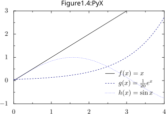

```dynamic-embed
[[Describe this app and list installation sources]]
```

Example plot



```python
from pyx import *
g = graph.graphxy(width=8,
                  x=graph.axis.linear(min=0, max=4),
                  y=graph.axis.linear(min=-1, max=3),
                  key=graph.key.key(pos="br", dist=0.1))
g.plot([graph.data.function("y(x)=x", title=r"$f(x) = x$"),
        graph.data.function("y(x)=1/20*e**x", title=r"$g(x) = {1 \over 20} e^x$"),
        graph.data.function("y(x)=sin(x)", title=r"$h(x) = \sin{x}$")],
       [graph.style.line([color.gradient.BlackBlue])])
g.writeSVGfile(@vault_path + '/attachments/figure plot pyx 1')
g.writePDFfile(@vault_path + '/attachments/figure plot pyx 1')
@show(@vault_url + '/attachments/figure plot pyx 1.svg')
```

Example plot with export function


```python
def export_and_show_pyx_figure(pyx_graph, outfile=None):
    if (outfile):
        g.writeSVGfile(@vault_path + '/attachments/' + outfile)
        g.writePDFfile(@vault_path + '/attachments/' + outfile)
    g.writeSVGfile(@vault_path + '/attachments/.temp')
    @show(@vault_url + '/attachments/.temp.svg')

from pyx import graph, color
g = graph.graphxy(width=8,
                  x=graph.axis.linear(min=0, max=4),
                  y=graph.axis.linear(min=-1, max=3),
                  key=graph.key.key(pos="br", dist=0.1))
g.plot([graph.data.function("y(x)=x", title=r"$f(x) = x$"),
        graph.data.function("y(x)=1/20*e**x", title=r"$g(x) = {1 \over 20} e^x$"),
        graph.data.function("y(x)=sin(x)", title=r"$h(x) = \sin{x}$")],
       [graph.style.line([color.gradient.BlackBlue])])
export_and_show_pyx_figure(g, "figure plot pyx 2")
```

```python
from pyx import graph, color
g = graph.graphxy(width=8,
                  x=graph.axis.linear(min=0, max=4),
                  y=graph.axis.linear(min=-1, max=3),
                  key=graph.key.key(pos="br", dist=0.1))
g.plot([graph.data.function("y(x)=x", title=r"$f(x) = x$"),
        graph.data.function("y(x)=1/20*e**x", title=r"$g(x) = {1 \over 20} e^x$"),
        graph.data.function("y(x)=sin(x)", title=r"$h(x) = \sin{x}$")],
       [graph.style.line([color.gradient.BlackBlue])])
export_and_show_pyx_figure(g, "figure plot pyx 3")
```

```latex
\documentclass{article} \title{plot pyx}
\usepackage{graphbox} 
\renewcommand{\thefigure}{1.4}
\begin{document}
\begin{figure} \centering{} \caption{PyX}
\includegraphics{plot pyx 1}
\end{figure}
\end{document}
```