> Good user interface design is based on human goals and behavior. The user interface in-turn affects behavior, which drives further design decisions. In subtle and unconscious ways, user experience alters how humans make decisions. What is seen, where it is presented, and how interactions are afforded, influence actions. It is important we make design decisions that lead to a better world, one data table design at a time.

# Fixed Header

Fixing the row header as a user scrolls provides context on what column the user is on.
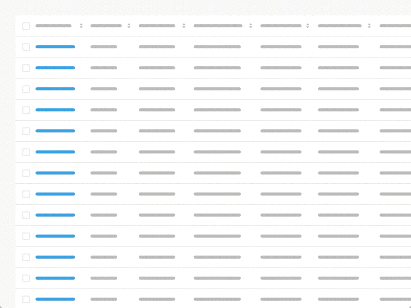

# Horizontal Scroll

Horizontal scrolling is inevitable when presenting large datasets. It is good practice to place identifier data in the first column. As an advanced feature, enable individual locking of columns so users can compare data with multiple anchoring identifiers.
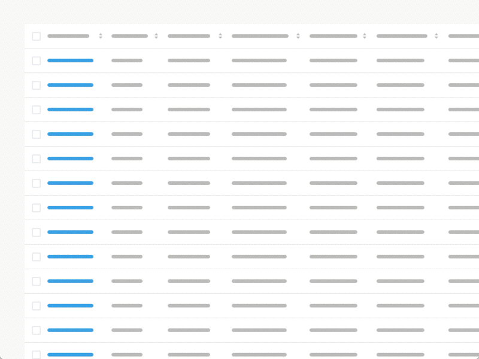

# Resizable columns

Resizing columns allows users to see abbreviated data in full.
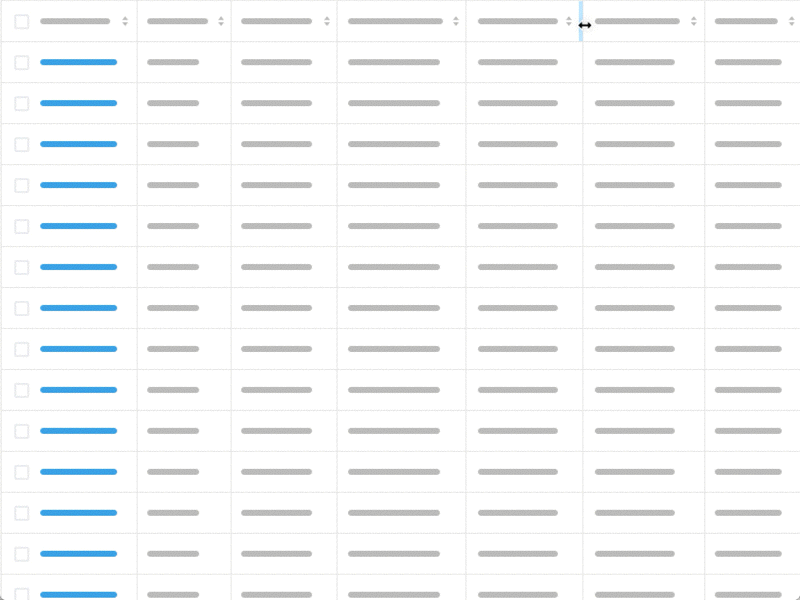

# Row Style - Zebra Stripes, Line Divisions, Free Form.

The row style helps users scan data. Reducing visual noise by removing row lines or zebra stripes works well for small datasets. Users may lose their place when parsing larger datasets. Line divisions help users keep their place. Alternating rows (aka zebra stripes) help users keep their place when scanning long horizontal datasets. Although they cause usability problems when there is a small number of rows because users may ascribe meaning to the highlighted rows.
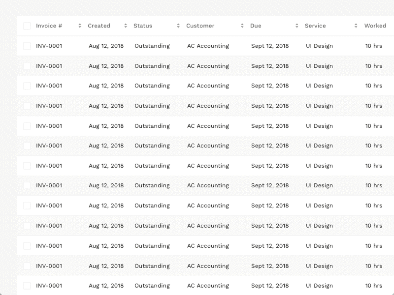

# Display Density

Smaller row height enables the user to view more data without the need for scrolling. However, it affects scannability leading to parsing errors. That is why many successful data table designs incorporate the ability to control display density.
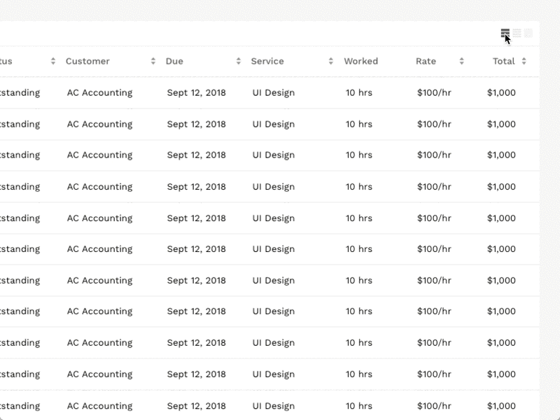

# Visual Table Summary

A visual data summary provides an overview of the accompanying table. It allows the user to spot patterns and issues in aggregate before actioning summary insights.
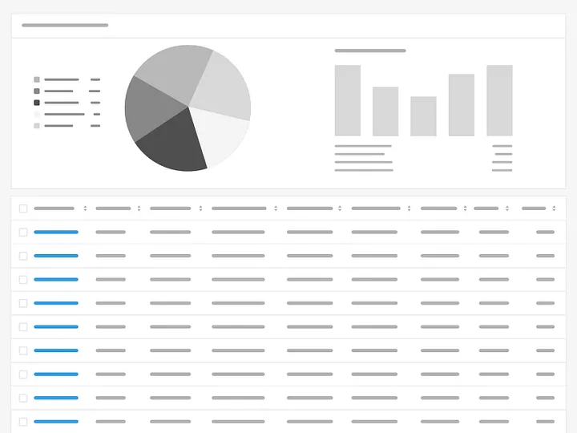

# Pagination

Pagination works by presenting a set number of rows in a view, with the ability to navigate to another set. The above example provides the ability to customize the row count per view. Infinite scroll often replaces this pattern. Infinite scroll progressively loads results as a user scrolls. Infinite scroll works well for discovery websites but is usually disastrous for prioritization apps.
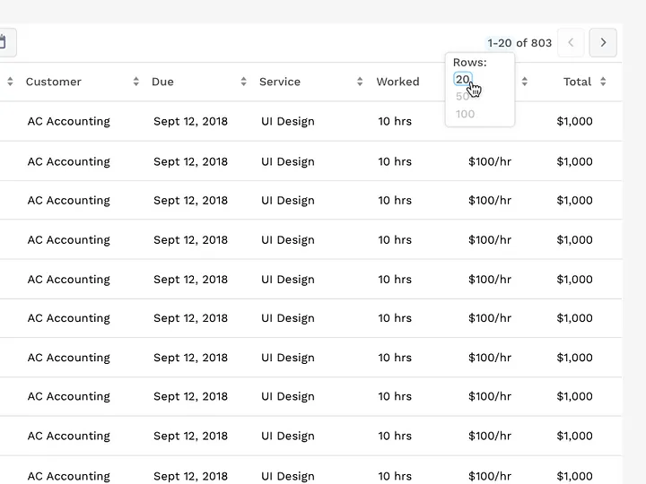

# Hover Actions

Presenting additional action when a user hovers reduces visual clutter. However, it can cause discoverability issues because the user needs to interact with the table to expose the presentation of actions.
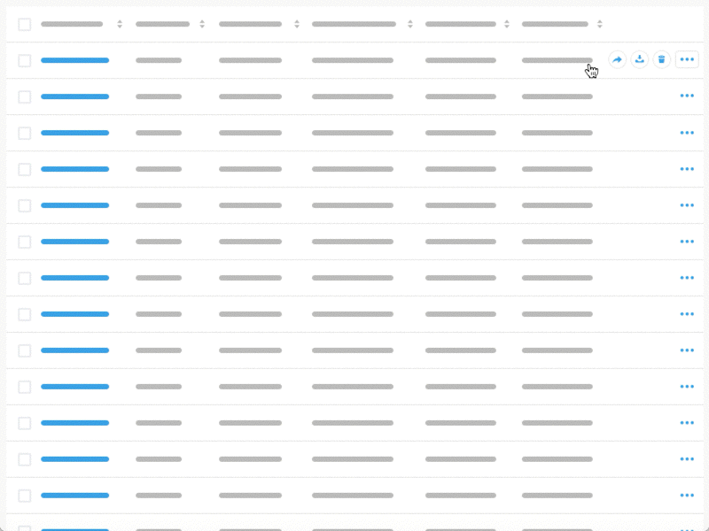

# Inline Editing

Inline editing allows the user to change data without navigating to a separate details view.
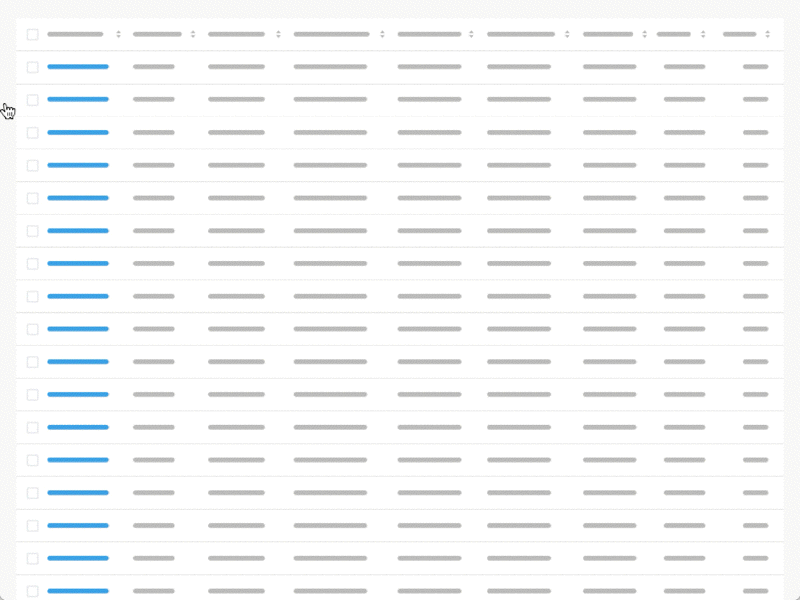

# Expandable Rows

Expandable rows allow the user to evaluate additional information without losing their context.
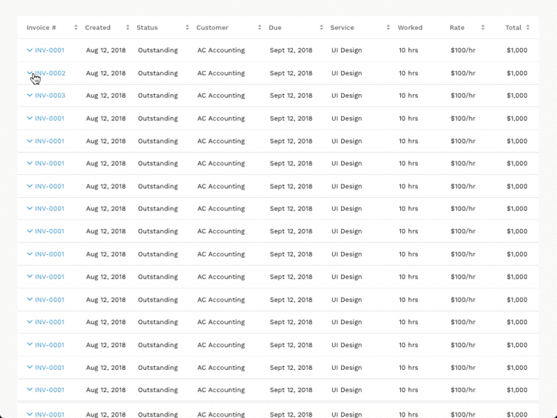

# Quick View

Much like expandable rows, quick view enables a user to view additional information while staying in context.
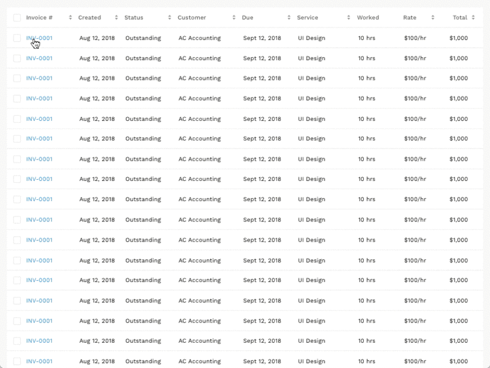

# Modal

Modals allow the user to stay within the table view but provides more focus on the additional information and actions.
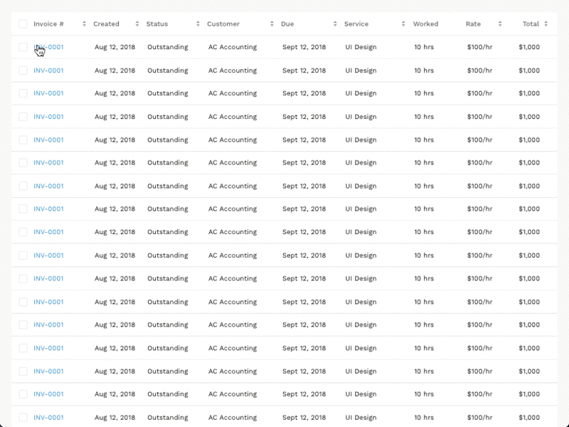

# Multi-Modal

A multi-modal feature is powerful for active use users to crank through many actions or compare details of different items.
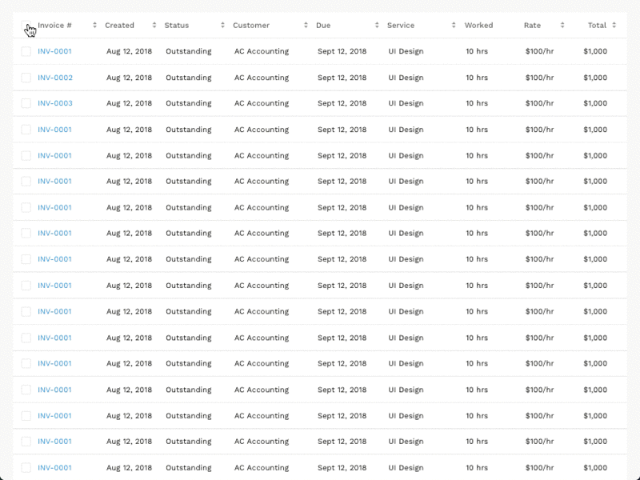

# Row to Details

Clicking on a row link transforms the table into a view with list items on the left and additional details on the right. It enables a user to parse large datasets, as well as reference many items without losing their place.
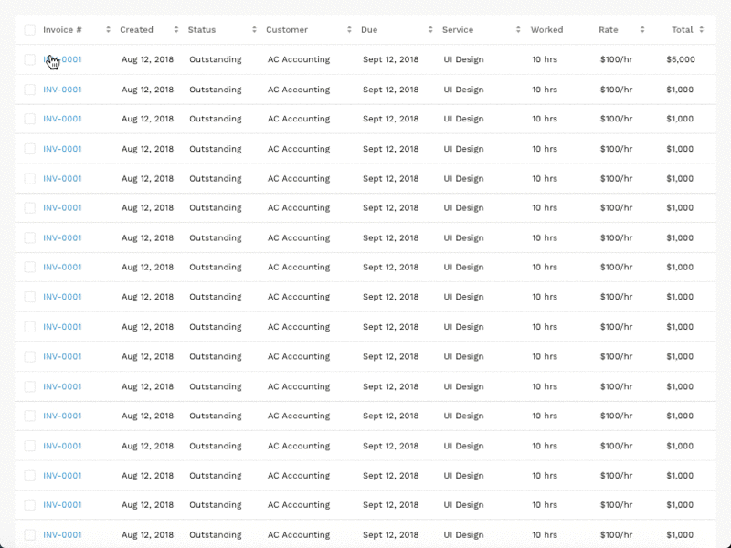

# Sortable Columns

Column sorting allows users to organize rows alphabetically and numerically.
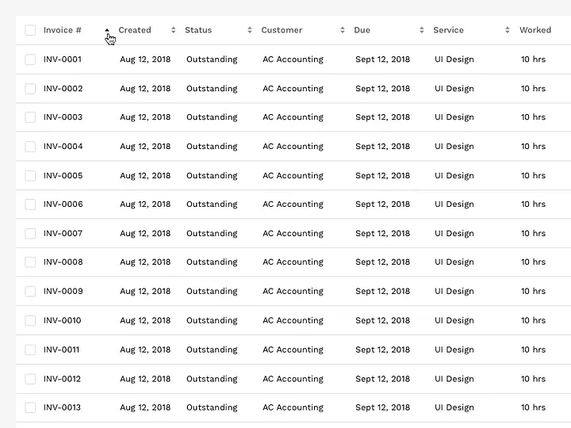

# Basic Filtering

Basic filtering allows users to manipulate the data presented in the table.
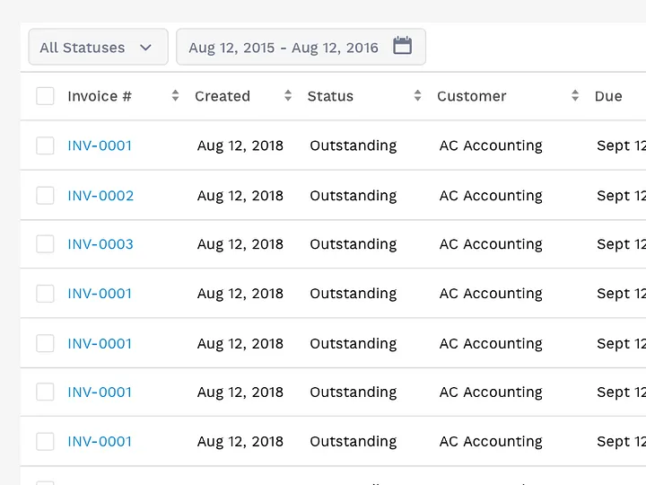

# Filter Columns

This design pattern allows users to assign filtering parameters to specific columns.
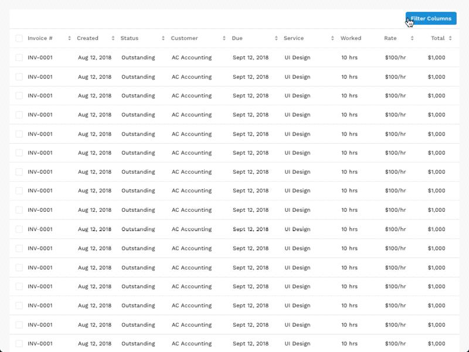

# Searchable Columns
This design pattern allows a user to search specific values within each column.
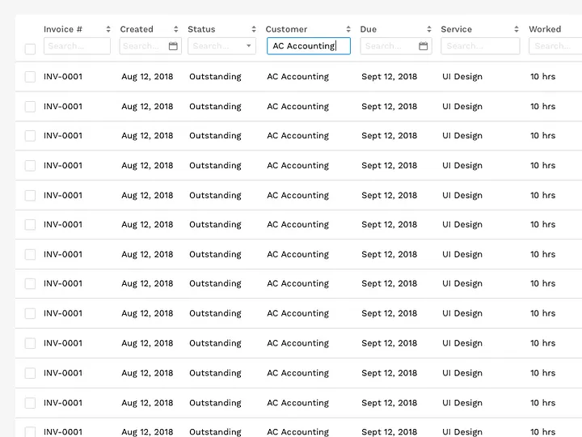

# Add Columns
This pattern allows users to add columns from a dataset. It is a way to keep the table’s data limited to essential information and enables the user to add additional columns based on their use case.
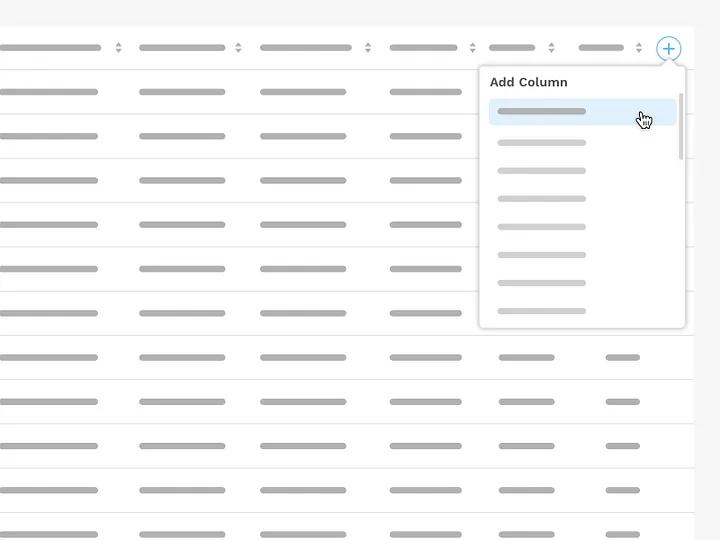

# Customizable Columns
The customizable columns feature enables users to pick the columns they want to see and sort accordingly. The feature may include the ability to save presets for later use.
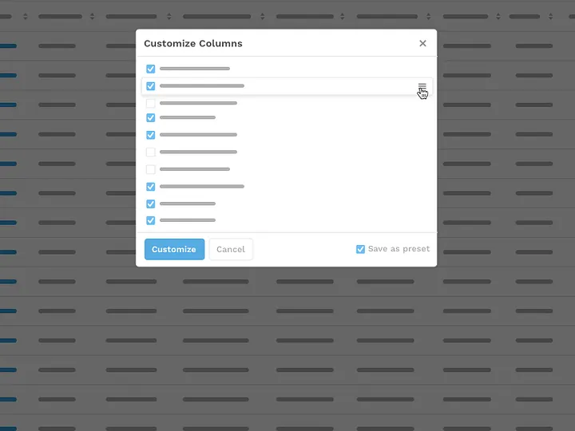

---
Sources:
- [Design better data tables. The ingredients of a successful data… | by Andrew Coyle | Medium](https://coyleandrew.medium.com/design-better-data-tables-4ecc99d23356)

Related:

Tags:
[User interface](User%20interface.md)
[Web design](Web%20design.md)