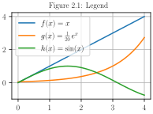
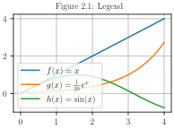
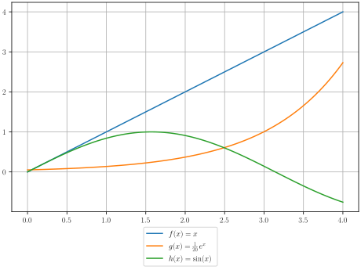

Inside overlay legend
Auto placed



```python
import numpy as np
import matplotlib.pyplot as plt
plt.rcParams['text.usetex'] = True
plt.rcParams['font.family'] = 'serif'
x = np.linspace(0, 4, 100)
plt.figure(figsize=(2.7, 2), layout='constrained')
plt.plot(x, x, label=r"$f(x) = x$")
plt.plot(x, np.exp(x)/20, label=r"$g(x) = \frac{1}{20}\, e^x$")
plt.plot(x, np.sin(x), label=r"$h(x) = \sin(x)$")
plt.grid(True)
plt.legend()
plt.title("Figure 2.1: Legend", fontsize=10)
export_plt_figure(plt, outfile="plot legend 1")
plt.show()
```

Lower left legend




```python
import numpy as np
import matplotlib.pyplot as plt
plt.rcParams['text.usetex'] = True
plt.rcParams['font.family'] = 'serif'
x = np.linspace(0, 4, 100)
plt.figure(figsize=(2.7, 2), layout='constrained')
plt.plot(x, x, label=r"$f(x) = x$")
plt.plot(x, np.exp(x)/20, label=r"$g(x) = \frac{1}{20}\, e^x$")
plt.plot(x, np.sin(x), label=r"$h(x) = \sin(x)$")
plt.grid(True)
plt.legend(loc="lower left")
plt.title("Figure 2.1: Legend", fontsize=10)
export_plt_figure(plt, outfile="plot legend 2")
plt.show()
```


```python
import numpy as np
import matplotlib.pyplot as plt
plt.rcParams['text.usetex'] = True
plt.rcParams['font.family'] = 'serif'
x = np.linspace(0, 4, 100)
plt.figure(figsize=(2.7, 2), layout='constrained')
ax = plt.subplot()
ax.plot(x, x, label=r"$f(x) = x$")
ax.plot(x, np.exp(x)/20, label=r"$g(x) = \frac{1}{20}\, e^x$")
ax.plot(x, np.sin(x), label=r"$h(x) = \sin(x)$")
ax.grid(True)
ax.legend(loc="lower left")
plt.title("Figure 2.1: Legend", fontsize=10)
export_plt_figure(plt, outfile="plot legend 3")
plt.show()
```

```python
import numpy as np
import matplotlib.pyplot as plt

ucl = ['upper', 'center', 'lower']
lcr = ['left', 'center', 'right']
fig, ax = plt.subplots(figsize=(6, 4), layout='constrained', facecolor='0.7')

ax.plot([1, 2], [1, 2], label='TEST')
# Place a legend to the right of this smaller subplot.
for loc in [
        'outside upper left',
        'outside upper center',
        'outside upper right',
        'outside lower left',
        'outside lower center',
        'outside lower right']:
    fig.legend(loc=loc, title=loc)
plt.show()
```

```python
import numpy as np
import matplotlib.pyplot as plt
plt.rcParams['text.usetex'] = True
plt.rcParams['font.family'] = 'serif'
x = np.linspace(0, 4, 100)
fig, ax = plt.subplots(figsize=(6, 4), layout='constrained')
ax.plot(x, x, label=r"$f(x) = x$")
ax.plot(x, np.exp(x)/20, label=r"$g(x) = \frac{1}{20}\, e^x$")
ax.plot(x, np.sin(x), label=r"$h(x) = \sin(x)$")
ax.grid(True)
# Place a legend to the right of this smaller subplot.
for loc in [
        'outside upper left',
        'outside upper center',
        'outside upper right',
        'outside lower left',
        'outside lower center',
        'outside lower right']:
    fig.legend(loc=loc, title=loc)
plt.show()
```



```python
import numpy as np
import matplotlib.pyplot as plt
plt.rcParams['text.usetex'] = True
plt.rcParams['font.family'] = 'serif'
x = np.linspace(0, 4, 100)
fig, ax = plt.subplots(layout='constrained')
ax.plot(x, x, label=r"$f(x) = x$")
ax.plot(x, np.exp(x)/20, label=r"$g(x) = \frac{1}{20}\, e^x$")
ax.plot(x, np.sin(x), label=r"$h(x) = \sin(x)$")
ax.grid(True)
fig.legend(loc='outside lower center')
export_plt_figure(plt, outfile="plot legend 4")
plt.show()
```