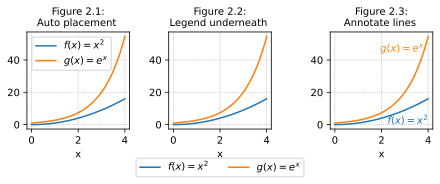

# Default best placement

Inside overlay legend
Auto placed


```python
import numpy as np
import matplotlib.pyplot as plt
plt.rcParams.update({'savefig.transparent':True, 'svg.fonttype':'none',
    'figure.constrained_layout.use':True, 'axes.titlesize': 10,
    'axes.grid':True, 'grid.linestyle':':'})
def plot_example_functions(axes):
    x = np.linspace(0, 4, 100)
    axes.set_xlabel("x")
    axes.plot(x, x, label=r"$f(x) = x$")
    axes.plot(x, np.exp(x)/20, label=r"$g(x) = \frac{1}{20}\, e^x$")
    axes.plot(x, np.sin(x), label=r"$h(x) = \sin(x)$")
def show_legend_auto(axes):
    axes.set_title("Figure 2.1: Automatic placement at best location")
    axes.legend()

fig, ax = plt.subplots(figsize=(6,2.2))
plot_example_functions(ax)
show_legend_auto(ax)
plt.savefig(@vault_path + '/attachments/plot legend auto.svg')
plt.show()
```

# Locations inside data

- Available locations: `best`, `upper right`, `upper left`, `lower left`, `lower right`, `right`, `center left`, `center right`, `lower center`, `upper center`, `center`


```python
import numpy as np
import matplotlib.pyplot as plt
plt.rcParams.update({'savefig.transparent':True, 'svg.fonttype':'none',
    'figure.constrained_layout.use':True, 'axes.titlesize': 10,
    'axes.grid':True, 'grid.linestyle':':'})
def plot_example_functions(axes):
    x = np.linspace(0, 4, 100)
    axes.set_xlabel("x")
    axes.plot(x, x, label=r"$f(x) = x$")
    axes.plot(x, np.exp(x)/20, label=r"$g(x) = \frac{1}{20}\, e^x$")
    axes.plot(x, np.sin(x), label=r"$h(x) = \sin(x)$")
def show_legend_top_right(axes):
    axes.set_title("Figure 2.2: Show legend inside data")
    axes.legend(loc="upper right")

fig, ax = plt.subplots(figsize=(6,2.2))
plot_example_functions(ax)
show_legend_top_right(ax)
plt.savefig(@vault_path + '/attachments/plot legend inside.svg')
plt.show()
```

# Custom location

- [Legend guide — Matplotlib 3.10.0 documentation](https://matplotlib.org/stable/users/explain/axes/legend_guide.html)
- [python - How to put the legend outside the plot - Stack Overflow](https://stackoverflow.com/questions/4700614/how-to-put-the-legend-outside-the-plot)
- [Customizing Plot Legends \| Python Data Science Handbook](https://jakevdp.github.io/PythonDataScienceHandbook/04.06-customizing-legends.html)

# Figure legends


```python
import numpy as np
import matplotlib.pyplot as plt
plt.rcParams.update({'savefig.transparent':True, 'svg.fonttype':'none',
    'figure.constrained_layout.use':True, 'axes.titlesize': 10,
    'axes.grid':True, 'grid.linestyle':':'})
def plot_example_functions(axes_list):
    x = np.linspace(0, 4, 100)
    for axes in axes_list:
        axes.set_xlabel("x")
    axes_list[0].plot(x, x, label=r"$f(x) = x$")
    axes_list[1].plot(x, np.exp(x)/20, color='C1',
        label=r"$g(x) = \frac{1}{20}\, e^x$")
    axes_list[2].plot(x, np.sin(x), color='C2', 
        label=r"$h(x) = \sin(x)$")
def show_legend_alongside_subplots(figure):
    figure.suptitle("Figure 2.4: Combined figure legend for all axes",
        fontsize=10)
    figure.legend(loc="outside center right")

fig, axs = plt.subplots(ncols=3, figsize=(6,2.2))
plot_example_functions(axs)
show_legend_alongside_subplots(fig)
plt.savefig(@vault_path + '/attachments/plot legend figure.svg')
plt.show()
```

# Figure collection for note preview

See [figures for print documents (PDF)](./attachments/plot-legend.pdf) or figures for displays:



```python
import numpy as np
import matplotlib.pyplot as plt
plt.rcParams.update({'savefig.transparent':True, 'svg.fonttype':'none',
    'figure.constrained_layout.use':True, 'axes.titlesize': 10,
    'axes.grid':True, 'grid.linestyle':':'})
def plot_example_function_foreach(axes_list):
    for axes in axes_list:
        x = np.linspace(0, 4, 100)
        axes.set_xlabel("x")
        axes.plot(x, np.pow(x, 2), 
            label=r"$f(x) = x^2$")
        axes.plot(x, np.exp(x), 
            label=r"$g(x) = e^x$")
def show_legend_best(axes):
    axes.set_title("Figure 2.1:\n Auto placement")
    axes.legend()
def show_legend_underneath(axes):
    axes.set_title("Figure 2.2:\n Legend underneath")
    box = axes.get_position()
    axes.legend(loc='upper center', bbox_to_anchor=(0.5, -0.25), ncols=2)
def annotate_lines(axes):
    axes.set_title("Figure 2.3:\n Annotate lines")
    axes.text(4, 0, r"$f(x) = x^2$", 
        horizontalalignment='right', color='C0')
    axes.text(3.8, 45, r"$g(x) = e^x$", 
        horizontalalignment='right', color='C1')

fig, axs = plt.subplots(ncols=3, figsize=(6,2.6))
plot_example_function_foreach(axs)
show_legend_best(axs[0])
show_legend_underneath(axs[1])
annotate_lines(axs[2])
plt.savefig(@vault_path + '/attachments/plot legend.svg')

# Redraw figure for print documents
plt.rcParams.update({'text.usetex':True, 'font.family':'serif'})
plt.clf()
fig, axs = plt.subplots(ncols=3, figsize=(6,2.6))
plot_example_function_foreach(axs)
show_legend_best(axs[0])
show_legend_underneath(axs[1])
annotate_lines(axs[2])
plt.savefig(@vault_path + '/attachments/plot legend.pdf')
plt.show()
```


[Other plot legends](Other%20plot%20legends.md)