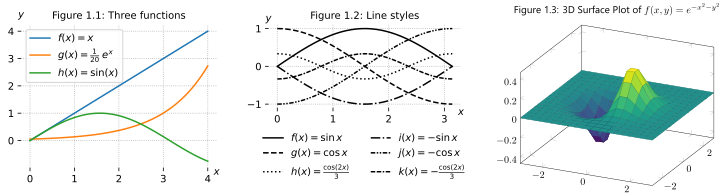

This is my Digital Garden - a collection of interconnected notes on topics that interest me or that I want to preserve. Unlike a blog, this is an evolving network of ideas and information. The content includes guides, glossaries, tips and tricks, personal thoughts, documentation, and summaries.

To navigate, simply follow the links between notes or search keywords. There's no strict hierarchy; instead, ideas are connected in a wiki-like graph network. You can start exploring by checking out these topics:

[LaTeX - Typeset mathematical and scientific notation, handle cross-referencing and citations, and position images according to defined placement rules](./latex/index.md)

[Plots - Dynamically plot mathematical functions, values as a vector graphic](./plots/index.md)

[PowerShell - A command-line shell and scripting language to manage Windows system and automate administrative tasks](./powershell/index.md)

[Computer - Setup my computers](./computer/index.md)

[Visual Media - List movies, television series, YouTube channels, and theatrical performances](./visual-media/index.md)

Other
- [Robotics](./Robotics.md)
- [Factorio - A game about automation, logistics and network optimizations](./factorio/index.md)
- [Computer Language](./Computer-Language.md)
- [Human language](./Human-language.md)
- [Windows](./windows/index.md)
- [Workflows - Improve workflow in applications](./Workflows.md)
- [Discussions](./Discussions.md)

This is a personal space for learning and growth, so you may encounter unfinished thoughts or work-in-progress pages. URLs to specific notes might change over time, as I update, restructure, or unlink pages.

Feel free to explore.