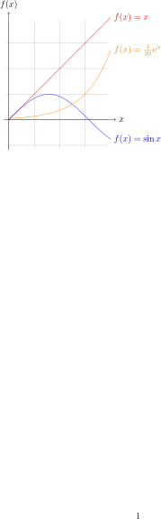

- modern LaTeX3 package with key-value configuration
- why not just booktabs

There are dozens[^1] of packages for tables, and built-in environments, so what is the problem. 

# My Design Principles

- Keep the table data **raw**, and readable: No ma                                  cros in table content (except math macros supported by MathJax, KaTeX)
- Row, column **headers**: More rows than columns; **Narrow** (down) **titles**; **Group** similar titles; Put more important columns to the left
- Make layout **light-weight**: Few border lines; Spacing between cells, rows, columns; Few colors; Visually guide horizontal reading (Zebra, dashed lines)
- Horizontal **alignment**: **Left**-align text, row headers; **Right**-align numbers; **Center**-align column headers
- [How to design good tables](How%20to%20design%20good%20tables.md)
- [Syntax - How to write tables](Syntax%20-%20How%20to%20write%20tables.md)

# Format headings (first row, first column)

- **Group** row, column headings, see 1a
- Visually clarify table **boundaries**: Thick horizontal lines 1a
- Visually clarify **column titles** and **row titles**: Thin border line 1b, 1c; Left-aligned first column 1a, 1b
- Apply border **pattern**: Inner **gridlines** $\mathrm{1c}$
- Multicolumn header
- See source examples: [Format table headings](./format%20table%20headings.md)


# Process, format cell body

## Format raw cell body

- [Format raw cell body](Format%20raw%20cell%20body.md)
- See [Follow varying typographic conventions with the same input syntax](./follow%20varying%20typographic%20conventions%20with%20the%20same%20input%20syntax.md)
- Stats

## Import data from files

- Keep the data in **raw** and **universal** (csv) form: Update data anytime with external programs like Excel, Python, MATLAB, R, PowerShell
- Render **scientific notation** correctly and **uniform**: Render `4.41941738e-02` as $4.42 \cdot 10^{-2}$ $\mathrm{3a, 3b, 3c}$ 
- **Format numbers**: Set max. decimal places $\mathrm{3a, 3b, 3c}$; When to show exponent $\mathrm{3c}$; Use German commas $\mathrm{3b}$
- Visually **guide horizontal reading**: Shade every other row $\mathrm{3a}$; Add dashed line every third row $\mathrm{3b}$ 
- Process input data: sort with column $\mathrm{3c}$ 
- More ideas: filter, sort, custom column titles, multi column names, Align at decimal or scientific separator
- See source examples: [Process, and format values from files](./process%20and%20format%20values%20from%20files.md)


## Advanced input processing

- formatted text, multicolumn, code in table, image in content, empty cell, postproc, true/false → tickboxes, postprocess make command, detect backtick for commands
- convert backticks to verbatim
- convert text to textbackslash, texttt
- convert `X \ Y` to diagonal row title and column title
- detect columntitle is first markdown column is left aligned
- detect diagonal splitcell in top-leftmost when is contains `\`
- make all math displaymode, inline, fancyfrac [Nicefrac, sfrac - Nice fractions for inline math](Nicefrac,%20sfrac%20-%20Nice%20fractions%20for%20inline%20math.md)

Image in table

Calculate column sum

# Layout, reference the table

## Split table in page columns

- Split in equal parts
- See source examples: [Layout the table](./layout%20the%20table.md)
- 4a: Longtable split in half
- References


## Create a simple table with borders

- Visually clarify table **boundaries**: Thick horizontal lines $\mathrm{1a}$; Thick frame $\mathrm{1c}$
- Visually clarify **column titles** and **row titles**: Thin border line $\mathrm{1a, 1b}$; Left-aligned row title $\mathrm{1b, 1c}$; Bold font $\mathrm{1c}$
- Apply border **pattern**: Inner **gridlines** $\mathrm{1c}$
- See source examples: [Create a simple table with borders](./create%20a%20simple%20table%20with%20borders.md)


## Add title and reference the table elsewhere

- **Placement, alignment**: center the table horizontally
- Add **references**: caption underneath and in the list of tables, label to cross-reference elsewhere
- More ideas: legende, Multifigure, Split, Longtable, surpress tableoftables entry, table next to text, globally set placement specifiers
- Center, Caption, Reference, Longtable, Caption below/above, Caption number, Figurename
- See source examples [Add title numbers, caption, and reference the table elsewhere](./add%20title%20numbers,%20caption,%20and%20reference%20the%20table%20elsewhere.md) 

2: diagonal cell A1
multi column header


# Export formatted table

$$
\begin{gather*}
\text{Table 1a:} \\
\begin{array}{ccc} \hline
\textbf{Name} & \textbf{Uniform} & \textbf{Alt code} \\ \hline
\alpha\ \backslash\texttt{alpha} & \text{U+03B1} & \text{Alt 224} \\
\gamma\ \backslash\texttt{gamma} & \text{U+0393} & \text{Alt 226} \\
\delta\ \backslash\texttt{delta} & \text{U+03B4} & \text{Alt 235}   \\ \hline
\end{array}
\end{gather*}
$$

|       Name        | Uniform | Alt code |
| :---------------: | :-----: | :------: |
| $\alpha$ `\alpha` | U+03B1  | Alt 224  |
| $\gamma$ `\gamma` | U+0393  | Alt 226  |
| $\delta$ `\delta` | U+03B4  | Alt 235  |

```latex
\documentclass{article}

\usepackage{pgfplotstable}

\begin{document}

% Original data
\pgfplotstableread{
    0.0     75.9638
    0.380665    206.565
    0.58711     243.435
    0.793555    333.435
}\data

% Get column names
\pgfplotstablegetcolumnnamebyindex{0}\of{\data}\to{\firstcolumnname}
\pgfplotstablegetcolumnnamebyindex{1}\of{\data}\to{\secondcolumnname}

% Retrieve desired element
\pgfplotstablegetelem{1}{[index]1}\of\data

% Perform calculation, save to \result
\pgfmathsetmacro\result{\pgfplotsretval + 360}

% Assemble new line
\edef\createsumrow{\noexpand\pgfplotstableread[header=has colnames,col sep=comma,row sep=crcr]{
    \firstcolumnname,\secondcolumnname\noexpand\\
    1.0,\result\noexpand\\
}\sum}
\createsumrow

% Concatenate
\pgfplotstablevertcat{\data}{\sum}

% Output
\pgfplotstabletypeset{\data}

\end{document}
```

# Formatting - Create table styles and apply them across your document

- Center
- Hlines
- Grid
- Environments
- Colors
- Dashed line every 5th row

## Key Managment

[Key Management - PGF/TikZ Manual](https://tikz.dev/pgfkeys#sec-87.2)

- full key (similar to absolute path): starts with a `/` slash like `/pgf/table/a`
- partial key (similar to relative path): doesn't start with a `/` slash like `a`
- handler (like hidden files): start with a `.` dot like `.code`

Handlers
- change directory `.cd` like `\pgfkeys{/pgf/table/.cd, a=}`
- quote link key (similar to soft link)
- use a macros value `.expand once=` `.expand twice` `.expanded`
- calculate `.evaluated`
- pass on `/.forward to`

Debug
- show value `.show value`
- show code `.show code`
- execute as key's code `/utils/exec=⟨code⟩`

Set key
```latex
\pgfkeys{/my key/.code=The value is '#1'.} % Create key
\pgfkeys{/my key=hi!} % Set key
```

Get key
```latex
\pgfkeys{/my key/.initial=red}
\pgfkeys{/my key=blue}
\pgfkeys{/my key/.get=\mymacro}
\mymacro
```


```latex
\pgfkeys{
  /a/.code=(a:#1),
  /b/.code=(b:#1),
  /b/.forward to=/a,
  /c/.forward to=/a
}
\pgfkeys{/b=1} \pgfkeys{/c=2}
```
- output: `(b:1)(a:1) (a:2)`
 

# How

- pgf keys for pgfplotstable styles
- tabulararray for better spacing
- tabularray interface 1 for pgf code injection
- no bookstabs because bad borders

# Inspiration

- [City Index | Dan Caldwell](https://caldwell.org/projects/data/city-index)
- [Styling Tables the Modern CSS Way - Piccalilli](https://piccalil.li/blog/styling-tables-the-modern-css-way/)

# Syntax

```tex
\documentclass{article}
\usepackage{yetenol-styles}
\pgfplotstableset{⟨globally applied styles⟩}
\begin{document}

\pgfplotstabletypeset[⟨individual styles⟩]{⟨input file or table cells⟩}

\end{document}
```


# Examples

- import the file [yetenol-styles.sty](latex-tables.md#Styling%20setup) for the required style definitions

Code in table

```tex
\documentclass{article}
\begin{document}
\begin{tabular}{cc}
    Special & \verb`\abc{}$&^_^uvw 123` \\
    Spacing & \verb`\bfseries\ \#\%` \\
    Nesting & \verb`$\left\\\{A\right.$\#`
\end{tabular}
\end{document}
```

```tex
\documentclass{article}
\usepackage{tabularray,codehigh}
\begin{document}
\begin{tblr}{hlines}
    Special & \fakeverb{\abc{}$&^_^uvw 123} \\
    Spacing & \fakeverb{\bfseries\ \#\%} \\
    Nesting & \fbox{\fakeverb{$\left\\\{A\right.$\#}}
\end{tblr}
\end{document}
```

```tex
\documentclass{article}
\usepackage{pgfplotstable,listings,filecontents}
\pgfplotstableset{
    /pgfplots/compat = 1.17,
    mixedtable/.style = {col sep = &, row sep = newline, string type},
}
\lstset{
morecomment=[is]\~\%,
}
\begin{document}
\begin{filecontents}{table.tex}
~ x & y %\abc{}$&^_^uvw 123
~ langer text & 2 %\bfseries\ \#\%
~ 3 & 4 %
~ 5 & 6 %$\left\\\{A\right.$\#
\end{filecontents}
\begin{minipage}{0.5\textwidth}
\raggedleft
\pgfplotstabletypeset[mixedtable]{table.tex}
\end{minipage}
% \hfill
\begin{minipage}{0.5\textwidth}
\raggedright
\begin{lstinputlisting}[firstline=5]{table.tex}
\end{lstinputlisting}
\end{minipage}

\end{document}
```

```tex
\documentclass{article}
\usepackage{amsmath,amssymb,array,longtable,booktabs}
\begin{document}
\begin{longtable}[]{@{}ll@{}}
    \toprule\noalign{}
    Command & Rendering \\
    \midrule\noalign{}
    \endhead
    \bottomrule\noalign{}
    \endlastfoot
    \texttt{\textbackslash{}lnot} & \(\lnot\) \\
    \texttt{\textbackslash{}land} & \(\land\) \\
    \texttt{\textbackslash{}lor} & \(\lor\) \\
    \texttt{\textbackslash{}to} & \(\to\) \\
    \texttt{\textbackslash{}gets} & \(\gets\) \\
    \texttt{\textbackslash{}iff} & \(\iff\) \\
    \texttt{\textbackslash{}implies} & \(\implies\) \\
    \texttt{\textbackslash{}impliedby} & \(\impliedby\) \\
    \texttt{\textbackslash{}mathbb\{R\}} & \(\mathbb{R}\) \\
    \texttt{\textbackslash{}approx} & \(\approx\) \\
    \texttt{\textbackslash{}subseteq} & \(\subseteq\) \\
    \texttt{\textbackslash{}supseteq} & \(\supseteq\) \\
    \texttt{\textbackslash{}setminus} & \(\setminus\) \\
    \texttt{\textbackslash{}times} & \(\times\) \\
    \texttt{\textbackslash{}leq} & \(\leq\) \\
    \texttt{\textbackslash{}geq} & \(\geq\) \\
    \texttt{\textbackslash{}cap} & \(\cap\) \\
    \end{longtable}
\end{document}
```

Create a **simple** table

```tex
\documentclass{article}
\usepackage{pgfplotstable}
\pgfplotstableset{
    /pgfplots/compat = 1.17,
    tabular/.style = {col sep = &, row sep = \\, string type},
}
\begin{document}
\pgfplotstabletypeset[tabular]{
    Name & Identifier \\
    Carl & 3 \\
    Peter & 7 \\
    Lara & 1 \\
}
\end{document}
```


Create a **center aligned** table with **horizontal lines** around the header and at the end of the table

```tex
\documentclass{standalone}
\usepackage{amsmath,amssymb,pgfplotstable}
\pgfplotstableset{
    /pgfplots/compat = 1.17,
    tabular/.style = {col sep = &, row sep = \\, string type},
    centering/.style = {
        begin table/.add = {\parskip=0pt\par\nopagebreak\centering{}}{},
        end table/.add = {}{\par\noindent\ignorespacesafterend{}},
    },
    hlines/.style = {
        every head row/.style = {before row = \hline, after row = \hline},
        every last row/.style = {after row = \hline},
    },
}
\begin{document}
\pgfplotstabletypeset[tabular,centering,hlines]{
    Name & Identifier \\
    Carl & 3 \\
    Peter & 7 \\
    Lara & 1 \\
}
\end{document}
```


Generate a table from a **csv**-spreadsheet (comma separated values)
- requires [resources/data.csv](latex-tables.md#Example%20files)

```tex
\documentclass{article}
\usepackage{amsmath,amssymb,pgfplotstable}
\pgfplotstableset{
    /pgfplots/compat = 1.17,
    csv/.style = {col sep = comma, row sep = newline, numeric type},
}
\begin{document}
\pgfplotstabletypeset[csv]{resources/data.csv}
\end{document}
```


Generate a table from a **csv** [file](latex-tables.md#Example%20files) and **color** every other row

```tex
\documentclass{article}
\usepackage{yetenol-styles}
\pgfplotstableset{booktabs,center,alternate}
\begin{document}

\pgfplotstabletypeset[csv]{resources/data.csv}

\end{document}
```


Add a table **caption** and a **label** for cross references

```tex
\documentclass{article}
\usepackage{amsmath,amssymb,pgfplotstable,tabularray,float,hyperref}
\hypersetup{colorlinks=true, linkcolor=blue}
\pgfplotstableset{
    /pgfplots/compat = 1.17,
    tabular/.style = {col sep = &, row sep = \\, string type},
    tblr/.style = {begin table = \begin{tblr}, end table = \end{tblr}},
    hlines/.style = {
        every head row/.style = {before row = \hline, after row = \hline},
        every last row/.style = {after row = \hline},
    },
    centering/.style = {
        begin table/.add = {\parskip=0pt\par\nopagebreak\centering{}}{},
        end table/.add = {}{\par\noindent\ignorespacesafterend{}},
    }
}
\begin{document}
Each person gets assigned a number listed in table \ref{tab:identifiers} on page \pageref{tab:identifiers}.
\begin{table}[H]
\pgfplotstabletypeset[tabular,tblr,centering,hlines]{
    Name & Identifier \\
    Carl & 3 \\
    Peter & 7 \\
    Lara & 1 \\
}\caption{People's identifiers}\label{tab:identifiers}
\end{table}
\end{document}
```


Use **german** number seperator $3,\!1416$ and **align at exponent** in scientific representation $\cdot 10^n$

```tex
\documentclass{article}
\usepackage{amsmath,amssymb,pgfplotstable,booktabs}
\pgfplotstableset{
    /pgfplots/compat = 1.17,
    csv/.style = {col sep = comma, row sep = newline, numeric type},
    hlines2/.style = {
        every head row/.style = {before row = \toprule, after row = \midrule},
        every last row/.style = {after row = \bottomrule},
    },
    german/.style = {dec sep={,\!}, 1000 sep ={\,}},
}
\begin{document}
\pgfplotstabletypeset[csv,hlines2,german,sci sep align]{resources/data.csv}
\end{document}
```


Allow table to split across **multiple pages**

```tex
\documentclass{article}
\usepackage{amsmath,amssymb,pgfplotstable,longtable,booktabs}
\pgfplotstableset{
    /pgfplots/compat = 1.17,
    csv/.style = {col sep = comma, row sep = newline, numeric type},
    hlines2/.style = {
        every head row/.style = {before row = \toprule, after row = \midrule},
        every last row/.style = {after row = \bottomrule},
    },
    longtable/.style = {
        begin table = \begin{longtable},
        end table = \end{longtable},
        every head row/.append style = {
            after row/.append = \endhead
        }
    },
}
\begin{document}
\,\vspace{15cm} % Force table to split
\pgfplotstabletypeset[csv,hlines2,longtable]{resources/data.csv}
\end{document}
```


```tex
\documentclass{article}
\usepackage{yetenol-styles}
\pgfplotstableset{booktabs,center}
\begin{document}

Each person gets assigned a number listed in table \ref{tab:identifiers} on page \pageref{tab:identifiers}.

\begin{table}\pgfplotstabletypeset[tabular]{
    Name & Identifier \\
    Carl & 3 \\
    Peter & 7 \\
    Lara & 1 \\
}\caption{People's identifiers}\label{tab:identifiers}
\end{table}

\end{document}
```


Use **german** number seperator $3,\!1416$ and **align at exponent** in scientific representation $\cdot 10^n$

```tex
\documentclass{article}
\usepackage{yetenol-styles}
\pgfplotstableset{booktabs,center,german,sci sep align}
\begin{document}

\pgfplotstabletypeset[csv]{resources/data.csv}

\end{document}
```


Allow table to split across **multiple pages**

```tex
\documentclass{article}
\usepackage{yetenol-styles}
\pgfplotstableset{booktabs,center}
\begin{document}
\,\vspace{15cm} % Force table to split

\pgfplotstabletypeset[csv,longtable]{resources/data.csv}

\end{document}
```


Hlines like bookstabs

```tex
\documentclass{article}
\usepackage{amsmath,amssymb,pgfplotstable,booktabs}
\pgfplotstableset{
    /pgfplots/compat = 1.17,
    tabular/.style = {col sep = &, row sep = \\, string type},
    hlines2/.style = {
        every head row/.style = {before row = \toprule, after row = \midrule},
        every last row/.style = {after row = \bottomrule},
    },
}
\begin{document}
\pgfplotstabletypeset[tabular,hlines2]{
    Column 1 & Column 2 & Column 3 \\
    Data 1 & 10 & 20.5 \\
    Data 2 & 15 & 30.7 \\
    Data 3 & 20 & 40.9 \\
    Data 4 & 25 & 50.1 \\
}
\end{document}
```



```tex
\documentclass{article}
\usepackage{amsmath,amssymb,pgfplotstable,tabularray}
\pgfplotstableset{
    /pgfplots/compat = 1.17,
    tabular/.style = {col sep = &, row sep = \\, string type},
    tabularray/.style = {begin table = \begin{tblr}, end table = \end{tblr}},
    hlines/.style = {
        every head row/.style = {before row = \hline, after row = \hline},
        every last row/.style = {after row = \hline},
    },
}
\begin{document}
\pgfplotstabletypeset[tabular,tabularray,hlines]{
    Column 1 & Column 2 & Column 3 \\
    Data 1 & 10 & 20.5 \\
    Data 2 & 15 & 30.7 \\
    Data 3 & 20 & 40.9 \\
    Data 4 & 25 & 50.1 \\
}
\end{document}
```


Vlines and hlines

```tex
\documentclass{article}
\usepackage{amsmath,amssymb,pgfplotstable,tabularray,booktabs}
\pgfplotstableset{
    /pgfplots/compat = 1.17,
    tabular/.style = {col sep = &, row sep = \\, string type},
    tabularray/.style = {begin table = \begin{tblr}, end table = \end{tblr}},
    hlines/.style = {
        every head row/.style = {before row = \hline, after row = \hline},
        every last row/.style = {after row = \hline},
    },
    vline/.style = {every first column/.style = {column type=l|,string type}},
}
\begin{document}
\pgfplotstabletypeset[tabular,tabularray,hlines,vline]{
    Column 1 & Column 2 & Column 3 \\
    Data 1 & 10 & 20.5 \\
    Data 2 & 15 & 30.7 \\
    Data 3 & 20 & 40.9 \\
    Data 4 & 25 & 50.1 \\
}
\end{document}
```


Shade every second row

```tex
\documentclass{article}
\usepackage{amsmath,amssymb,pgfplotstable,tabularray,xcolor}
\pgfplotstableset{
    /pgfplots/compat = 1.17,
    tabular/.style = {col sep = &, row sep = \\, string type},
    tabularray/.style = {begin table = \begin{tblr}, end table = \end{tblr}},
    hlines/.style = {
        every head row/.style = {before row = \hline, after row = \hline},
        every last row/.style = {after row = \hline},
    },
    hshade/.style = {every even row/.style = {before row = {\SetRow{gray9}}}},
}
\begin{document}
\pgfplotstabletypeset[tabular,tabularray,hlines,hshade]{
    Column 1 & Column 2 & Column 3 \\
    Data 1 & 10 & 20.5 \\
    Data 2 & 15 & 30.7 \\
    Data 3 & 20 & 40.9 \\
    Data 4 & 25 & 50.1 \\
}
\end{document}
```


```tex
\documentclass{article}
\usepackage{amsmath,amssymb,pgfplotstable,booktabs,colortbl}
\pgfplotstableset{
    /pgfplots/compat = 1.17,
    tabular/.style = {col sep = &, row sep = \\, string type},
    tabularray/.style = {begin table = \begin{tblr}, end table = \end{tblr}},
    hlines2/.style = {
        every head row/.style = {before row = \toprule, after row = \midrule},
        every last row/.style = {after row = \bottomrule},
    },
    hshade2/.style = {every even row/.style = {before row = {\rowcolor[gray]{0.9}}}},
}
\begin{document}
\pgfplotstabletypeset[tabular,hlines2,hshade2]{
    Column 1 & Column 2 & Column 3 \\
    Data 1 & 10 & 20.5 \\
    Data 2 & 15 & 30.7 \\
    Data 3 & 20 & 40.9 \\
    Data 4 & 25 & 50.1 \\
}
\end{document}
```


```tex

```

```tex
\documentclass{article}
\usepackage{}
```

```
\pgfplotstabletypeset{
$z$      & 0                       & 4                                 & 12                       \\
$p_Z(z)$ & $p_X(0) = \dfrac{1}{6}$ & $p_X(-4) + p_X(4) = \dfrac{1}{2}$ & $p_X(12) = \dfrac{1}{3}$ \\
}
```

```tex
\NeedsTeXFormat{LaTeX2e}
\ProvidesPackage{yetenol-styles}[]
\RequirePackage{pgfplotstable} %%%%%%%%%% STYLE TABLES %%%%%%%%%%
\RequirePackage{booktabs}
\pgfplotsset{compat=1.17}
\RequirePackage{float} %%%%% By default place tables at precisely their location in the code
\floatplacement{table}{H}
\RequirePackage{booktabs} %%%%% Horizontal lines around table and header
\pgfplotstableset{
    booktabs/.style = {
        every head row/.style = {
            before row = \toprule, 
            after row = \midrule
        },
        every last row/.style = {
            after row = \bottomrule
        },
    },
}
\pgfplotstableset{
    center/.style = { %%%%% Horizontally align the table in the center of the page
        begin table/.add = {\parskip=0pt\par\nopagebreak\centering{}}{},
        end table/.add = {}{\par\noindent\ignorespacesafterend{}},
    },
    tabular/.style = { %%%%% Read default tabular values
        col sep = &, 
        row sep = \\,  
        string type,
    },
    csv/.style = { %%%%% Read comma seperated values
        col sep = comma,
        row sep = newline,
    },
    german/.style = { %%%%% Use german number seperators
        dec sep={,\!}, 
        1000 sep ={\,},
    },
    hasrowname/.style={
        every first column/.style={
            column type=l|,
            string type,
        },
    },
    noheader/.style = {
        header = false, % don't detect header
        every head row/.style={output empty row},  % removes the automatic header
         every last row/.style = {
            after row = {} % clear bottom line
        },
    },
}
\RequirePackage{colortbl} %%%%% Color every other row
\pgfplotstableset{
    alternate/.style = {
        every even row/.style= {
            before row={\rowcolor[gray]{0.9}}
        },
    },
}
\RequirePackage{longtable} %%%%% Allow table to split across multiple pages
\pgfplotstableset{
    longtable/.style = {
        begin table = \begin{longtable},
        end table = \end{longtable},
        every head row/.append style = {
            after row/.append = \endhead
        }
    },
}
\RequirePackage{tabularray}
\pgfplotstableset{
    tabularray/.style = {
        begin table = \begin{tblr},
        end table = \end{tblr},
        every head row/.style = {
            before row = \hline, 
            after row = \hline
        },
        every last row/.style = {
            after row = \hline
        },
        % every head row/.style = {
        %     before row = \toprule, 
        %     after row = \midrule
        % },
        % every last row/.style = {
        %     after row = \bottomrule
        % },
    },
}
```

# Add custom styling

- add overleaf style to replace default middle column type to be still use Overleaf's visual table editor

```tex
\newcolumntype{m}[1]{>{\begin{pgfplotstablecoltype}[#1]}r<{\end{pgfplotstablecoltype}}}
```

- `empty cells with={--},`
- [Index | PgfplotsTable Manual](https://texdoc.org/serve/pgfplotstable/0#page=68)
- [5.3 A summary of how to define and use styles and keys | PgfplotsTable Manual](https://texdoc.org/serve/pgfplotstable/0#page=59)
- [TikZ & PGF Manual](https://texdoc.org/serve/pgf/0)

# Styling setup

Manually add the file `yetenol-styles.sty`

```tex
\NeedsTeXFormat{LaTeX2e}
\ProvidesPackage{yetenol-styles}[]
\RequirePackage{pgfplotstable} %%%%%%%%%% STYLE TABLES %%%%%%%%%%
\RequirePackage{booktabs}
\pgfplotsset{compat=1.17}
\RequirePackage{float} %%%%% By default place tables at precisely their location in the code
\floatplacement{table}{H}
\RequirePackage{booktabs} %%%%% Horizontal lines around table and header
\pgfplotstableset{
    booktabs/.style = {
        every head row/.style = {
            before row = \toprule, 
            after row = \midrule
        },
        every last row/.style = {
            after row = \bottomrule
        },
    },
}
\pgfplotstableset{
    center/.style = { %%%%% Horizontally align the table in the center of the page
        begin table/.add = {\parskip=0pt\par\nopagebreak\centering{}}{},
        end table/.add = {}{\par\noindent\ignorespacesafterend{}},
    },
    tabular/.style = { %%%%% Read default tabular values
        col sep = &, 
        row sep = \\,  
        string type,
    },
    csv/.style = { %%%%% Read comma seperated values
        col sep = comma,
        row sep = newline,
    },
    german/.style = { %%%%% Use german number seperators
        dec sep={,\!}, 
        1000 sep ={\,},
    },
}
\RequirePackage{colortbl} %%%%% Color every other row
\pgfplotstableset{
    alternate/.style = {
        every even row/.style= {
            before row={\rowcolor[gray]{0.9}}
        },
    },
}
\RequirePackage{longtable} %%%%% Allow table to split across multiple pages
\pgfplotstableset{
    longtable/.style = {
        begin table = \begin{longtable},
        end table = \end{longtable},
        every head row/.append style = {
            after row/.append = \endhead
        }
    },
}
```

# Example files

Add a comma-seperated spreadsheet to `resources/data.csv`

```csv
# Convergence results
# fictional source generated 2008
level,dof,$e_1$,$e_2$,info,{a,b},quot(error1)
1,9,2.50000000e-01,7.57858283e-01,48,0,0
2,25,6.25000000e-02,5.00000000e-01,25,-1.35691545e+00,4
3,81,1.56250000e-02,2.87174589e-01,41,-1.17924958e+00,4
4,289,3.90625000e-03,1.43587294e-01,8,-1.08987331e+00,4
5,1089,9.76562500e-04,4.41941738e-02,22,-1.04500712e+00,4
6,4225,2.44140625e-04,1.69802322e-02,46,-1.02252239e+00,4
7,16641,6.10351562e-05,8.20091159e-03,40,-1.01126607e+00,4
8,66049,1.52587891e-05,3.90625000e-03,48,-1.00563427e+00,3.99999999e+00
9,263169,3.81469727e-06,1.95312500e-03,33,-1.00281745e+00,4.00000001e+00
10,1050625,9.53674316e-07,9.76562500e-04,2,-1.00140880e+00,4.00000001e+00
```

Longtblr

```tex
\documentclass{article}
\pagestyle{empty}
\newcommand{\anton}{5}
\usepackage{pgfplotstable,tabularray,amsmath,amssymb,multicol}
\UseTblrLibrary{booktabs}\SetTblrInner{column{1,Z}={c}}
\pgfplotstableset{
    /pgfplots/compat = 1.17,
    tabular/.style = {col sep = &, row sep = \\, string type},    tblr/.style = {begin table = \begin{tblr}, end table = \end{tblr}},
    longtblr/.style = {begin table = \begin{longtblr}{}, end table = \end{longtblr}, skip coltypes},
    tabular/.style = {col sep = &, row sep = \\, string type},
    hlines/.style={every table/.append code=\SetTblrInner{
        hline{1,Z}={\heavyrulewidth},hline{2}={\lightrulewidth} }},
    dash3rd/.style = {every nth row = {3}{before row = \hline[dashed]}},
    splitonce/.style = {every row no 4/.style = {after row = \pagebreak}},
    every last column/.style = {column name = {\pgfmathsetmacro{\halfrows}{int((\pgfplotstablerows-1)/2)}\halfrows},%
        postproc cell content/.append style={%
    /pgfplots/table/@cell content/.add={}{\pgfplotstablerows}}},
    every table/.append code=\SetTblrInner{ row{\pgfplotstablerows}={font=\bfseries} }
}
\begin{document}
\begin{minipage}{\textwidth}
\begin{multicols}{2}
\pgfplotstabletypeset[tabular,longtblr,hlines,splitonce]{
    Header 1 & Header 2 & Header 3 \\
    Row 1 & Data & Data \\
    Row 2 & Data & Data \\
    Row 3 & Data & Data \\
    Row 4 & Data & Data \\
    Row 5 & Data & Data \\
    Row 6 & Data & Data \\
    Row 7 & Data & Data \\
    Row 8 & Data & Data \\
    Row 9 & Data & Data \\
    Row 10 & Data & Data \\
    } 
\end{multicols}
\end{minipage}
\end{document}
```

# Alternatives

```tex
\documentclass{paper}
\begin{document}

\begin{table}[h]
    \centering
    \begin{tabular}{cc}
         Name & Identifier \\
         \hline
        Carl & 3 \\
        Peter & 7 \\
        Lara & 1 \\    
    \end{tabular}
    \caption{\centering Each person gets an identifier}
    \label{tab:identifier2}
\end{table}

\end{document}
```


---
Sources:

Related:
- [Graphical elements - Standardize tables, images, plots](./graphical%20elements.md)
- [LaTeX - Typeset mathematical and scientific notation, handle cross-referencing and citations, and position images according to defined placement rules](./latex.md)
- [Markup and typesetting systems - Produce printed or digital documents aesthetically pleasing with readable typography](./markup%20and%20typesetting%20systems.md)
- [Style presets - Format your document after you written the content in Word, Latex, Markdown](Style%20presets%20-%20Format%20your%20document%20after%20you%20written%20the%20content%20in%20Word,%20Latex,%20Markdown.md)
- [Excel to latex - Embed spreadsheet files as latex tables](Excel%20to%20latex%20-%20Embed%20spreadsheet%20files%20as%20latex%20tables.md)


Tags:


[^1]: Here are some of the packages for tables, though the descriptions are not good: [tables - Which tabular packages do which tasks and which packages conflict? - TeX - LaTeX Stack Exchange](https://tex.stackexchange.com/questions/12672/which-tabular-packages-do-which-tasks-and-which-packages-conflict)