- page width chart `expand chart`
- arrows between bars
- month, quartal, year, week
- spacing `y unit title`
- less grid
- today
- multiline text
- custom title, calendar title

Portfolio examination

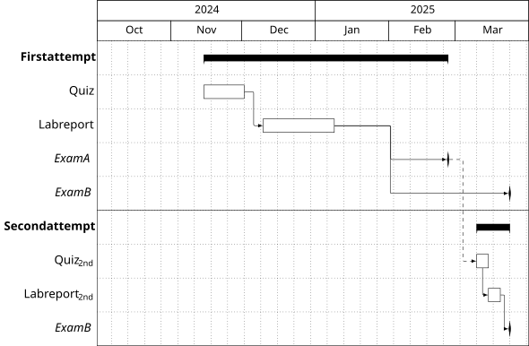

```latex
\documentclass{standalone} \title{gantt portfolio examination}
\usepackage{pgfgantt}
\begin{document}
\begin{ganttchart}[
    time slot format=isodate,
    x unit=.7mm, y unit title=6mm, title height=1,
    canvas/.append style={fill=none}, title/.append style={fill=none},
    hgrid, vgrid={*{5}{draw=none}, dotted, {draw=none}}, 
]{2024-10-01}{2025-03-31}
\gantttitlecalendar{year, month=shortname} \\
\ganttgroup{First attempt}{2024-11-15}{2025-02-25} \\
\ganttbar{Quiz}{2024-11-15}{2024-12-01} \\
\ganttlinkedbar{Lab report}{2024-12-10}{2025-01-08} \\ 
\ganttlinkedmilestone{Exam A}{2025-02-25} \\
\ganttmilestone{Exam B}{2025-03-23}
\ganttlink[link mid=.32]{elem2}{elem4} \\[solid]
\ganttgroup{Second attempt}{2025-03-10}{2025-03-23} \\
\ganttbar{Quiz\textsubscript{2nd}}{2025-03-10}{2025-03-14} 
\ganttlink[link/.append style={dashed}]{elem3}{elem6} \\
\ganttlinkedbar[link type=dr]{Lab report\textsubscript{2nd}}{2025-03-15}{2025-03-19} \\
\ganttlinkedmilestone{Exam B}{2025-03-23}
\end{ganttchart}
\end{document}
```

Portfolio examination hline

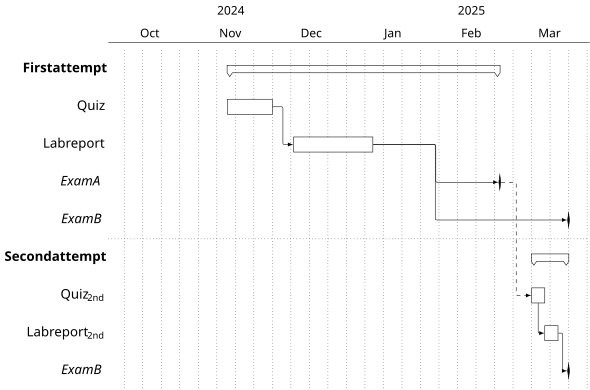

```latex
\documentclass{standalone} \title{gantt portfolio examination hline}
\usepackage{pgfgantt}
\begin{document}
\begin{ganttchart}[
    time slot format=isodate,
    x unit=.7mm, y unit title=6mm, 
    %title height=1,
    group right peak width=2,
    group left peak width=2,
    canvas/.style={fill=none}, 
    title/.style={fill=none},
    group/.append style={draw,fill=none},
    vgrid={*{5}{draw=none}, dotted, {draw=none}}, 
]{2024-10-01}{2025-03-31}
\gantttitlecalendar{year} \\[solid]
\gantttitlecalendar{month=shortname} \\
\ganttgroup{First attempt}{2024-11-15}{2025-02-25} \\
\ganttbar{Quiz}{2024-11-15}{2024-12-01} \\
\ganttlinkedbar{Lab report}{2024-12-10}{2025-01-08} \\ 
\ganttlinkedmilestone{Exam A}{2025-02-25} \\
\ganttmilestone{Exam B}{2025-03-23}
\ganttlink[link mid=.32]{elem2}{elem4} \\[dotted]
\ganttgroup{Second attempt}{2025-03-10}{2025-03-23} \\
\ganttbar{Quiz\textsubscript{2nd}}{2025-03-10}{2025-03-14} 
\ganttlink[link/.append style={dashed}]{elem3}{elem6} \\
\ganttlinkedbar[link type=dr]{Lab report\textsubscript{2nd}}{2025-03-15}{2025-03-19} \\
\ganttlinkedmilestone{Exam B}{2025-03-23}
\end{ganttchart}
\end{document}
```


Portfolio examination

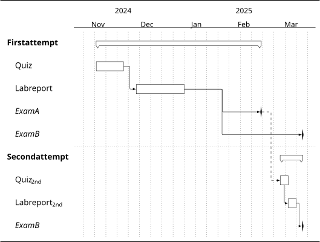

```latex
\documentclass{standalone} \title{gantt portfolio examination 2}
\usepackage{pgfgantt}
\usetikzlibrary {backgrounds}
\tikzset{background rectangle/.style={inner sep=0pt},
         background top/.style={draw,line width=.08em},
         background bottom/.style={draw,line width=.08em}}
\begin{document}
\begin{tikzpicture}[framed,show background top,show background bottom]
\begin{ganttchart}[
    time slot format=isodate,
    x unit=.7mm, y unit title=6mm, 
    title height=1,
    group right peak width=2, group left peak width=2,
    canvas/.style={fill=none}, title/.style={fill=none},
    group/.append style={draw,fill=white},
    group label node/.append style={
        align=left, 
        text width=2.8cm  },
    bar label node/.append style={
        align=left, left=-1em,
        text width=2.8cm  },
    milestone label node/.append style={
        align=left, left=-1em,
        text width=2.8cm  },
    vgrid={*{5}{draw=none}, dotted, {draw=none}}, 
]{2024-11-01}{2025-03-31}
\gantttitlecalendar{year} \\[solid]
\gantttitlecalendar{month=shortname} \\
\ganttgroup{First attempt}{2024-11-15}{2025-02-25} \\
\ganttbar{Quiz}{2024-11-15}{2024-12-01} \\
\ganttlinkedbar{Lab report}{2024-12-10}{2025-01-08} \\ 
\ganttlinkedmilestone{Exam A}{2025-02-25} \\
\ganttmilestone{Exam B}{2025-03-23}
\ganttlink[link mid=.32]{elem2}{elem4} \\[dotted]
\ganttgroup{Second attempt}{2025-03-10}{2025-03-23} \\
\ganttbar{Quiz\textsubscript{2nd}}{2025-03-10}{2025-03-14} 
\ganttlink[link/.append style={dashed}]{elem3}{elem6} \\
\ganttlinkedbar[link type=dr]{Lab report\textsubscript{2nd}}{2025-03-15}{2025-03-19} \\
\ganttlinkedmilestone{Exam B}{2025-03-23}
\end{ganttchart}
\end{tikzpicture}
\end{document}
```


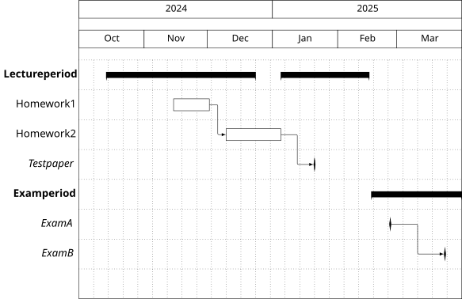

```latex
\documentclass{standalone} \title{gantt chart 2}
\usepackage{pgfgantt}
\begin{document}
\begin{ganttchart}[
    hgrid, 
    vgrid={*{6}{draw=none}, dotted}, 
    x unit=2pt,
    time slot format=isodate,
]{2024-10-01}{2025-03-31}
\gantttitlecalendar{year, month=shortname} \\
\ganttgroup{Lecture period}{2024-10-14}{2024-12-23}
\ganttgroup{}{2025-01-05}{2025-02-15} \\
\ganttbar{Homework 1}{2024-11-15}{2024-12-01} \\
\ganttlinkedbar{Homework 2}{2024-12-10}{2025-01-04} \\ 
\ganttlinkedmilestone{Test paper}{2025-01-20} \\
\ganttgroup{Exam period}{2025-02-17}{2025-03-31} \\
\ganttmilestone{Exam A}{2025-02-25} \\
\ganttlinkedmilestone{Exam B}{2025-03-23} \\
\end{ganttchart}
\end{document}
```

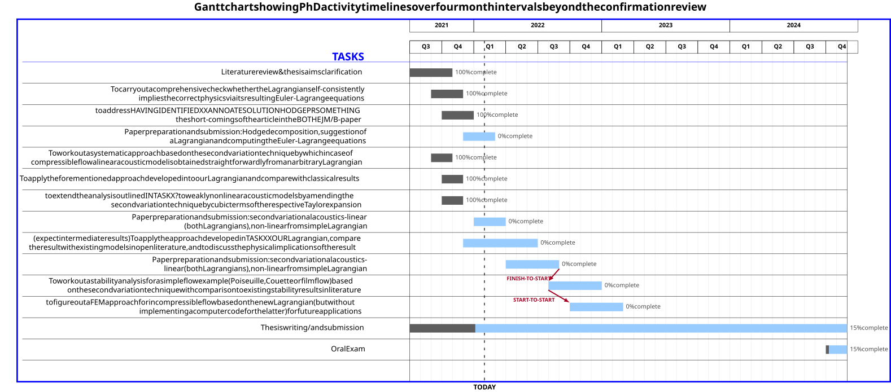

```latex
\documentclass{standalone} \title{gantt chart myline}
% Uncomment the following line to allow the usage of graphics (.png, .jpg)
%\usepackage[pdftex]{graphicx}
% Comment the following line to NOT allow the usage of umlauts
\usepackage{pgfgantt}
\usepackage{amsfonts}
% Start the document
\begin{document}
\definecolor{barblue}{RGB}{153,204,254}
\definecolor{groupblue}{RGB}{51,102,254}
\definecolor{linkred}{RGB}{165,0,33}
%\renewcommand\sfdefault{phv}
%\renewcommand\mddefault{mc}
%\renewcommand\bfdefault{bc}
\setganttlinklabel{s-s}{START-TO-START}
\setganttlinklabel{f-s}{FINISH-TO-START}
\setganttlinklabel{f-f}{FINISH-TO-FINISH}
\sffamily
% Find the left edge of the bar label by measuring the width of the longest label, and add 10pt
\pgfmathsetmacro\myleft{width("To apply the forementioned approach developed in to our Lagrangian and compare with classical results")+2cm}
% Adapt \ganttnewline to draw a line from a position equal to the length of the longest label
\makeatletter
\newcommand*\myline[2][]{%
\begingroup%
\pgfmathsetmacro\y@upper{%
\gtt@lasttitleline * \ganttvalueof{y unit title}%
+ (\gtt@currentline - \gtt@lasttitleline - 1)%
* \ganttvalueof{y unit chart}%
}
\draw[#1,#2]
(-\myleft pt, \y@upper pt) --  %<-- -\myleft pt replaces 0pt, which starts the line from the left edge of the canvas.
(\gtt@chartwidth * \ganttvalueof{x unit}, \y@upper pt);%
\global\advance\gtt@currentline by-1\relax%
\endgroup%
}
\makeatother

\begin{ganttchart}[
  [
   canvas/.append style={fill=none, draw=black!5, line width=.75pt},
    hgrid style/.style={*1{draw=black!5, line width=.75pt}},
    vgrid={*1{draw=black!5, line width=.75pt}},
    today=7,
    today rule/.style={
      draw=black!64,
      dash pattern=on 3.5pt off 6.5pt,
      line width=1.5pt
    },
    today label font=\small\bfseries,
    title/.style={draw=black, fill=none},
    title label font=\bfseries\footnotesize,
    include title in canvas=false,
    bar label node/.append style={left=2cm,align=right},
    bar/.append style={draw=none, fill=black!63},
    bar incomplete/.append style={fill=barblue},
    bar progress label font=\mdseries\footnotesize\color{black!70},
    link/.style={-latex, line width=1.5pt, linkred},
    link label font=\scriptsize\bfseries,
    link label node/.append style={below left=-2pt and 0pt}
  ]{1}{41}
  \gantttitle{2021}{6}
  \gantttitle{2022}{12}
  \gantttitle{2023}{12}
  \gantttitle{2024}{12} \\
  \gantttitlelist{"Q3","Q4","Q1","Q2","Q3","Q4","Q1","Q2","Q3","Q4","Q1","Q2","Q3","Q4"}{3}
  \myline{blue}{thick}
  \ganttbar[
    progress=100,
    name=WBS1A
  ]{Literature review \& thesis aims clarification } {1}{4} \myline{thin}{blue}
    \ganttbar[
    progress=100,
    name=WBS1A
  ]{To carry out a comprehensive check whether the Lagrangian self-consistently\\implies the correct physics via its resulting Euler-Lagrange equations}{3}{5} \myline{thin}{blue}
  \ganttbar[
    progress=100,
    name=WBS1D
  ]{to address HAVING IDENTIFIED X XANNOATE SOLUTION HODGE PR SOMETHING \\the short-comings of the article in the BOTHEJM/B-paper}{4}{6} \myline{thin}{blue}
   \ganttbar[
    progress=0,
    name=WBS1C
  ]{Paper preparation and submission: Hodge decomposition, suggestion of\\a Lagrangian and computing the Euler-Lagrange equations}{6}{8} \myline{thin}{blue}
    \ganttbar[
    progress=100,
    name=WBS1A
  ]{To work out a systematic approach based on the second variation technique by which in case of\\compressible flow a linear acoustic model is obtained straight forwardly from an arbitrary Lagrangian}{3}{4} \myline{thin}{blue}
  \ganttbar[
    progress=100,
    name=WBS1B
  ]{To apply the forementioned approach developed in to our Lagrangian and compare with classical results}{4}{5} \myline{thin}{blue}
   \ganttbar[
    progress=100,
    name=WBS1C
  ]{to extend the analysis outlined IN TASK X? to weakly nonlinear acoustic models by amending the\\second variation technique by cubic terms of the respective Taylor expansion}{4}{5} \myline{thin}{blue}
  \ganttbar[
    progress=0,
    name=WBS1D
  ]{Paper preparation and submission: second variational acoustics- linear\\(both Lagrangians), non-linear from simple Lagrangian}{7}{9} \myline{thin}{blue}
   \ganttbar[
    progress=0,
    name=NONLAG
  ]{(expect intermediate results)To apply the approach developed in TASK XX OUR Lagrangian, compare\\the result with existing models in open literature, and to discuss the physical implications of the result}{6}{12} \myline{thin}{blue}
  \ganttbar[
    progress=0,
    name=REL
  ]{Paper preparation and submission: second variational acoustics-\\linear (both Lagrangians), non-linear from simple Lagrangian}{10}{14} \myline{thin}{blue}
  \ganttbar[
    progress=0,name=POI]{
 To work out a stability analysis for a simple flow example (Poiseuille, Couette or film flow) based\\on the second variation technique with comparison to existing stability results in literature}{14}{18} \myline{thin}{blue}
  \ganttbar[
    progress=0,
    name=FEM
  ]{to figure out a FEM approach for incompressible flow based on the new Lagrangian (but without\\implementing a computer code for the latter) for future applications}{16}{20} \myline{thin}{blue}

  \ganttbar[progress=15]{Thesis writing / and submission}{1}{41} \myline{thin}{blue}
  \ganttbar[progress=15]{Oral Exam}{40}{41} \myline{thin}{blue}

  \ganttlink[link type=s-s]{POI}{FEM}

  %\ganttlink[link type=f-s]{NONLAG}{REL}
  \ganttlink[link type=f-s]{REL}{POI}

  \node [text=blue,font=\Large\bfseries,anchor=east] at (-2,-1.75) {TASKS};
  \draw[line width=2pt,blue] ([yshift=-1cm]current bounding box.south west) rectangle (current bounding box.north east);
  \node [font=\Large\bfseries] at ([yshift=0.5cm]current bounding box.north) {Gantt chart showing PhD activity time lines over four month intervals beyond the confirmation review};
\end{ganttchart}

\end{document}
```


First and second attempt

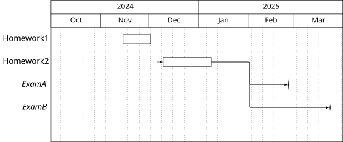

```latex
\documentclass{standalone} \title{gantt chart 7}
\usepackage{pgfgantt}
\begin{document}
\begin{ganttchart}[
    vgrid={*{5}{draw=none}, dotted, {draw=none}}, 
    x unit=.7mm, y unit title=6mm,
    title height=1,
    time slot format=isodate,
]{2024-10-01}{2025-03-31}
\gantttitlecalendar{year, month=shortname} \\
\ganttbar{Homework 1}{2024-11-15}{2024-12-01} \\
\ganttlinkedbar{Homework 2}{2024-12-10}{2025-01-08} \\ 
\ganttlinkedmilestone{Exam A}{2025-02-25} \\
\ganttmilestone{Exam B}{2025-03-23} \\
\ganttlink[link mid=.32]{elem1}{elem3}
\end{ganttchart}
\end{document}
```


Time and weight

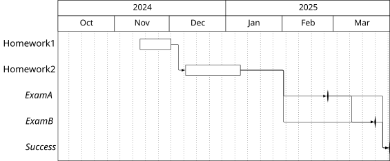

```latex
\documentclass{standalone} \title{gantt chart 3}
\usepackage{pgfgantt}
\begin{document}
\begin{ganttchart}[
    vgrid={*{5}{draw=none}, dotted, {draw=none}}, 
    x unit=.7mm, y unit title=6mm,
    title height=1,
    time slot format=isodate,
]{2024-10-01}{2025-03-31}
\gantttitlecalendar{year, month=shortname} \\
\ganttbar{Homework 1}{2024-11-15}{2024-12-01} \\
\ganttlinkedbar{Homework 2}{2024-12-10}{2025-01-08} \\ 
\ganttlinkedmilestone{Exam A}{2025-02-25} \\
\ganttlinkedmilestone{Exam B}{2025-03-23} \\
\ganttlinkedmilestone{Success}{2025-03-31}
\ganttlink[link mid=.32]{elem1}{elem3}
\ganttlink[link mid=.9]{elem2}{elem4}
\end{ganttchart}
\end{document}
```


Colors

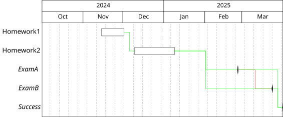

```latex
\documentclass{standalone} \title{gantt chart 5}
\usepackage{pgfgantt}
\begin{document}
\begin{ganttchart}[
    vgrid={*{5}{draw=none}, dotted, {draw=none}}, 
    x unit=.7mm, y unit title=6mm,
    title height=1,
    link/.style={green},
    time slot format=isodate,
]{2024-10-01}{2025-03-31}
\gantttitlecalendar{year, month=shortname} \\
\ganttbar{Homework 1}{2024-11-15}{2024-12-01} \\
\ganttlinkedbar{Homework 2}{2024-12-10}{2025-01-08} \\ 
\ganttlinkedmilestone{Exam A}{2025-02-25} \\
\ganttlinkedmilestone[link/.style={red}]{Exam B}{2025-03-23} \\
\ganttlinkedmilestone{Success}{2025-03-31}
\ganttlink[link mid=.32]{elem1}{elem3}
\ganttlink[link mid=.9]{elem2}{elem4}
\end{ganttchart}
\end{document}
```


Exams

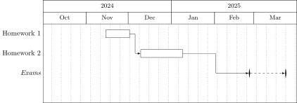

```latex
\documentclass{standalone} \title{gantt chart 4}
\usepackage{pgfgantt}
\begin{document}
\begin{ganttchart}[
    vgrid={*{5}{draw=none}, dotted, {draw=none}}, 
    x unit=.7mm, y unit title=6mm,
    title height=1,
    time slot format=isodate,
]{2024-10-01}{2025-03-31}
\gantttitlecalendar{year, month=shortname} \\
\ganttbar{Homework 1}{2024-11-15}{2024-12-01} \\
\ganttlinkedbar{Homework 2}{2024-12-10}{2025-01-08} \\ 
\ganttlinkedmilestone{Exams}{2025-02-25}
\ganttlinkedmilestone[link/.append style={dashed}]{}{2025-03-23} \\
\end{ganttchart}
\end{document}
```

```latex
\documentclass{standalone} \title{}
\usepackage{pgfgantt}
\begin{document}
\begin{ganttchart}[
vgrid,
hgrid
]{1}{12}
\gantttitle{Title}{12} \\
\ganttbar{Task 1}{1}{4} \\
\ganttlinkedbar{Task 2}{5}{6} \\
\ganttlinkedmilestone{M 1}{6} \\
\ganttlinkedbar{Task 3}{7}{11}
\end{ganttchart}
\end{document}
```


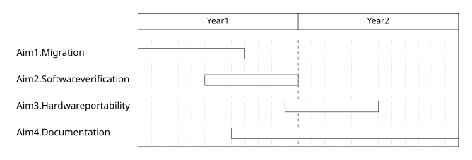

```latex
\documentclass[tikz, margin=5mm]{standalone} \title{gantt chart 1}
\usepackage{pgfgantt}
\title{Gantt Charts with the pgfgantt Package}
\begin{document}
\begin{ganttchart}[
   vgrid={*{11}{gray, dotted}, *1{black, dashed}},
   bar label node/.append style={
     align=left,
     text width=width("Aim 2. Software verificationx")}
   ]{1}{24}
\gantttitle{Year 1}{12} \gantttitle{Year 2}{12} \\
\ganttbar{Aim 1. Migration}{1}{8} \\
\ganttbar{Aim 2. Software verification}{6}{12} \\
\ganttbar{Aim 3. Hardware portability}{12}{18} \\
\ganttbar{Aim 4. Documentation}{8}{24}
\end{ganttchart}
\end{document}
```

# Alternatives 

# Typst

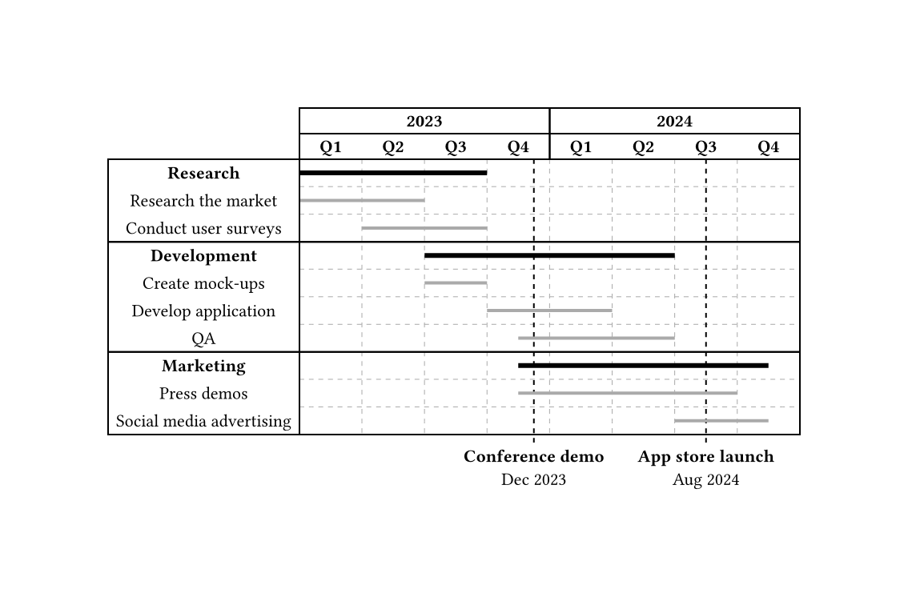

```typst
#import "@preview/timeliney:0.1.0"

#timeliney.timeline(
  show-grid: true,
  {
    import timeliney: *
      
    headerline(group(([*2023*], 4)), group(([*2024*], 4)))
    headerline(
      group(..range(4).map(n => strong("Q" + str(n + 1)))),
      group(..range(4).map(n => strong("Q" + str(n + 1)))),
    )
  
    taskgroup(title: [*Research*], {
      task("Research the market", (0, 2), style: (stroke: 2pt + gray))
      task("Conduct user surveys", (1, 3), style: (stroke: 2pt + gray))
    })

    taskgroup(title: [*Development*], {
      task("Create mock-ups", (2, 3), style: (stroke: 2pt + gray))
      task("Develop application", (3, 5), style: (stroke: 2pt + gray))
      task("QA", (3.5, 6), style: (stroke: 2pt + gray))
    })

    taskgroup(title: [*Marketing*], {
      task("Press demos", (3.5, 7), style: (stroke: 2pt + gray))
      task("Social media advertising", (6, 7.5), style: (stroke: 2pt + gray))
    })

    milestone(
      at: 3.75,
      style: (stroke: (dash: "dashed")),
      align(center, [
        *Conference demo*\
        Dec 2023
      ])
    )

    milestone(
      at: 6.5,
      style: (stroke: (dash: "dashed")),
      align(center, [
        *App store launch*\
        Aug 2024
      ])
    )
  }
)
```


# Figma


https://www.figma.com/templates/gantt-chart/

---
Sources:
- [Gantt chart - Wikipedia](https://en.wikipedia.org/wiki/Gantt_chart)
- [timeliney – Typst Universe](https://typst.app/universe/package/timeliney/)
- [pgfgantt Package documentation](http://mirrors.ctan.org/graphics/pgf/contrib/pgfgantt/pgfgantt-doc.pdf)

Related:

Tags:
[LaTeX](./index.md)
