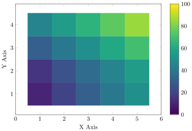

```py
generate_latex_figure(r"""
\documentclass{standalone}
\usepackage{pgfplots}
\usepackage{tikz}
\pgfplotsset{compat=1.18}
\begin{document}
\begin{tikzpicture}
\begin{axis}[ width=10cm, height=8cm,
    xlabel={X Axis}, ylabel={Y Axis},
    colormap/viridis, colorbar,
    point meta min=0, point meta max=100,
]
\addplot[ matrix plot*, mesh/cols=5,
    point meta=explicit, ] 
table [meta=C] {
x y C
1 1 10
2 1 20
3 1 30
4 1 40
5 1 50
1 2 15
2 2 25
3 2 35
4 2 45
5 2 55
1 3 30
2 3 40
3 3 50
4 3 60
5 3 70
1 4 45
2 4 55
3 4 65
4 4 75
5 4 85
};
\end{axis}
\end{tikzpicture}
\end{document}
""", outfile="figure heatmap")
```
