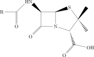
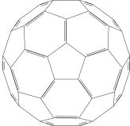

# Chemistry



```py
generate_latex_figure(r"""
\documentclass{standalone}
\usepackage{chemfig}
\begin{document}
\chemfig{[:-90]HN(-[::-45](-[::-45]R)=[::+45]O)>[::+45]*4(-(=O)
    -N*5(-(<:(=[::-60]O)-[::+60]OH)-(<[::+0])(<:[::-108])-S>)--)}
\end{document}
""", outfile="figure stereochemistry")
```

- Example from [Obsidian TikZJax](https://github.com/artisticat1/obsidian-tikzjax) 

# Molecule with repeating pattern




```py
generate_latex_figure(r"""
\documentclass{standalone}
\usepackage{chemfig}
\begin{document}
\definesubmol\fragment1{(
    -[:#1,0.85,,,draw=none] -[::126]-[::-54](=_#(2pt,2pt)[::180])
    -[::-70](-[::-56.2,1.07]=^#(2pt,2pt)[::180,1.07])
    -[::110,0.6](-[::-148,0.60](=^[::180,0.35])-[::-18,1.1])
    -[::50,1.1](-[::18,0.60]=_[::180,0.35])
    -[::50,0.6] -[::110] )}
\chemfig{ !\fragment{18} !\fragment{90} !\fragment{162}
    !\fragment{234} !\fragment{306} }
\end{document}
""", outfile="figure molecule repeating")
```

- Example from [Obsidian TikZJax](https://github.com/artisticat1/obsidian-tikzjax) 

# Figure collection for note preview


```py
generate_latex_figure(r"""
\documentclass{standalone}
\usepackage{graphicx}
\begin{document}
\includegraphics{figure stereochemistry.pdf}
\includegraphics{figure molecule repeating.pdf}
\end{document}
""", outfile="figure molecules")
```
