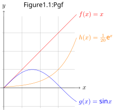
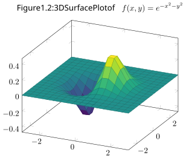

# 2D Plots



```latex
\documentclass{standalone} \title{plot tikz}
\usepackage{tikz,caption}
\usetikzlibrary{trees, decorations, arrows, automata, shadows, 
    positioning, plotmarks, calc, matrix}
\begin{document}
\begin{tikzpicture}[domain=0:4]
\node[above] at (2.2,4.2) {Figure 1.1: Pgf};
\draw[very thin,color=gray] (-0.1,-1.1) grid (3.9,3.9);
\draw[->] (-0.2,0) -- (4.2,0) node[right] {$x$};
\draw[->] (0,-1.2) -- (0,4.2) node[above] {$y$};
\draw[color=red]    plot (\x,\x)             node[right] {$f(x) =x$};
\draw[color=blue]   plot (\x,{sin(\x r)})    node[right] {$g(x) = \sin x$};
\draw[color=orange] plot (\x,{0.05*exp(\x)}) node[right] {$h(x) = \frac{1}{20} \mathrm e^x$};
\end{tikzpicture}
\end{document}
```

- [Plots of Functions - PGF/TikZ Manual](https://tikz.dev/tikz-plots)
- Example from [Obsidian TikZJax](https://github.com/artisticat1/obsidian-tikzjax) 

# 3D Plot - PgfPlots



```latex
\documentclass{standalone} \title{plot tikz 3d}
\usepackage{pgfplots}
\pgfplotsset{compat=1.16}
\begin{document}
\begin{tikzpicture}
\begin{axis}[
    colormap/viridis,
    title={Figure 1.2: 3D Surface Plot of $f(x,y) = e^{-x^2-y^2}$}
]
\addplot3[ surf, samples=18, domain=-3:3, ]{
    exp(-x^2-y^2)*x  };
\end{axis}
\end{tikzpicture}
\end{document}
```

- Example from [Obsidian TikZJax](https://github.com/artisticat1/obsidian-tikzjax) 

# Figure collection for note preview


```latex
\documentclass{standalone} \title{plot tikz collection}
\usepackage{graphbox}
\begin{document}
\includegraphics[align=c]{figure plot tikz}
\includegraphics[align=c]{figure plot tikz 3d}
\end{document}
```

https://pyx-project.org/
https://pyx-project.org/gallery/graph/index.html

https://asymptote.sourceforge.io/
https://gertingold.github.io/pythonnawi/graphics.html
