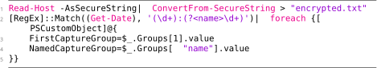
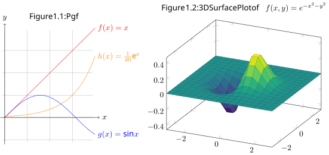

The powerful typesetting system LaTeX is well known in the world of academia, scientific publishing, and technical documentation. While LaTeX mainly gets used to produce pages of PDF, it integrates well as a pre-processing tool to create vector graphics in notes, websites, and documents, too. Guides show how to improve, or generate the following content elements:

[Math - Typeset, align, wrap, comment, enumerate, space out, scale, and style mathematical expressions, utilizing AMSmath](./math/index.md)

$$
\begin{align*} \qquad&\hspace{-2em}
\mathbb{P}(X+Y=k) 
= \sum_{\mathclap{x \in X(\Omega)}} \mathbb{P}(X = x) \cdot \mathbb{P}(Y=k-x) \\&
= \sum_{x = 0}^n \binom{n}{x}\, p^x\, (1-p)^{n-x} \cdot \binom{m}{k-x}\, q^{k-x}\, (1-q)^{m-(k-x)}
\end{align*}
$$

[Tables - Separate content in plaintext and styles like alignment, spacing, markup, and calculation, utilizing Tabularray](./tables/index.md)


[Code Snippets - Print source code with syntax highlighting in latex with listings](./Code-Snippets.md)



[Follow varying typographic conventions with the same input syntax](./math/Follow-varying-typographic-conventions-with-the-same-input-syntax.md)

$$
\begin{gather*}
\left( \left( \left( ( ) \sqrt{2}  \right) \right) \right) \quad
\Bigg( \bigg( \Big( ( ) \sqrt{2}  \Big) \bigg) \Bigg) \tag{6a} \\
\frac{235}{711} \quad \tfrac{235}{711} \quad  {^{235} {\!/\!} _{711}} \quad {^{235} \mathclap{\diagup} _{711}} \tag{6b} \\
2.71828\times 10^{3} \quad 2{,}72\cdot 10^{3} \quad 2\,718{,}28 \tag{6c} \\
1 \, \mathrm{kg\, m / s^2} \quad 1 \, \mathrm{kg\, m s^{-2}} \quad 1 \, \mathrm{\tfrac{kg\, m}{s^2} } \tag{6d} \\
1{,}50 \,\text€ \quad \$\, 1.50 \quad 2 \,¥ \quad 1.50 \,\text{GBP} \tag{6e} \\
\text{March 1, 2024 \quad 1. März '24} \tag{6f}
\end{gather*}
$$

[Plots - Dynamically plot mathematical functions, values as a vector graphic](../plots/index.md)



[Networks, Commutative diagrams - Dynamically draw graph networks as a vector graphic](./math/Networks-Commutative-diagrams.md)


[Electrical circuit - Dynamically draw electronic circuit diagrams as a vector graphic](./Electrical-circuit.md)


[Molecules - Dynamically draw structural formulas of chemical molecules as a vector graphic](./Molecules.md)


[Heatmaps](./Heatmaps.md)


[Gantt chart](./Gantt-chart.md)


Roadmap for further data visualizations

- spiderweb diagram
- Fractals
- Public transport map
- (trail) Maps
- orbital paths
- engineering blueprint
- Minecraft blueprint
- Factorio blueprint
- music notes
- timeline
- geographic maps with transparent circles
- low-poly art

Roadmap for setup comparisons

- writing, conversion, lint, debug
- which editor comparison
- Don't spent so much time on your setup, start writing code
- alternative markup systems

Learn, Troubleshoot, Debugging/Help/Documentation
- keep package number low
- don't create macros
- problem with text, quotes, math, tables, images, floats, listings, layout, development, setup, conversion, compile time, plots, graphics, citations
- [Learn and troubleshoot LaTeX - Read (package) documentation, cheat sheets, tutorials](../Learn-and-troubleshoot-LaTeX.md)
- [Develop LaTeX packages](../Develop-LaTeX-packages.md)

Other topics

- [Values  - Standardize math, numbers, symbols, quantities, money](../Values-.md)
- [Float - Dynamically place figures, images, tables, and listings at the top, bottom, or single page](../Float.md)
- [Graphics, Plots, Visualization - Generate dynamic professional vector graphics with matching fonts, design](../Graphics-Plots-Visualization.md)
- [Project structure - Create folders for setup, resources, bibliographies](../Project-structure.md)
- [Graphical elements - Standardize tables, images, plots](../Graphical-elements.md)
- [Layout the document - Setup margins, hyphenation, table of contents](../Layout-the-document.md)

Color gradients
- [Color gradients and my gradual descent into madness – Typst Blog](https://typst.app/blog/2023/color-gradients/)

Animation
- [GitHub - ManimCommunity/manim: A community-maintained Python framework for creating mathematical animations.](https://github.com/ManimCommunity/manim/)

Motivation and use cases for LaTeX

# Collection for note preview


```latex
\documentclass{article} \title{math comments}
\usepackage{mathtools,amssymb,amsfonts}
\begin{document}
\begin{gather*}
+ - \cdot \times / \div :{} \Sigma \smallint \Im\,  \Re \mid\, \parallel \cap \setminus \neg \land \pm \Join \\
=\, \approx\, <\, \ge\, \triangleq\, \coloneqq\, \equiv\, \in\, \subset\, \supseteq\, \gg, \ne\, \nless\, \nsupseteq\,  \nsim \\
\sum_{\mathclap{x \in X(\Omega)}} \mathbb{P}(X = x)
\overset{\text{def}}{=} x \overset{i}{=} xxx \overset{\mathclap{\text{use (4b)}}}{=} xxx \xRightarrow{+ xx} x \\
x = \mathrlap{\phantom{(x)}\overbrace{\phantom{x xx}}^{\text{for }x}}  \underbrace{ (x)x }_{\text{for }x}  \underbrace{ \vphantom{(} xx \cdot x }_{ \mathclap{\substack{\text{for }x\\ \text{and relatives}} }  }
= \begin{cases} xx  & \text{for } xx \\[-1ex] & \text{because}\ldots \\ x  & \text{ow.} \end{cases}
\end{gather*}
\end{document}
```


```latex
\documentclass{standalone} \title{latex collection}
\usepackage{graphbox}
\begin{document}
\includegraphics[align=c]{figure math comments} \hspace{1em}
\includegraphics[align=c]{figure pet owners} \hspace{1em}
\includegraphics[align=c]{figure automata}
\end{document}
```

---
Sources:
- 2023-06-19: [How I'm able to take notes in mathematics lectures using LaTeX and Vim | Gilles Castel](https://castel.dev/post/lecture-notes-1/)
- [The LaTeX fetish (Or: Don’t write in LaTeX! It’s just for typesetting) – Daniel Allington](http://www.danielallington.net/2016/09/the-latex-fetish/)

Related:
```dynamic-embed
[[List related notes]]
``` 

Tags:
[Markup and typesetting systems - Produce printed or digital documents aesthetically pleasing with readable typography](../Markup-and-typesetting-systems.md)
