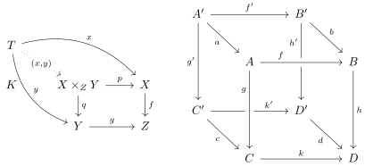

# Simple commutative diagrams - AMSCD

- See examples with source code: Simple commutative diagrams supported by KaTeX, MathJaX - Amscd

$$
\begin{align*}
\begin{CD}
A @>a>> B\\
@VVbV @VVcV\\
C @>d>> D
\end{CD}
\end{align*}
$$

# Finite state automata and Turing machines - Automata TikZ

- [Automata Drawing Library - PGF/TikZ Manual](https://tikz.dev/library-automata)


```latex
\documentclass{standalone} \title{figure automata}
\usepackage{tikz}
\usetikzlibrary{trees, decorations, arrows, automata, shadows, positioning, plotmarks, calc, matrix}
\tikzstyle{alter}=[circle, minimum size=16pt, draw, inner sep=1pt] 
\tikzstyle{majarr}=[draw=black]
\begin{document}
\begin{tikzpicture}[auto, >=stealth']
\tikzstyle{majarr}=[draw=black,->,shorten <=1.5pt, shorten >=1.5pt]
\node[alter, initial, accepting, initial text=] at (0,0) (e) {$[\varepsilon]$};
\node[alter, accepting] at (2,0) (0) {$[0]$};
\node[alter] at (0,-2) (1) {$[1]$};
\node[alter, accepting] at (4,0) (01) {$[01]$};
\node[alter] at (2,-2) (00) {$[00]$};
\node[alter] at (4,-2) (11) {$[11]$};
\draw[majarr] (e) edge node[midway, anchor=south] {$\scriptstyle 0$} (0);
\draw[majarr] (e) edge node[midway, anchor=east] {$\scriptstyle 1$} (1);
\draw[majarr] (0) edge[bend left=10] node[midway, anchor=west] {$\scriptstyle 0$} (00);
\draw[majarr] (0) edge node[midway, anchor=south] {$\scriptstyle 1$} (01);
\draw[majarr] (01) edge node[midway, anchor=west] {$\scriptstyle 0$} (00);
\draw[majarr] (01) edge node[midway, anchor=west] {$\scriptstyle 1$} (11);
\draw[majarr] (00) edge[bend left=10] node[midway, anchor=east] {$\scriptstyle 0$} (0);
\draw[majarr] (00) edge node[midway, anchor=south] {$\scriptstyle 1$} (1);
\draw[majarr] (1) edge node[midway, anchor=east] {$\scriptstyle 0$} (0);
\draw[majarr] (1) edge[bend right=43] node[midway, anchor=south] {$\scriptstyle 1$} (11);
\draw[majarr] (11) edge[loop right] node {$\scriptstyle 0,1$} (11);
\end{tikzpicture}
\end{document}
```

# Commutative diagrams - tikzcd TikZ

- [Commutative diagrams with TikZ](https://ctan.math.washington.edu/tex-archive/graphics/pgf/contrib/tikz-cd/tikz-cd-doc.pdf)
- Embed TikZ in Obsidian



```latex
\documentclass{standalone} \title{figure tikzcd}
\usepackage{tikz-cd}
\begin{document}
\begin{tikzcd}
T
\arrow[drr, bend left, "x"]
\arrow[ddr, bend right, "y"]
\arrow[dr, dotted, "{(x,y)}" description] & & \\
K & X \times_Z Y \arrow[r, "p"] \arrow[d, "q"]
& X \arrow[d, "f"] \\
& Y \arrow[r, "g"]
& Z
\end{tikzcd}
\quad \quad
\begin{tikzcd}[row sep=2.5em]
A' \arrow[rr,"f'"] \arrow[dr,swap,"a"] \arrow[dd,swap,"g'"] &&
  B' \arrow[dd,swap,"h'" near start] \arrow[dr,"b"] \\
& A \arrow[rr,crossing over,"f" near start] &&
  B \arrow[dd,"h"] \\
C' \arrow[rr,"k'" near end] \arrow[dr,swap,"c"] && D' \arrow[dr,swap,"d"] \\
& C \arrow[rr,"k"] \arrow[uu,<-,crossing over,"g" near end]&& D
\end{tikzcd}
\end{document}
```

# Figure collection for note preview


```latex
\documentclass{standalone} \title{figure networks}
\usepackage{graphicx}
\begin{document}
\includegraphics{figure automata.pdf}
\includegraphics{figure tikzcd.pdf}
\end{document}
```
