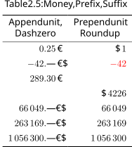

# Scientific notation


```latex
\documentclass{standalone} \title{table numbers scientific notation}
\renewcommand{\thetable}{2.1}
\usepackage{tabularray,tikz}
\UseTblrLibrary{siunitx}
\sisetup{exponent-product = \cdot}
\begin{document}
\begin{tblr}[tall,caption=Scientific notation]{
    hline{1,Z}={.08em},hline{2},
    column{1}={r,cmd={\pgfmathprintnumber}},
    column{2}={r,cmd={\pgfkeys{/pgf/number format/.cd,
        sci, sci zerofill}\pgfmathprintnumber}},
    column{3}={r,cmd={\num[exponent-mode=engineering,round-mode=figures,uncertainty-mode=separate]}},
    row{1}={c,cmd={}},
}
$U$ in V & $R_1$ in \unit{\ohm} & $I_1$ in \unit{\ampere} \\
.00093  & 4219e7 & 24       \\
.005693 & 3799e5 & 64\pm1   \\
.4893   & 2959e2 & 244(2:3) \\
2.93    & 1279   & 336(31)  \\
93      & 81     & 724(520) \\
6307    & 701    & 2(1)e3   \\
19107   & 49121  & 268840   \\
95907   & 102881 & 5376400  \\
198307  & 210401 & 10752400 \\
\end{tblr}
\end{document}
```

## Scientific vs Engineering 


```latex
\documentclass{standalone} \title{table numbers scientific}
\renewcommand{\thetable}{2.2}
\usepackage{tabularray,tikz}
\UseTblrLibrary{siunitx}
\sisetup{exponent-product = \cdot}
\begin{document}
\begin{tblr}[tall,caption={Exponent, Uncertainty, Round}]{
    hline{1,Z}={.08em},hline{2},
    column{1}={r,cmd={\pgfmathprintnumber}},
    column{2}={r,cmd={\num[exponent-mode=engineering,uncertainty-mode=separate]}},
    row{1}={c,cmd={}}
}
scientific & engineering \\
0.25      & 0.25     \\
-42       & -42      \\
289       & 289      \\
4225.31   & 4225.31  \\
66049     & 66049(1)    \\
263169    & 263169(12:34)   \\
1.0563e6  & 1.0563e6 \\
\end{tblr}
\end{document}
```

## Pgf


```latex
\documentclass{standalone} \title{table number formats pgf}
\renewcommand{\thetable}{2.3}
\usepackage{tabularray,tikz}
\UseTblrLibrary{functional}
\usetikzlibrary{fpu}
\ExplSyntaxOn
\regexConst\cNumberPattern {([-+]?(?:\d*\.)?\d+(?:e[-+]?\d+)?)} 
\prgNewFunction\printNumber{ mm }{
    \tlIfBlankF{#1}{ \pgfkeys{/pgf/number~format/.cd,#1} }
    \tlSet\lTmpaTl{\evalWhole{#2}}
    \regexVarReplaceOnce\cNumberPattern{\c{pgfmathprintnumber}\cB\{\0\cE\}}\lTmpaTl
    \prgReturn{ \tlUse\lTmpaTl }}
\ExplSyntaxOff
\begin{document}
\begin{tblr}[tall,caption=Pgf number formats]{
    hline{1,Z}={.08em},hline{3},
    hline{6,9,12,15,18,21,24,27,30,33}={dashed},
    column{1}={r,cmd=\printNumber{}},
    column{2}={r,cmd=\printNumber{sci}},
    column{3}={r,cmd=\printNumber{sci,sci subscript}},
    column{4}={r,cmd=\printNumber{frac}},
    row{1,2}={c,m}, cell{1}{2}={c=2}{}, cell{1}{1,4}={r=2}{},
    hline{2}={2-3}{leftpos=-2,rightpos=-2,endpos},
}
{Auto\\format} & Scientific notation && Fraction \\
               & forced   & subscript            \\
0.25           & 0.25     & 0.25      & 0.25     \\
-42            & -42      & -42       & -42      \\
289            & 289      & 289       & 289      \\
4225.31        & 4225.31  & 4225.31   & 4225.31  \\
66049          & 66049    & 66049     & 66049    \\
263169         & 263169   & 263169    & 263169   \\
1.0563e6       & 1.0563e6 & 1.0563e6  & 1.0563e6 \\
\end{tblr}
\end{document}
```

## SiUnitX


```latex
\documentclass{standalone} \title{table number formats siunitx}
\renewcommand{\thetable}{2.4}
\usepackage{tabularray}
\UseTblrLibrary{siunitx}
\sisetup{exponent-product = \cdot}
\begin{document}
\begin{tblr}[tall,caption=SiUnitX number formats]{
    hline{1,Z}={.08em},hline{5},
    hline{6,9,12,15,18,21,24,27,30,33}={dashed},
    column{2}={r,cmd={\num[exponent-mode=fixed, uncertainty-mode=full, round-mode=places]}},
    column{3}={r,cmd={\num[exponent-mode=scientific, uncertainty-mode=compact-marker, round-mode=figures, round-mode=uncertainty]}},
    column{4}={r,cmd={\num[exponent-mode=engineering,uncertainty-mode=separate]}},
    cell{1-4}{2-Z}={c,appto={,},cmd={}}, column{1}={l,cmd=\quad}, row{2-Z}={rowsep=0pt},
    cell{1,5,11}{1}={c=4}{font=\bfseries,cmd={}},
    row{5,11}={abovesep=6pt,belowsep=2pt},
}
Settings \\
Exponent: & fixed           & scientific   & engineering  \\
Uncertainty: & full & compact-marker & separate           \\
Round: & places & figures & uncertainty \\
Integer                                                \\
7        & 7        & 7        & 7        \\
-83      & -83      & -83      & -83      \\
4225     & 4225     & 4225     & 4225     \\
263169   & 263169   & 263169   & 263169   \\
1.0563e6 & 1.0563e6 & 1.0563e6 & 1.0563e6 \\
Floating points                           \\
0.25           & 0.25         & 0.25        & 0.25     \\
8(12:34)       & 8(12:34)     & 8(12:34)    & 8(12:34) \\
289            & 289          & 289         & 289      \\
4225.31        & 4225.31      & 4225.31     & 4225.31  \\
66049(1)       & 66049(1)     & 66049(1)    & 66049(1) \\
263169         & 263169       & 263169      & 263169   \\
1.0563e6       & 1.0563e6     & 1.0563e6    & 1.0563e6 \\
\end{tblr}
\end{document}
```

# Localized dates and time


English

```latex
\documentclass[english]{standalone} \title{table numbers datetime english} 
\renewcommand{\thetable}{2.5a}
\usepackage{tabularray,babel,datetime2}
\DTMsetup{useregional}
\begin{document}
\begin{tblr}[tall,caption=English date \& time]{ 
    hline{1,Z}={.08em},hline{2}, row{1}={c},
    cell{2-Z}{1}={r,cmd={\DTMdate}}, cell{2-Z}{2}={r,cmd={\DTMtime}}, }
Date & Time \\
2024-03-03 & 14:55:00 \\
2024-09-13 & 09:12:28 \\
\end{tblr}
\end{document}
```

British

```latex
\documentclass[british]{standalone} \title{table numbers datetime british} 
\renewcommand{\thetable}{2.5b}
\usepackage{tabularray,babel,datetime2}
\DTMsetup{useregional}
\begin{document}
\begin{tblr}[tall,caption=British date \& time]{ 
    hline{1,Z}={.08em},hline{2}, row{1}={c},
    cell{2-Z}{1}={r,cmd={\DTMdate}}, cell{2-Z}{2}={r,cmd={\DTMtime}}, 
}
Date & Time \\
2024-03-03 & 14:55:00 \\
2024-09-13 & 09:12:28 \\
\end{tblr}
\end{document}
```

German

```latex
\documentclass[german]{standalone} \title{table numbers datetime german} 
\renewcommand{\thetable}{2.5c}
\usepackage{tabularray,babel,datetime2}
\DTMsetup{useregional}
\begin{document}
\begin{tblr}[tall,caption={German date, time}]{ 
    hline{1,Z}={.08em},hline{2}, row{1}={c},
    cell{2-Z}{1}={r,cmd={\DTMdate}}, cell{2-Z}{2}={r,cmd={\DTMtime}}, 
}
Date & Time \\
2024-03-03 & 14:55:00 \\
2024-09-13 & 09:12:28 \\
\end{tblr}
\end{document}
```

Dutch

```latex
\documentclass[dutch]{standalone} \title{table numbers datetime dutch} 
\renewcommand{\thetable}{2.5d}
\usepackage{tabularray,babel,datetime2}
\DTMsetup{useregional}
\begin{document}
\begin{tblr}[tall,caption=Dutch date \& time]{ 
    hline{1,Z}={.08em},hline{2}, row{1}={c},
    cell{2-Z}{1}={r,cmd={\DTMdate}}, cell{2-Z}{2}={r,cmd={\DTMtime}}, }
Date & Time \\
2024-03-03 & 14:55:00 \\
2024-09-13 & 09:12:28 \\
\end{tblr}
\end{document}
```

```latex
\documentclass{standalone} \title{table numbers datetimes} 
\usepackage{graphbox,tabularray}
\begin{document}
\begin{tblr}{rows={c,rowsep=8pt}}
\includegraphics{figure table numbers datetime english} &
\includegraphics{figure table numbers datetime british} \\
\includegraphics{figure table numbers datetime german} &
\includegraphics{figure table numbers datetime dutch} \\
\end{tblr}
\end{document}
```

# Prefix, Suffix

## Show price with cents and currency


Select non-empty cells manually

```latex
\documentclass{standalone} \title{table numbers backwaren 1} 
\renewcommand{\thetable}{2.6a}
\usepackage{tabularray,textcomp}
\UseTblrLibrary{siunitx,functional}
\ExplSyntaxOn
\regexConst\cNumberPattern {([-+]?(?:\d*[\.\,])?\d+(?:e[-+]?\d+)?)} 
\prgNewFunction\printNumber{ mm }{
    \tlSet\lTmpaTl{\evalWhole{#2}}
    \regexVarReplaceOnce\cNumberPattern{\c{num}\cB\{\0\cE\}}\lTmpaTl
    \prgReturn{\evalWhole{\lTmpaTl}}}
\ExplSyntaxOff
\sisetup{round-mode=places,zero-decimal-as-symbol}
\begin{document}
\begin{tblr}[tall,caption={Prices w/ cents, equal width}]{
    hline{1,Z}={.08em},hline{2}, colspec={lr}, row{1}={c},
    cell{2,3,5}{2}={appto=\,€,cmd=\printNumber{}},
}
Baked goods     & Price \\
Pretzel         & .45   \\
Brownie         & 1     \\
Cake of the day &       \\
German bread    & 2,3   \\
\end{tblr}
\end{document}
```

Skip empty cells automatically

```latex
\documentclass[german]{standalone} \title{table numbers backwaren 2} 
\renewcommand{\thetable}{2.6b}
\usepackage{tabularray,babel,textcomp}
\UseTblrLibrary{siunitx,functional}
\ExplSyntaxOn
\regexConst\cNumberPattern {([-+]?(?:\d*[\.\,])?\d+(?:e[-+]?\d+)?)} 
\prgNewFunction\printNumber{ mm }{
    \propSetFromKeyval\lTmpbProp{#1}
    \propGetTF\lTmpbProp{preto}\lTmpbTl
        { \tlPutRight\lTmpbTl{\,} }{ \tlClear\lTmpbTl }
    \propGetTF\lTmpbProp{appto}\lTmpcTl
        { \tlPutLeft\lTmpcTl{\,} }{ \tlClear\lTmpcTl }
    \propGetTF\lTmpbProp{si}\lTmpdTl
        { \tlSet\lTmpdTl{\evalWhole{\sisetup{\tlUse\lTmpdTl}}}}
        { \tlClear\lTmpdTl }
    \tlSet\lTmpaTl{\evalWhole{#2}}
    \regexVarReplaceOnceTF\cNumberPattern{\c{tlUse}\c{lTmpbTl} \c{num}\cB\{\0\cE\} \c{tlUse}\c{lTmpcTl}}\lTmpaTl{
        \prgReturn{\evalWhole{\lTmpdTl\lTmpaTl}}
    }{ \prgReturn{#2} } }
\ExplSyntaxOff
\begin{document}
\begin{tblr}[tall,caption=Skip empty cells]{
    hline{1,Z}={.08em},hline{2}, colspec={lr}, row{1}={c},
    column{2}={cmd={\printNumber{appto={\,€},si={
        round-mode=places,zero-decimal-as-symbol}}}},
}
Baked goods     & Price \\
Pretzel         & .45   \\
Brownie         & 1     \\
Cake of the day &       \\
German bread    & 2,3   \\
\end{tblr}
\end{document}
```

```latex
\documentclass{standalone} \title{table numbers backwaren} 
\usepackage{graphbox}
\begin{document}
\includegraphics{figure table numbers backwaren 1} \hspace{1em}
\includegraphics{figure table numbers backwaren 2}
\end{document}
```

## Round up, emphasize negative values


```latex
\documentclass{standalone} \title{table numbers budget}
\renewcommand{\thetable}{2.7}
\usepackage{tabularray}
\UseTblrLibrary{siunitx}
\sisetup{round-mode=places,round-direction=up,
    round-precision=0,negative-color=red}
\begin{document}
\begin{tblr}[tall,caption={Round up, Negatives, Separate thousands}]{
    hline{1,Z}={.08em},hline{2}, colspec={lr}, row{1}={c},
    cell{2-Z}{2}={cmd=\$\,\num}
}
Name           & Budget \\
Kitty Peck     & 12.30  \\
Hayley Santos  & -42.3  \\
Lottie Noble   & 4226.7 \\
Scrooge McDuck & 12366049  \\
\end{tblr}
\end{document}
```

## More monetary values




```latex
\documentclass{standalone} \title{table numbers money}
\renewcommand{\thetable}{2.5}
\usepackage{tabularray,mathtools,amsfonts,amssymb}
\UseTblrLibrary{functional,siunitx}
\sisetup{exponent-product = \cdot}
\ExplSyntaxOn
\regexConst\cNumberPattern {([-+]?(?:\d*\.)?\d+(?:e[-+]?\d+)?)} 
\prgNewFunction\printNum{ mm }{
    \propSetFromKeyval\lTmpbProp{#1}
    \propGetTF\lTmpbProp{preto}\lTmpbTl{ \tlPutRight\lTmpbTl{\,} }{ \tlClear\lTmpbTl }
    \propGetTF\lTmpbProp{appto}\lTmpcTl{ \tlPutLeft\lTmpcTl{\,} }{ \tlClear\lTmpcTl }
    \propGetTF\lTmpbProp{si}\lTmpdTl{ \tlSet\lTmpdTl{\evalWhole{%
        \sisetup{\tlUse\lTmpdTl}%
    }}}{ \tlClear\lTmpdTl }
    \tlSet\lTmpaTl{\evalWhole{#2}}
    \regexVarReplaceOnceTF\cNumberPattern{\evalWhole{ \c{tlUse}\c{lTmpbTl} \c{num}\cB\{\0\cE\} \c{tlUse}\c{lTmpcTl}}}\lTmpaTl{
        \prgReturn{\evalWhole{\lTmpdTl\lTmpaTl}}
    }{ \prgReturn{#2} } }
\ExplSyntaxOff
\begin{document}
\sisetup{exponent-mode=fixed}
\begin{tblr}[tall,caption={Money, Prefix, Suffix}]{
    hline{1,Z}={.08em},hline{2},
    %cell{2-Z}{1}={preto={}},
    column{1}={r,cmd=\printNum{appto=€,si={minimum-decimal-digits=2,zero-decimal-as-symbol}}},
    column{2}={r,cmd=\printNum{preto=\$,si={round-mode=places,round-direction=up,round-precision=0,negative-color=red}}},
    row{1}={c,m,cmd={}},
}
{Append unit,\\Dash zero} & {Prepend unit\\Round up} \\
0.25     & 0.254    \\
-42      & -42      \\
289.3    &          \\
         & 4225.31  \\
66049    & 66049    \\
263169   & 263169   \\
1.0563e6 & 1.0563e6 \\
\end{tblr}
\end{document}
```

# Fractions


```latex
\documentclass{standalone} \title{table numbers fractions}
\renewcommand{\thetable}{2.1}
\usepackage{tabularray}
\let\oldfrac\frac
\renewcommand{\frac}[2]{\mathchoice 
    {\oldfrac{#1}{#2}} {{^{#1}\!/_{\!#2}}}
    {\oldfrac{#1}{#2}} {\oldfrac{#1}{#2}}  }
\begin{document}
\begin{tblr}[tall]{
    cell{2-Z}{1-Z}={r,mode=math},
    cell{2}{1-Z}={r,mode=math},
    cell{3}{1-Z}={r,mode=dmath}
}
Numbers & Fractions \\
1 & {1\over5} \\
-3 & \frac{1}{5} \\
\oldfrac{1}{5} & \frac{1}{5} \\
\end{tblr}
\end{document}
```


# Evaluate mathematical terms


```latex
\documentclass{standalone} \title{table numbers evaluate}
\renewcommand{\thetable}{2.6}
\usepackage{tabularray,tikz}
\usetikzlibrary{fpu}
\begin{document}
$\begin{tblr}[tall,caption=Evaluate]{ hline{1,Z}={.08em},
    column{1}={r,rightsep=3pt},
    column{2}={l,cmd=\simeq\pgfmathprint,leftsep=0pt}, }
-1          & -1      \\
\pi         & pi      \\
\frac{2}{6} & 2/6     \\
\sqrt{2}    & sqrt(2) \\
13          & 13      \\
\end{tblr}$
\end{document}
```

# Complex evaluate, assign cell content with PgfPlotsTable


```latex
\documentclass{standalone} \title{table body pgfplotstable} 
\usepackage{tabularray,pgfplotstable,amsmath,amssymb,graphicx}
\renewcommand{\thetable}{2.4}
\pgfplotstableset{
    /pgfplots/compat = 1.17,
    tex/.style = {col sep = &, row sep = \\},
    tblr/.style = {environment=tblr, every table/.append code={\SetTblrInner[tblr,talltblr,longtblr]{#1}}},
    numberic cells/.style = {numeric type, tblr={ column{1,Z}={r} }},
    tblr outer/.style = {tblr, every table/.append code={\SetTblrOuter[tblr,talltblr,longtblr]{#1}}},
    environment/.style={begin table=\begin{#1}{},end table=\end{#1},skip coltypes,environment/.style={}},
    caption/.style = {tblr outer={tall,caption={#1}}},
    hlines/.style={tblr={ hline{1,Z}={.08em},hline{2}={.05em} }},
    columns/Term/.style={string type, assign cell content/.style={/pgfplots/table/@cell content={ $##1$ }}},
    columns/Value/.style={assign cell content/.style={/pgfplots/table/@cell content={ \pgfmathprint{##1} }}},
}
\begin{document}
\includegraphics{table body evaluate math}
\hspace{1em}
\pgfplotstabletypeset[tex, numberic cells,hlines,caption,tblr={
    column{1}={r,rightsep=3pt},
    column{2}={l,mode=math,cmd=\simeq,leftsep=0pt},
    row{1}={c,mode=text,font=\bfseries,cmd={}}, baseline=b
}]{
    Term        & Value   \\
    -1          & -1      \\
    \pi         & pi      \\
    \frac{2}{6} & 2/6     \\
    \sqrt{2}    & sqrt(2) \\
    13          & 13      \\
}
\end{document}
```

# Alternative without functional


```latex
\documentclass{standalone} \title{table body number format no functional} 
\usepackage{tabularray,mathtools,tikz}
\renewcommand{\thetable}{2.1}
\UseTblrLibrary{siunitx}
\sisetup{exponent-product = \cdot}
\usetikzlibrary{fpu}
\begin{document}
\begin{tblr}[tall,caption=Number formats]{colspec={
    Q[r,cmd={\pgfmathprintnumber}]
    Q[r,cmd={\pgfkeys{/pgf/number format/.cd,sci}\pgfmathprintnumber}]
    Q[r,cmd={\pgfkeys{/pgf/number format/.cd,sci,sci subscript}\pgfmathprintnumber}]
    Q[r,cmd={\pgfkeys{/pgf/number format/.cd,frac}\pgfmathprintnumber}]
    Q[r,cmd={\num}]
},  hline{1,Z}={.08em},hline{3},
    rowhead = 2, hline{6,9,12,15,18}={dashed},
    hline{2}={1-Y}{leftpos=-2,rightpos=-2,endpos},
    hline{2}={Z}{leftpos=-1,rightpos=-1,endpos},
    row{1-2}={c,m,cmd={}}, cell{1}{1}={c=4}{},
}
PGF math print number                     &&&& SIunitx  \\
float    & sci      & {sci\\sub.} & frac     & num      \\
0.25     & 0.25     & 0.25        & 0.25     & 0.25     \\
-42      & -42      & -42         & -42      & -42      \\
289      & 289      & 289         & 289      & 289      \\
4225     & 4225     & 4225        & 4225     & 4225     \\
66049    & 66049    & 66049       & 66049    & 66049    \\
263169   & 263169   & 263169      & 263169   & 263169   \\
1.0563e6 & 1.0563e6 & 1.0563e6    & 1.0563e6 & 1.0563e6 \\
\end{tblr}
\end{document}
```

# Figure collection for note preview


```latex
\documentclass{standalone} \title{table body}
\usepackage{tabularray,graphbox}
\begin{document}
\begin{tblr}{rows={m,c,rowsep=8pt},cell{1}{1}={r=2}{}}
\includegraphics{figure table numbers scientific notation} &
\includegraphics{figure table numbers backwaren 1} &
\includegraphics{figure table numbers budget} \\&
\includegraphics{figure table numbers datetime english} &
\includegraphics{figure table numbers datetime german} \\
\end{tblr}
\end{document}
```
