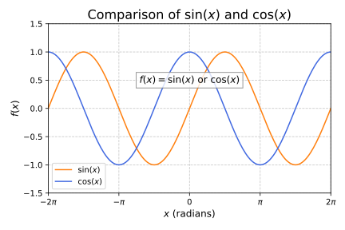

# Content

[Math - Typeset, align, wrap, comment, enumerate, space out, scale, and style mathematical expressions, utilizing amsmath](./math.md)

$$
\begin{align*} \qquad&\hspace{-2em}
\mathbb{P}(X+Y=k) 
= \sum_{\mathclap{x \in X(\Omega)}} \mathbb{P}(X = x) \cdot \mathbb{P}(Y=k-x) \\&
= \sum_{x = 0}^n \binom{n}{x}\, p^x\, (1-p)^{n-x} \cdot \binom{m}{k-x}\, q^{k-x}\, (1-q)^{m-(k-x)}
\end{align*}
$$

[Tables - Create tables and format by definiting styles in the preamble, utilizing pgfplotstable, tabularray](./tables.md)

[Code Snippets - Print source code with syntax highlighting in latex with listings](./code%20snippets.md)

[Graphics - Draw vector networks, graphs, images, plots in latex with tikz, pgf](./graphics.md)

[PyPlot](./pyplot.md)

[Dataview - Create dynamic tables using data stored in note properties](./dataview.md)

- [Convert dataview to static markdown for publishing](Convert%20dataview%20to%20static%20markdown%20for%20publishing.md)

# Tools

- [LaTeX - Typeset mathematical and scientific notation, handle cross-referencing and citations, and position images according to defined placement rules](./latex.md)
- [Markdown - Write content-focused and format with hierarchy, abstract highlighting, and meta-information](./markdown.md)
- [TYPST - A modern, readable, robust, fast typesetting system](./typst.md)
- [Style presets - Format your document after you written the content in Word, Latex, Markdown](Style%20presets%20-%20Format%20your%20document%20after%20you%20written%20the%20content%20in%20Word,%20Latex,%20Markdown.md)
- [Pandoc - Convert markup languages context aware with pandoc filters](Pandoc%20-%20Convert%20markup%20languages%20context%20aware%20with%20pandoc%20filters.md)
- [OfficeMath - Create mathematical equations and expressions in Microsoft Office products](./officemath.md)
 
# Typography

- determine good line breaks for whole paragraphs at once
- Kerning: when letters move closer together, e.g. the 'T" and 'e' in Tea'
- Ligatures: when letters merge together, e.g fi"
- prevent widows and orphans: lonely lines at the start or end of a page, respectively

# Structured documents 

- sections, headings, figures, tables, images, a table of contents, cross-references

---
Sources:

Related:

Tags:
[Computer Language](./computer%20language.md)