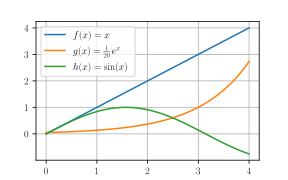

 MatPlotLib PyPlot is a [Python](./python.md) extension about visualisation. Generate GUI, SVG, PDF figures with an implicit, MATLAB-like interface

- Install extension via <pre><code class='language-powershell'>pip install matplotlib</code></pre>
- Download it from the [publisher's website](https://matplotlib.org/stable/gallery/index.html)


Example plot


```python
import numpy as np
import matplotlib.pyplot as plt

# Enable LaTeX rendering
plt.rcParams['text.usetex'] = True
plt.rcParams['font.family'] = 'serif'

# Create data
x = np.linspace(0, 4, 100)
f = x
g = np.exp(x)/20
h = np.sin(x)

# Create the plot
plt.figure(figsize=(4, 2.5))
plt.plot(x, f, label=r"$f(x) = x$")
plt.plot(x, g, label=r"$g(x) = \frac{1}{20}\, e^x$")
plt.plot(x, h, label=r"$h(x) = \sin(x)$")
plt.legend()
plt.grid(True)
plt.savefig(@vault_path + '/attachments/figure plt.svg', format='svg', transparent=True)
plt.show()
```

Attempt to generate commands for PGF drawing

```python
import matplotlib
import numpy as np
import matplotlib.pyplot as plt

matplotlib.use("pgf")
matplotlib.rcParams.update({
    "pgf.texsystem": "pdflatex",
    'font.family': 'serif',
    'font.size' : 11,
    'text.usetex': True,
    'pgf.rcfonts': False,
})

np.random.seed(19680801)

# example data
mu = 100  # mean of distribution
sigma = 15  # standard deviation of distribution
x = mu + sigma * np.random.randn(437)

num_bins = 50

fig, ax = plt.subplots()

# the histogram of the data
n, bins, patches = ax.hist(x, num_bins, density=1)

# add a 'best fit' line
y = ((1 / (np.sqrt(2 * np.pi) * sigma)) *
     np.exp(-0.5 * (1 / sigma * (bins - mu))**2))
ax.plot(bins, y, '--')
ax.set_xlabel('Smarts')
ax.set_ylabel('Probability density')
ax.set_title(r'Histogram of IQ: $\mu=100$, $\sigma=15$')

# Tweak spacing to prevent clipping of ylabel
fig.tight_layout()
fig.set_size_inches(4.7747,3.5)
plt.savefig(@vault_path + '/attachments/histogram.pgf')
plt.show()
```

```latex
\documentclass[a4paper]{article}
\usepackage[utf8]{inputenc}

\usepackage{tikz}
\usepackage{tikz-cd}
\usepackage{pgfplots}
\pgfplotsset{compat=1.14}

\begin{document}

\section{Histogram}

\begin{figure}[h]
    \begin{center}
        \input{histogram.pgf}
    \end{center}
    \caption{A PGF histogram from \texttt{matplotlib}.}
\end{figure}

\end{document}
```


```python
import matplotlib.pyplot as plt

#Direct input 
plt.rcParams['text.latex.preamble']=[r"\usepackage{lmodern}"]
#Options
params = {'text.usetex' : True,
          'font.size' : 11,
          'font.family' : 'lmodern',
          'text.latex.unicode': True,
          }
plt.rcParams.update(params) 

fig = plt.figure()

#You must select the correct size of the plot in advance
fig.set_size_inches(3.54,3.54) 

plt.plot([1,2,3,4])
plt.xlabel("Excitation-Energy")
plt.ylabel("Intensität")
plt.savefig(@vault_path + '/attachments/graph.pdf', 
            #This is simple recomendation for publication plots
            dpi=1000, 
            # Plot will be occupy a maximum of available space
            bbox_inches='tight', 
            )
plt.show()
```

