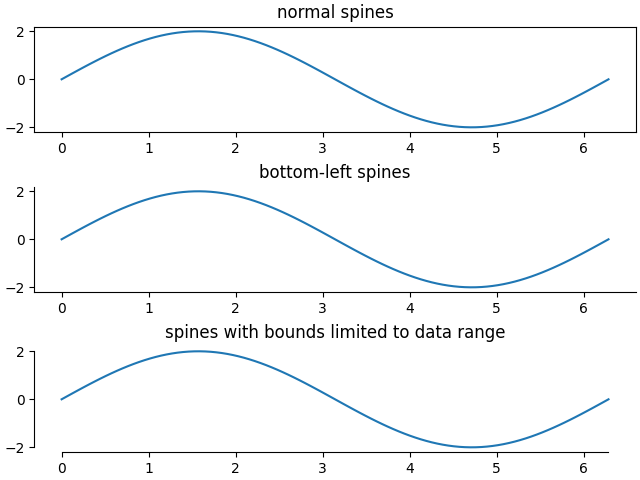

 MatPlotLib PyPlot is a [Python](./python.md) extension about visualisation. Generate GUI, SVG, PDF figures with an implicit, MATLAB-like interface

- Install extension via <pre><code class='language-powershell'>pip install matplotlib</code></pre>
- Download it from the [publisher's website](https://matplotlib.org/stable/gallery/index.html)


> Matplotlib is a comprehensive library for creating static, animated, and interactive visualizations.

- Source: [Matplotlib documentation — Matplotlib 3.10.0 documentation](https://matplotlib.org/stable/)

> The fundamental package for scientific computing with Python

- Source: [NumPy -](https://numpy.org/)

Example plot


```python
import numpy as np
import matplotlib.pyplot as plt

# Enable LaTeX rendering
plt.rcParams['text.usetex'] = True
plt.rcParams['font.family'] = 'serif'

# Create data
x = np.linspace(0, 4, 100)
f = x
g = np.exp(x)/20
h = np.sin(x)

# Create the plot
plt.figure(figsize=(4, 2.5))
plt.plot(x, f, label=r"$f(x) = x$")
plt.plot(x, g, label=r"$g(x) = \frac{1}{20}\, e^x$")
plt.plot(x, h, label=r"$h(x) = \sin(x)$")
plt.legend()
plt.grid(True)
plt.savefig(@vault_path + '/attachments/figure plt.svg', format='svg', transparent=True)
plt.show()
```

# Color gradients

- [CMasher: Scientific colormaps for making accessible, informative and cmashing plots — CMasher documentation](https://cmasher.readthedocs.io/)

## Layout multiple subfigures

- [Quick start guide — Matplotlib 3.10.0 documentation](https://matplotlib.org/stable/users/explain/quick_start.html#working-with-multiple-figures-and-axes)

# API interfaces

## Axes interface

> create a Figure and one or more Axes objects, then explicitly use methods on these objects to add data, configure limits, set labels etc.

## PyPlot interface

> matplotlib.pyplot is a state-based interface to matplotlib. It provides an implicit, MATLAB-like, way of plotting. It also opens figures on your screen, and acts as the figure GUI manager. pyplot is mainly intended for interactive plots and simple cases of programmatic plot generation:

- [matplotlib.pyplot — Matplotlib 3.10.0 documentation](https://matplotlib.org/stable/api/pyplot_summary.html#module-matplotlib.pyplot)


- [bad matplotlib attempts](bad%20matplotlib%20attempts.md)

# Modify spines



- [Spines — Matplotlib 3.10.0 documentation](https://matplotlib.org/stable/gallery/spines/spines.html#sphx-glr-gallery-spines-spines-py)
- [Spine placement — Matplotlib 3.10.0 documentation](https://matplotlib.org/stable/gallery/spines/spine_placement_demo.html#sphx-glr-gallery-spines-spine-placement-demo-py)

```python
import matplotlib.pyplot as plt
import numpy as np

x = np.linspace(0, 2 * np.pi, 100)
y = np.sin(x)

# Constrained layout makes sure the labels don't overlap the Axes.
fig, (ax0, ax1, ax2) = plt.subplots(ncols=3, layout='constrained')

ax0.plot(x, y)
ax0.set_title('normal')

ax1.plot(x, y)
ax1.set_title('bottom-left')

# Hide the right and top spines
ax1.spines.right.set_visible(False)
ax1.spines.top.set_visible(False)

ax2.plot(x, y)
ax2.set_title('data range')

# Only draw spines for the data range, not in the margins
ax2.spines.bottom.set_bounds(x.min(), x.max())
ax2.spines.left.set_bounds(y.min(), y.max())
# Hide the right and top spines
ax2.spines.right.set_visible(False)
ax2.spines.top.set_visible(False)

plt.show()
```

Spines


```python
import numpy as np
import matplotlib.pyplot as plt
plt.rcParams['text.usetex'] = True
plt.rcParams['font.family'] = 'serif'
x = np.linspace(0, 4, 100)
plt.figure(figsize=(3, 2.5))
plt.plot(x, x, label=r"$f(x) = x$")
plt.plot(x, np.exp(x)/20, label=r"$g(x) = \frac{1}{20}\, e^x$")
plt.plot(x, np.sin(x), label=r"$h(x) = \sin(x)$")
plt.legend()
plt.grid(True)
plt.savefig(@vault_path + '/attachments/plot spine normal.svg', format='svg', transparent=True)
plt.savefig(@vault_path + '/attachments/plot spine normal.pdf', transparent=True)
plt.show()
```

```python
import numpy as np
import matplotlib.pyplot as plt
plt.rcParams['text.usetex'] = True
plt.rcParams['font.family'] = 'serif'
x = np.linspace(0, 4, 100)
plt.figure(figsize=(3, 2.5))
ax = plt.subplot()
ax.plot(x, x, label=r"$f(x) = x$")
ax.plot(x, np.exp(x)/20, label=r"$g(x) = \frac{1}{20}\, e^x$")
ax.plot(x, np.sin(x), label=r"$h(x) = \sin(x)$")
ax.spines[['right', 'top']].set_visible(False)
ax.legend()
ax.grid(True)
plt.savefig(@vault_path + '/attachments/plot spine bottom-left.svg', format='svg', transparent=True)
plt.savefig(@vault_path + '/attachments/plot spine bottom-left.pdf', transparent=True)
plt.show()
```


```python
import numpy as np
import matplotlib.pyplot as plt
plt.rcParams['text.usetex'] = True
plt.rcParams['font.family'] = 'serif'
x = np.linspace(0, 4, 100)
plt.figure(figsize=(3, 2.5))
ax = plt.subplot()
ax.plot(x, x, label=r"$f(x) = x$")
ax.plot(x, np.exp(x)/20, label=r"$g(x) = \frac{1}{20}\, e^x$")
ax.plot(x, np.sin(x), label=r"$h(x) = \sin(x)$")
ax.spines[['left', 'bottom']].set_position('center')
ax.spines[['top', 'right']].set_visible(False)
ax.legend()
ax.grid(True)
plt.savefig(@vault_path + '/attachments/plot spine zero.svg', format='svg', transparent=True)
plt.savefig(@vault_path + '/attachments/plot spine zero.pdf', transparent=True)
plt.show()
```

```latex
\documentclass{standalone}
\usepackage{graphbox}
\begin{document}
\includegraphics{plot spine normal}
\includegraphics{plot spine bottom-left}
\includegraphics{plot spine zero}
\end{document}
```