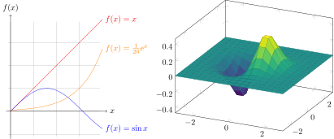
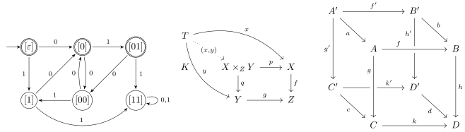

[Plots - Dynamically plot mathematical functions as a vector graphic](./plots.md)

[Networks, Commutative diagrams - Dynamically draw graph networks as a vector graphic](./networks-commutative-diagrams.md)

[Electrical circuit - Dynamically draw electronic circuit diagrams as a vector graphic](./electrical-circuit.md)

[Molecules - Dynamically draw structural formulas of chemical molecules as a vector graphic](./molecules.md)

[Heatmaps](Heatmaps.md)

[Gantt chart](./gantt-chart.md)

