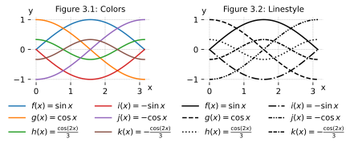

# Native and external processing tools


- Compare: [Graphing tool comparison - Compare native and external calculation and drawing engines like PGF, MatPlotLib, PyX for visualising data](Graphing%20tool%20comparison%20-%20Compare%20native%20and%20external%20calculation%20and%20drawing%20engines%20like%20PGF,%20MatPlotLib,%20PyX%20for%20visualising%20data.md)

# Modify spines of the x or y axis

- Hide unwanted spines, see 1.2, 1.3
- Move spines to origin $(0,0)$, see 1.3
- Add arrow tips to the top and right end of the spines
- [Physical Review Journals - Axis Labels and Scales on Graphs - H-18](https://journals.aps.org/authors/axis-labels-and-scales-on-graphs-h18)
- [graphics - Are there any guidelines for labeling axes in plots/graphs? - Academia Stack Exchange](https://academia.stackexchange.com/questions/18357/are-there-any-guidelines-for-labeling-axes-in-plots-graphs)
- [How to Label Axes and Units in Data Visualizations](https://www.linkedin.com/advice/0/what-best-practices-labeling-axes-units-data-visualizations-laftc#:~:text=%F0%9F%9A%80When%20labeling%20axes%2C%20use,associated%20with%20the%20corresponding%20data.)
- See source code examples: [Spines - Place axis spines of plots](./spines.md)


# Add legend

- Show legend at best determined location inside data, see 2.1
- Position legend outside data, see 2.2
- Position legend entries horizontally or in a grid, see 2.2
- Annotate the lines directly within the data, see 2.3
- See source code examples: [Function legend - Show formulas for multiple functions](./function-legend.md)


# Differentiate functions with color or line style

See source code examples: [Cycles - Differentiate data set with colors or line style](./cycles.md)



# Text

- [Annotate - Write text on the plot](Annotate%20-%20Write%20text%20on%20the%20plot.md)

annotate interval
Multiline titles: Wrap overlong title

```
def wrap_title(axes):
    import textwrap as tw
    long_title = axes.get_title()
    axes.set_title(tw.fill(long_title, 20))
```

# Terminology


Explicit Axes through Figure `fig` , Axes `ax`

Implicit Axes through PyPlot `plt`

- figure: entire canvas
- axes: subplot
- spines: connecting lines between ticks
- savefig.bbox: add tight padding around figure to prevent cropped legends
- constrained_layout: Place elements next to each other instead of overlaying
- titlesize 10: default fontsize for latex figures, allows longer titles
- grid linesstyle: less visual dominant that solid lines, to keep focus on function line

```python
import numpy as np
import matplotlib.pyplot as plt
plt.rcParams.update({'savefig.transparent':True, 'savefig.bbox':'tight', 
    'figure.constrained_layout.use':True, 'svg.fonttype':'none',
    'axes.titlesize': 10, 'axes.grid':True, 'grid.linestyle':':'})
plt.rc('axes.spines', left=False, top=False, right=False, bottom=False)
def plot_example_function(axes):
    x = np.linspace(0, 2.5, 100)
    axes.set_xlabel("x")
    axes.plot(x, np.cos(np.pi*x)*np.exp(-x), 
        label=r"$f(x) = \dfrac{\cos(\pi x)}{e^x}$")
    axes.legend()

fig, ax = plt.subplots(figsize=(6,2.2))
plot_example_function(ax)
# plt.savefig(@vault_path + '/attachments/plot .svg')
plt.show()
```

# Dufte

- Source code examples: [dufte plots](dufte%20plots.md)

# Size

- [Size of plots](Size%20of%20plots.md)

# Legend

- [Function legend - Show formulas for multiple functions](./function-legend.md)


Color gradients

- [CMasher: Scientific colormaps for making accessible, informative and cmashing plots — CMasher documentation](https://cmasher.readthedocs.io/)

## Layout multiple subfigures

- [Quick start guide — Matplotlib 3.10.0 documentation](https://matplotlib.org/stable/users/explain/quick_start.html#working-with-multiple-figures-and-axes)


---
Sources:
- [Plot (graphics) - Wikipedia](https://en.wikipedia.org/wiki/Plot_(graphics))
- [Graph Terminology | Axis, Range & Scale](https://study.com/academy/lesson/graph-terminology-axis-range-scale.html)

Related:

Tags:
