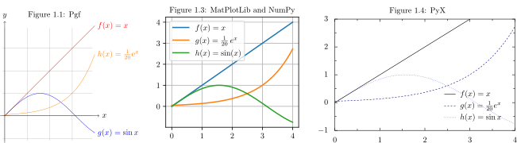

# Native and external processing tools 



- Compare: [PGF vs MatPlotLib vs PyX - Compare native and externalk calculation and drawing engines for plotting](PGF%20vs%20MatPlotLib%20vs%20PyX%20-%20Compare%20native%20and%20externalk%20calculation%20and%20drawing%20engines%20for%20plotting.md)

# Terminology

Explicit Axes through Figure `fig` , Axes `ax`

Implicit Axes through PyPlot `plt`


```python
import numpy as np
import matplotlib.pyplot as plt
plt.rcParams.update({"text.usetex":True, 'font.family':'serif'})
x = np.linspace(0, np.pi*2, 100)
fig, ax = plt.subplots(layout='constrained')
ax.plot(x, np.sin(x), label=r"$f(x) = \sin(x)$")
ax.set_title("Sample plot")
export_plt_figure(plt, outfile="")
plt.show()
``````

# Size

- [Size of plots](Size%20of%20plots.md)

# Legend

- [Function legend - Show formulas for multiple functions](./function-legend.md)

# Modify spines (axis lines)

- See source code examples: [Spines - Place axis spines of plots](./spines.md)


Color gradients

- [CMasher: Scientific colormaps for making accessible, informative and cmashing plots — CMasher documentation](https://cmasher.readthedocs.io/)

## Layout multiple subfigures

- [Quick start guide — Matplotlib 3.10.0 documentation](https://matplotlib.org/stable/users/explain/quick_start.html#working-with-multiple-figures-and-axes)


