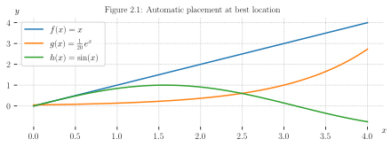
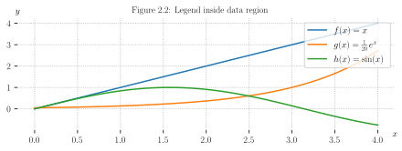
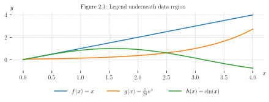
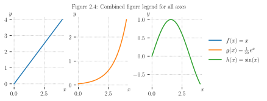
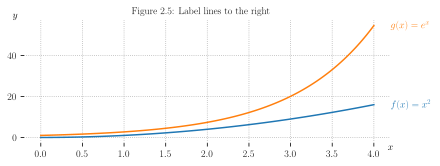
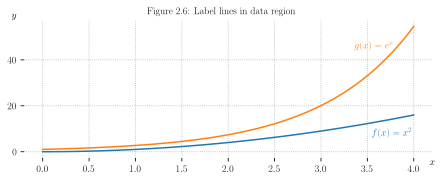
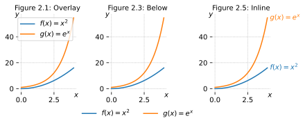

# Legend box - Show line labels in separate legend

## Default best placement

Inside overlay legend
Auto placed



```python
import numpy as np
import matplotlib.pyplot as plt
plt.rcParams.update({'savefig.transparent':True, 'savefig.bbox':'tight', 
    'figure.constrained_layout.use':True, 'svg.fonttype':'none',
    'axes.titlesize': 10, 'axes.grid':True, 'grid.linestyle':':'})
plt.rc('axes.spines', left=False, top=False, right=False, bottom=False)
def plot_function_values(axes):
    x = np.linspace(0, 4, 100)
    axes.plot(x, x, label=r"$f(x) = x$")
    axes.plot(x, np.exp(x)/20, label=r"$g(x) = \frac{1}{20}\, e^x$")
    axes.plot(x, np.sin(x), label=r"$h(x) = \sin(x)$")
    axes.set_xlabel('$x$')
    axes.set_ylabel('$y$')
    move_xylabels_to_corners(axes)
def move_xylabels_to_corners(axes):
    axes.xaxis.set_label_coords(1, 0)
    axes.yaxis.set_label_coords(0, 1.025)
    axes.yaxis.label.set(rotation=0)
def show_legend_auto(axes):
    axes.set_title("Figure 2.1: Automatic placement at best location")
    axes.legend()

fig, ax = plt.subplots(figsize=(6,2.2))
plot_function_values(ax)
show_legend_auto(ax)
plt.savefig(@vault_path + '/attachments/figure plot legend auto.svg')
plt.show()
```

## Locations inside data

- Available locations: `best`, `upper right`, `upper left`, `lower left`, `lower right`, `right`, `center left`, `center right`, `lower center`, `upper center`, `center`




```python
import numpy as np
import matplotlib.pyplot as plt
plt.rcParams.update({'savefig.transparent':True, 'savefig.bbox':'tight', 
    'figure.constrained_layout.use':True, 'svg.fonttype':'none',
    'axes.titlesize': 10, 'axes.grid':True, 'grid.linestyle':':'})
plt.rc('axes.spines', left=False, top=False, right=False, bottom=False)
def plot_function_values(axes):
    x = np.linspace(0, 4, 100)
    axes.plot(x, x, label=r"$f(x) = x$")
    axes.plot(x, np.exp(x)/20, label=r"$g(x) = \frac{1}{20}\, e^x$")
    axes.plot(x, np.sin(x), label=r"$h(x) = \sin(x)$")
    axes.set_xlabel('$x$')
    axes.set_ylabel('$y$')
    move_xylabels_to_corners(axes)
def move_xylabels_to_corners(axes):
    axes.xaxis.set_label_coords(1, 0)
    axes.yaxis.set_label_coords(0, 1.025)
    axes.yaxis.label.set(rotation=0)
def show_legend_top_right(axes):
    axes.set_title("Figure 2.2: Legend inside data region")
    axes.legend(loc="upper right")

fig, ax = plt.subplots(figsize=(6,2.2))
plot_function_values(ax)
show_legend_top_right(ax)
plt.savefig(@vault_path + '/attachments/figure plot legend inside.svg')
plt.show()
```

## Custom location

- [Legend guide — Matplotlib 3.10.0 documentation](https://matplotlib.org/stable/users/explain/axes/legend_guide.html)
- [python - How to put the legend outside the plot - Stack Overflow](https://stackoverflow.com/questions/4700614/how-to-put-the-legend-outside-the-plot)
- [Customizing Plot Legends \| Python Data Science Handbook](https://jakevdp.github.io/PythonDataScienceHandbook/04.06-customizing-legends.html)



```python
import numpy as np
import matplotlib.pyplot as plt
plt.rcParams.update({'savefig.transparent':True, 'savefig.bbox':'tight', 
    'figure.constrained_layout.use':True, 'svg.fonttype':'none',
    'axes.titlesize': 10, 'axes.grid':True, 'grid.linestyle':':'})
plt.rc('axes.spines', left=False, top=False, right=False, bottom=False)
def plot_function_values(axes):
    x = np.linspace(0, 4, 100)
    axes.plot(x, x, label=r"$f(x) = x$")
    axes.plot(x, np.exp(x)/20, label=r"$g(x) = \frac{1}{20}\, e^x$")
    axes.plot(x, np.sin(x), label=r"$h(x) = \sin(x)$")
    axes.set_xlabel('$x$')
    axes.set_ylabel('$y$')
    move_xylabels_to_corners(axes)
def move_xylabels_to_corners(axes):
    axes.xaxis.set_label_coords(1, 0)
    axes.yaxis.set_label_coords(0, 1.025)
    axes.yaxis.label.set(rotation=0)
def show_legend_underneath(axes):
    axes.set_title("Figure 2.3: Legend underneath data region")
    axes.legend(loc='upper center', ncols=3, 
        bbox_to_anchor=(0.5, -0.2), frameon=False)

fig, ax = plt.subplots(figsize=(6,2.2))
plot_function_values(ax)
show_legend_underneath(ax)
plt.savefig(@vault_path + '/attachments/figure plot legend outside.svg')
plt.show()
```

## Figure legends



```python
import numpy as np
import matplotlib.pyplot as plt
plt.rcParams.update({'savefig.transparent':True, 'savefig.bbox':'tight', 
    'figure.constrained_layout.use':True, 'svg.fonttype':'none',
    'axes.titlesize': 10, 'axes.grid':True, 'grid.linestyle':':'})
plt.rc('axes.spines', left=False, top=False, right=False, bottom=False)
def plot_function_values(axes_list):
    x = np.linspace(0, 4, 100)
    axes_list[0].plot(x, x, label=r"$f(x) = x$")
    axes_list[1].plot(x, np.exp(x)/20, color='C1',
        label=r"$g(x) = \frac{1}{20}\, e^x$")
    axes_list[2].plot(x, np.sin(x), color='C2', 
        label=r"$h(x) = \sin(x)$")
    for axes in axes_list:
        axes.set_xlabel('$x$')
        axes.set_ylabel('$y$')
        move_xylabels_to_corners(axes)
def move_xylabels_to_corners(axes):
    axes.xaxis.set_label_coords(1, 0)
    axes.yaxis.set_label_coords(-.025, 1)
    axes.yaxis.label.set(rotation=0)
def show_legend_alongside_subplots(figure):
    figure.suptitle("Figure 2.4: Combined figure legend for all axes",
        fontsize=10)
    figure.legend(loc="outside right center", frameon=False)

fig, axs = plt.subplots(ncols=3, figsize=(6,2.2))
plot_function_values(axs)
show_legend_alongside_subplots(fig)
plt.savefig(@vault_path + '/attachments/figure plot legend figure.svg')
plt.show()
```

# Annotate data - Show line labels at the lines themselves

## Annotate next to last point of line



```python
import numpy as np
import matplotlib.pyplot as plt
plt.rcParams.update({'savefig.transparent':True, 'savefig.bbox':'tight',
    'figure.constrained_layout.use':True, 'svg.fonttype':'none',
    'axes.titlesize': 10, 'axes.grid':True, 'grid.linestyle':':'})
plt.rc('axes.spines', left=False, top=False, right=False, bottom=False)
def graph_example_function(axes):
    x = np.linspace(0, 4, 100)
    axes.plot(x, np.pow(x, 2), label=r"$f(x) = x^2$")
    axes.plot(x, np.exp(x), label=r"$g(x) = e^x$")
    axes.set_xlabel('$x$')
    axes.set_ylabel('$y$')
    move_xylabels_to_corners(axes)
def move_xylabels_to_corners(axes):
    axes.xaxis.set_label_coords(1, 0)
    axes.yaxis.set_label_coords(-.025, 1)
    axes.yaxis.label.set(rotation=0)
def show_legend_besides_lines(axes):
    axes.set_title("Figure 2.5: Label lines to the right")
    lines = axes.get_lines()
    for line in lines:
        label = line.get_label()
        last_y_value = line.get_ydata()[-1]
        axes.annotate(label, xy=(1, last_y_value), xytext=(0, 0), 
            color=line.get_color(), xycoords=axes.get_yaxis_transform(), 
            textcoords="offset points", va="center")

fig, ax = plt.subplots(figsize=(6,2.2))
graph_example_function(ax)
show_legend_besides_lines(ax)
plt.savefig(@vault_path + '/attachments/figure plot legend next to line.svg')
plt.show()
```

## Labels inside data region



```python
import numpy as np
import matplotlib.pyplot as plt
plt.rcParams.update({'savefig.transparent':True, 'savefig.bbox':'tight', 
    'figure.constrained_layout.use':True, 'svg.fonttype':'none',
    'axes.titlesize': 10, 'axes.grid':True, 'grid.linestyle':':'})
plt.rc('axes.spines', left=False, top=False, right=False, bottom=False)
def graph_example_function(axes):
    x = np.linspace(0, 4, 100)
    axes.plot(x, np.pow(x, 2), label=r"$f(x) = x^2$")
    axes.plot(x, np.exp(x), label=r"$g(x) = e^x$")
    axes.set_xlabel('$x$')
    axes.set_ylabel('$y$')
    move_xylabels_to_corners(axes)
def move_xylabels_to_corners(axes):
    axes.xaxis.set_label_coords(1, 0)
    axes.yaxis.set_label_coords(-.025, 1)
    axes.yaxis.label.set(rotation=0)
def annotate_lines(axes):
    axes.set_title("Figure 2.6: Label lines in data region")
    lines = axes.get_lines()
    axes.text(4, 7, horizontalalignment='right', 
        s=lines[0].get_label(), color=lines[0].get_color())
    axes.text(3.8, 45, horizontalalignment='right',
        s=lines[1].get_label(), color=lines[1].get_color())

fig, ax = plt.subplots(figsize=(6,2.4))
graph_example_function(ax)
annotate_lines(ax)
plt.savefig(@vault_path + '/attachments/figure plot legend at line.svg')
plt.show()
```

# Figure collection for note preview

See [graphic for print documents (PDF)](../plot-legend.pdf) or graphic for displays:



```python
import numpy as np
import matplotlib.pyplot as plt
import textwrap as tw
plt.rcParams.update({'savefig.transparent':True, 'savefig.bbox':'tight', 
    'figure.constrained_layout.use':True, 'svg.fonttype':'none',
    'axes.titlesize': 10, 'axes.grid':True, 'grid.linestyle':':'})
plt.rc('axes.spines', left=False, top=False, right=False, bottom=False)
def graph_example_function(axes):
    x = np.linspace(0, 4, 100)
    axes.plot(x, np.pow(x, 2), label=r"$f(x) = x^2$")
    axes.plot(x, np.exp(x), label=r"$g(x) = e^x$")
    axes.set_xlabel('$x$')
    axes.set_ylabel('$y$')
    move_xylabels_to_corners(axes)
def move_xylabels_to_corners(axes):
    axes.xaxis.set_label_coords(1, 0)
    axes.yaxis.set_label_coords(-.025, .95)
    axes.yaxis.label.set(rotation=0)
def show_legend_best(axes):
    axes.set_title("Figure 2.1: Overlay")
    axes.legend()
def show_legend_underneath(axes):
    axes.set_title("Figure 2.3: Below")
    axes.legend(loc='upper center', ncols=2, 
        bbox_to_anchor=(0.5, -0.15), frameon=False)
def show_legend_besides_lines(axes):
    axes.set_title("Figure 2.5: Inline")
    lines = axes.get_lines()
    for line in lines:
        label = line.get_label()
        last_y_value = line.get_ydata()[-1]
        axes.annotate(label, xy=(1, last_y_value), xytext=(0, 0), 
            color=line.get_color(), xycoords=axes.get_yaxis_transform(), 
            textcoords="offset points", va="center")
def draw_figure(filetype):
    fig, axs = plt.subplots(ncols=3, figsize=(6,2.4))
    [graph_example_function(ax) for ax in axs] 
    show_legend_best(axs[0])
    show_legend_underneath(axs[1])
    show_legend_besides_lines(axs[2])
    plt.savefig(@vault_path + '/attachments/figure plot legend.' + filetype)
    
draw_figure('svg')
plt.clf()
plt.rcParams.update({'text.usetex':True, 'font.family':'serif'})
draw_figure('pdf')
plt.show()
```

Other plot legends
