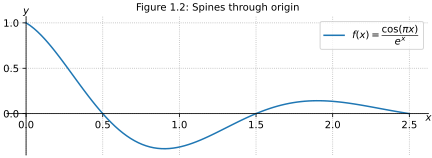
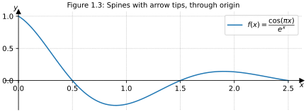
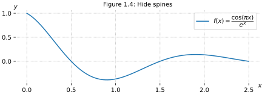
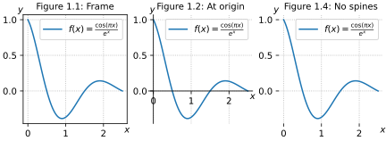

# Default spines

Spines are the lines connecting the axis tick marks and noting the boundaries of the data area. They can be placed at arbitrary positions. By default, Matplotlib displays spines on all four sides of the plot.

-  Default frame clearly marks boundaries of data


```python
import numpy as np
import matplotlib.pyplot as plt
plt.rcParams.update({'savefig.transparent':True, 'svg.fonttype':'none',
    'figure.constrained_layout.use':True, 'axes.titlesize': 10,
    'axes.grid':True, 'grid.linestyle':':'})
def plot_function_values(axes):
    x = np.linspace(0, 2.5, 100)
    axes.plot(x, np.cos(np.pi*x)*np.exp(-x), 
        label=r"$f(x) = \dfrac{\cos(\pi x)}{e^x}$")
    axes.set_xlabel('$x$')
    axes.set_ylabel('$y$')
    move_xylabels_to_corners(axes)
    axes.legend()
def move_xylabels_to_corners(axes):
    axes.xaxis.set_label_coords(1, -.025)
    axes.yaxis.set_label_coords(-.025, 1)
    axes.yaxis.label.set(rotation=0)
def keep_spines_normal(axes):
    axes.set_title("Figure 1.1: Default spines")

fig, ax = plt.subplots(figsize=(6,2.2))
plot_function_values(ax)
keep_spines_normal(ax)
plt.savefig(@vault_path + '/attachments/figure spine default.svg')
plt.show()
```

# Through origin

Move spines to make them intersect at the origin $(0,0)$



```python
import numpy as np
import matplotlib.pyplot as plt
plt.rcParams.update({'savefig.transparent':True, 'svg.fonttype':'none',
    'figure.constrained_layout.use':True, 'axes.titlesize': 10,
    'axes.grid':True, 'grid.linestyle':':'})
def plot_function_values(axes):
    x = np.linspace(0, 2.5, 100)
    axes.plot(x, np.cos(np.pi*x)*np.exp(-x), 
        label=r"$f(x) = \dfrac{\cos(\pi x)}{e^x}$")
    axes.set_xlabel('$x$')
    axes.set_ylabel('$y$')
    move_xylabels_to_xyaxis(axes)
    axes.legend()
def move_xylabels_to_xyaxis(axes):
    axes.xaxis.set_label_coords(1, 0, 
        transform=axes.get_yaxis_transform())
    axes.yaxis.set_label_coords(0, 1, 
        transform=axes.get_xaxis_transform())
    axes.yaxis.label.set(rotation=0)
def move_spines_to_origin(axes):
    axes.set_title("Figure 1.2: Spines through origin")
    axes.spines[['right', 'top']].set_visible(False)
    axes.spines[['left', 'bottom']].set_position('zero')

fig, ax = plt.subplots(figsize=(6,2.2))
plot_function_values(ax)
move_spines_to_origin(ax)
plt.savefig(@vault_path + '/attachments/plot spine origin.svg')
plt.show()
```

# Arrow tips

> Draw filled triangles and the top and right end of the spines, intersecting at $(0,0)$. In each case, one of the coordinates (0) is a data coordinate (i.e., y = 0 or x = 0, respectively) and the other one (1) is an axes coordinate (i.e., at the very right/top of the axes). Also, disable clipping (clip_on=False) as the marker actually spills out of the axes.

- Source: [Centered spines with arrows — Matplotlib 3.3.4 documentation](https://matplotlib.org/3.3.4/gallery/recipes/centered_spines_with_arrows.html)
- 👎 triangle shape is also used for scatter data points



```python
import numpy as np
import matplotlib.pyplot as plt
plt.rcParams.update({'savefig.transparent':True, 'svg.fonttype':'none',
    'figure.constrained_layout.use':True, 'axes.titlesize': 10,
    'axes.grid':True, 'grid.linestyle':':'})
def plot_function_values(axes):
    x = np.linspace(0, 2.5, 100)
    axes.plot(x, np.cos(np.pi*x)*np.exp(-x), 
        label=r"$f(x) = \dfrac{\cos(\pi x)}{e^x}$")
    axes.set_xlabel('$x$')
    axes.set_ylabel('$y$')
    move_xylabels_to_xyaxis(axes)
    axes.legend()
def move_xylabels_to_xyaxis(axes):
    axes.xaxis.set_label_coords(1, -.025, 
        transform=axes.get_yaxis_transform())
    axes.yaxis.set_label_coords(-.025, 1, 
        transform=axes.get_xaxis_transform())
    axes.yaxis.label.set(rotation=0)
def move_spines_to_origin_and_add_arrows(axes):
    axes.set_title("Figure 1.3: Spines with arrow tips, through origin")
    axes.spines[['right', 'top']].set_visible(False)
    axes.spines[['left', 'bottom']].set_position('zero')
    axes.plot(1, 0, ">k", transform=axes.get_yaxis_transform(), 
        clip_on=False)
    axes.plot(0, 1, "^k", transform=axes.get_xaxis_transform(), 
        clip_on=False)

fig, ax = plt.subplots(figsize=(6,2.2))
plot_function_values(ax)
move_spines_to_origin_and_add_arrows(ax)
plt.savefig(@vault_path + '/attachments/plot spine arrow tips.svg')
plt.show()
```

# Hide all spines

- Keep focus on the function line with less visual distraction 



```python
import numpy as np
import matplotlib.pyplot as plt
plt.rcParams.update({'savefig.transparent':True, 'svg.fonttype':'none',
    'figure.constrained_layout.use':True, 'axes.titlesize': 10,
    'axes.grid':True, 'grid.linestyle':':'})
def plot_function_values(axes):
    x = np.linspace(0, 2.5, 100)
    axes.plot(x, np.cos(np.pi*x)*np.exp(-x), 
        label=r"$f(x) = \dfrac{\cos(\pi x)}{e^x}$")
    axes.set_xlabel('$x$')
    axes.set_ylabel('$y$')
    move_xylabels_to_corners(axes)
    axes.legend()
def move_xylabels_to_corners(axes):
    axes.xaxis.set_label_coords(1, 0)
    axes.yaxis.set_label_coords(0, 1)
    axes.yaxis.label.set(rotation=0)
def hide_spines(axes):
    axes.set_title("Figure 1.4: Hide spines")
    axes.spines[:].set_visible(False)

fig, ax = plt.subplots(figsize=(6,2.2))
plot_function_values(ax)
hide_spines(ax)
plt.savefig(@vault_path + '/attachments/plot spines hidden.svg')
plt.show()
```

# Figure collection for note preview

See [graphic for print documents (PDF)](../plot-spines.pdf) or graphic for displays:



```python
import numpy as np
import matplotlib.pyplot as plt
plt.rcParams.update({'savefig.transparent':True, 'svg.fonttype':'none',
    'figure.constrained_layout.use':True, 'axes.titlesize': 10,
    'axes.grid':True, 'grid.linestyle':':'})
def plot_function_values(axes):
    x = np.linspace(0, 2.5, 100)
    axes.plot(x, np.cos(np.pi*x)*np.exp(-x), 
        label=r"$f(x) = \frac{\cos(\pi x)}{e^x}$")
    axes.set_xlabel('$x$')
    axes.set_ylabel('$y$')
    move_xylabels_to_corners(axes)
    axes.legend()
def move_xylabels_to_corners(axes):
    axes.xaxis.set_label_coords(1, -.025)
    axes.yaxis.set_label_coords(-.025, 1)
    axes.yaxis.label.set(rotation=0)
def move_xylabels_to_xyaxis(axes):
    axes.xaxis.set_label_coords(1, -.025, 
        transform=axes.get_yaxis_transform())
    axes.yaxis.set_label_coords(-.025, 1, 
        transform=axes.get_xaxis_transform())
    axes.yaxis.label.set(rotation=0)
def keep_spines_normal(axes):
    axes.set_title("Figure 1.1: Frame")
def move_spines_to_origin(axes):
    axes.set_title("Figure 1.2: At origin")
    axes.spines[['right', 'top']].set_visible(False)
    axes.spines[['left', 'bottom']].set_position('zero')
    move_xylabels_to_xyaxis(axes)
def hide_spines(axes):
    axes.set_title("Figure 1.4: No spines")
    axes.spines[:].set_visible(False)
def draw_figure(filetype):
    fig, axs = plt.subplots(ncols=3, figsize=(6,2.2))
    [plot_function_values(ax) for ax in axs]
    keep_spines_normal(axs[0])
    move_spines_to_origin(axs[1])
    hide_spines(axs[2])
    plt.savefig(@vault_path + '/attachments/figure plot spines.' + filetype)

draw_figure('svg')
plt.clf()
plt.rcParams.update({'text.usetex':True, 'font.family':'serif'})
draw_figure('pdf')
plt.show()
```


Other spine plots
