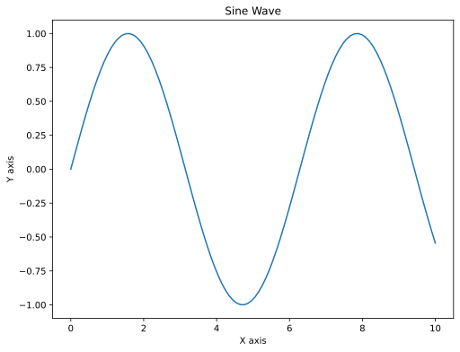
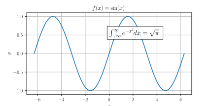

Plot of values for $x = 0, 1, \ldots$

```python
import matplotlib.pyplot as plt
plt.plot([1, 2, 3, 4])
plt.ylabel('some numbers')
plt.show()
```

Plot $x$ and $y$ coordinates

```python
import matplotlib.pyplot as plt
plt.plot([1, 2, 3, 4], [1, 4, 9, 16])
plt.show()
```

Use numpy

```python
import matplotlib.pyplot as plt
import numpy as np
# evenly sampled time at 200ms intervals
t = np.arange(0., 5., 0.2)

# red dashes, blue squares and green triangles
plt.plot(t, t, 'r--', t, t**2, 'bs', t, t**3, 'g^')
plt.show()
```

Plotting with keyword string

```python
data = {'a': np.arange(50),
        'c': np.random.randint(0, 50, 50),
        'd': np.random.randn(50)}
data['b'] = data['a'] + 10 * np.random.randn(50)
data['d'] = np.abs(data['d']) * 100

plt.scatter('a', 'b', c='c', s='d', data=data)
plt.xlabel('entry a')
plt.ylabel('entry b')
plt.show()
```

SVG export

```run-python
import matplotlib.pyplot as plt
import numpy as np

# Generate some data
x = np.linspace(0, 10, 100)
y = np.sin(x)

# Create the plot
plt.figure(figsize=(8, 6))
plt.plot(x, y)
plt.title('Sine Wave')
plt.xlabel('X axis')
plt.ylabel('Y axis')

# Save the plot as SVG
plt.savefig(@vault_path + '/attachments/sine_wave_plot.svg', format='svg', dpi=300, bbox_inches='tight', transparent=True)
plt.close()
```



Showcase

```python
import numpy as np
import matplotlib.pyplot as plt

# Set up the figure with a wide aspect ratio
plt.figure(figsize=(12, 4))

# Generate data
x = np.linspace(-2*np.pi, 2*np.pi, 200)
y1 = np.sin(x)
y2 = np.cos(x)

# Plot the data
plt.plot(x, y1, color='#ff7f0e', label=r'$\sin(x)$')  # Using hex color
plt.plot(x, y2, color='royalblue', label=r'$\cos(x)$')  # Using named color

# Set the title with LaTeX
plt.title(r'Comparison of $\sin(x)$ and $\cos(x)$', fontsize=16)

# Set x and y labels with LaTeX
plt.xlabel(r'$x$ (radians)', fontsize=12)
plt.ylabel(r'$f(x)$', fontsize=12)

# Add a grid
plt.grid(True, linestyle='--', alpha=0.7)

# Add a legend
plt.legend(fontsize=10)

# Add text annotation with LaTeX
plt.text(0, 0.5, r'$f(x) = \sin(x)$ or $\cos(x)$', 
         fontsize=12, ha='center', va='center', 
         bbox=dict(facecolor='white', edgecolor='gray', alpha=0.8))

# Customize the plot area
plt.xlim(-2*np.pi, 2*np.pi)
plt.ylim(-1.5, 1.5)

# Add custom ticks with LaTeX
plt.xticks([-2*np.pi, -np.pi, 0, np.pi, 2*np.pi],
           [r'$-2\pi$', r'$-\pi$', r'$0$', r'$\pi$', r'$2\pi$'])

# Adjust layout and save as SVG with transparent background
plt.tight_layout()
plt.gcf().set_facecolor('none')
plt.savefig(@vault_path + '/attachments/pyplot_features_demo.svg', format='svg', transparent=True)

# Show the plot
plt.show()
```


```python
import numpy as np
import matplotlib.pyplot as plt

# Enable LaTeX rendering
plt.rcParams['text.usetex'] = True
plt.rcParams['font.family'] = 'serif'

# Create data
x = np.linspace(-2*np.pi, 2*np.pi, 100)
y = np.sin(x)

# Create the plot
plt.figure(figsize=(10, 6))
plt.plot(x, y)
plt.title(r'$f(x) = \sin(x)$')
plt.xlabel(r'$x$')
plt.ylabel(r'$y$')

# Add a text box with a more complex equation
plt.text(0, 0.5, r'$\int_{-\infty}^{\infty} e^{-x^2} dx = \sqrt{\pi}$', 
         fontsize=14, bbox=dict(facecolor='white', alpha=0.8))

plt.grid(True)
plt.savefig(@vault_path + '/attachments/latex_plot.svg', format='svg', transparent=True)
plt.show()
```

