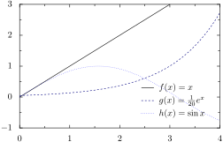

 PyX is a [Python](./python.md) extension about visualisation. Generate PDF, SVG graphics with LaTeX drawn text and PostScript drawing backend

- Install extension via <pre><code class='language-powershell'>pip install PyX</code></pre>
- Download the [latest release](https://github.com/pyx-project/pyx/releases/latest) of its source code [repository](https://github.com/pyx-project/pyx) on GitHub
- Download it from the [publisher's website](https://pyx-project.org/)


Example plot


```python
from pyx import *
g = graph.graphxy(width=8,
                  x=graph.axis.linear(min=0, max=4),
                  y=graph.axis.linear(min=-1, max=3),
                  key=graph.key.key(pos="br", dist=0.1))
g.plot([graph.data.function("y(x)=x", title=r"$f(x) = x$"),
        graph.data.function("y(x)=1/20*e**x", title=r"$g(x) = {1 \over 20} e^x$"),
        graph.data.function("y(x)=sin(x)", title=r"$h(x) = \sin{x}$")],
       [graph.style.line([color.gradient.BlackBlue])])
g.writeSVGfile(@vault_path + '/attachments/pxy1')
g.writePDFfile(@vault_path + '/attachments/pxy1')
@show(@vault_url + '/attachments/pxy1.svg')
```

Example plot with export function



```python
def export_and_show_pyx_figure(pyx_graph, outfile=None):
    if (outfile):
        g.writeSVGfile(@vault_path + '/attachments/' + outfile)
        g.writePDFfile(@vault_path + '/attachments/' + outfile)
    g.writeSVGfile(@vault_path + '/attachments/.temp')
    @show(@vault_url + '/attachments/.temp.svg')

from pyx import graph, color
g = graph.graphxy(width=8,
                  x=graph.axis.linear(min=0, max=4),
                  y=graph.axis.linear(min=-1, max=3),
                  key=graph.key.key(pos="br", dist=0.1))
g.plot([graph.data.function("y(x)=x", title=r"$f(x) = x$"),
        graph.data.function("y(x)=1/20*e**x", title=r"$g(x) = {1 \over 20} e^x$"),
        graph.data.function("y(x)=sin(x)", title=r"$h(x) = \sin{x}$")],
       [graph.style.line([color.gradient.BlackBlue])])
export_and_show_pyx_figure(g, "pyx 1")
```

```python
from pyx import graph, color
g = graph.graphxy(width=8,
                  x=graph.axis.linear(min=0, max=4),
                  y=graph.axis.linear(min=-1, max=3),
                  key=graph.key.key(pos="br", dist=0.1))
g.plot([graph.data.function("y(x)=x", title=r"$f(x) = x$"),
        graph.data.function("y(x)=1/20*e**x", title=r"$g(x) = {1 \over 20} e^x$"),
        graph.data.function("y(x)=sin(x)", title=r"$h(x) = \sin{x}$")],
       [graph.style.line([color.gradient.BlackBlue])])
export_and_show_pyx_figure(g, "pyx 2")
```

