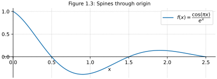
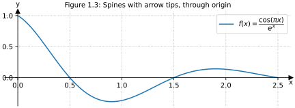

# Default spines

Spines are the lines connecting the axis tick marks and noting the boundaries of the data area. They can be placed at arbitrary positions. By default, Matplotlib displays spines on all four sides of the plot.

-  Default frame clearly marks boundaries of data


```python
import numpy as np
import matplotlib.pyplot as plt
plt.rcParams.update({'savefig.transparent':True, 'svg.fonttype':'none',
    'figure.constrained_layout.use':True, 'axes.titlesize': 10,
    'axes.grid':True, 'grid.linestyle':':'})
def graph_example_function(axes):
    x = np.linspace(0, 2.5, 100)
    axes.set_xlabel("x")
    axes.plot(x, np.cos(np.pi*x)*np.exp(-x), 
        label=r"$f(x) = \dfrac{\cos(\pi x)}{e^x}$")
    axes.legend()
def keep_spines_normal(axes):
    axes.set_title("Figure 1.1: Default spines")

fig, ax = plt.subplots(figsize=(6,2.2))
graph_example_function(ax)
keep_spines_normal(ax)
plt.savefig(@vault_path + '/attachments/plot spine default.svg')
plt.show()
```

# Hide spines

Only keep left and bottom spine

- Keep focus on the function line with less visual distraction 


```python
import numpy as np
import matplotlib.pyplot as plt
plt.rcParams.update({'savefig.transparent':True, 'svg.fonttype':'none',
    'figure.constrained_layout.use':True, 'axes.titlesize': 10,
    'axes.grid':True, 'grid.linestyle':':'})
def graph_example_function(axes):
    x = np.linspace(0, 2.5, 100)
    axes.set_xlabel("x")
    axes.plot(x, np.cos(np.pi*x)*np.exp(-x), 
        label=r"$f(x) = \dfrac{\cos(\pi x)}{e^x}$")
    axes.legend()
def hide_spines_top_and_right(axes):
    axes.set_title("Figure 1.2: Left, bottom spine")
    axes.spines[['right', 'top']].set_visible(False)

fig, ax = plt.subplots(figsize=(6,2.2))
graph_example_function(ax)
hide_spines_top_and_right(ax)
plt.savefig(@vault_path + '/attachments/plot spine left bottom.svg')
plt.show()
```

# Through origin

Move spines to make them intersect at the origin $(0,0)$



```python
import numpy as np
import matplotlib.pyplot as plt
plt.rcParams.update({'savefig.transparent':True, 'svg.fonttype':'none',
    'figure.constrained_layout.use':True, 'axes.titlesize': 10,
    'axes.grid':True, 'grid.linestyle':':'})
def graph_example_function(axes):
    x = np.linspace(0, 2.5, 100)
    axes.set_xlabel("x")
    axes.plot(x, np.cos(np.pi*x)*np.exp(-x), 
        label=r"$f(x) = \dfrac{\cos(\pi x)}{e^x}$")
    axes.legend()
def move_spines_to_origin(axes):
    axes.set_title("Figure 1.3: Spines through origin")
    axes.spines[['right', 'top']].set_visible(False)
    axes.spines[['left', 'bottom']].set_position('zero')

fig, ax = plt.subplots(figsize=(6,2.2))
graph_example_function(ax)
move_spines_to_origin(ax)
plt.savefig(@vault_path + '/attachments/plot spine origin.svg')
plt.show()
```

# Arrow tips

> Draw filled triangles and the top and right end of the spines, intersecting at $(0,0)$. In each case, one of the coordinates (0) is a data coordinate (i.e., y = 0 or x = 0, respectively) and the other one (1) is an axes coordinate (i.e., at the very right/top of the axes).  Also, disable clipping (clip_on=False) as the marker actually spills out of the axes.

- Source: [Centered spines with arrows — Matplotlib 3.3.4 documentation](https://matplotlib.org/3.3.4/gallery/recipes/centered_spines_with_arrows.html)
- 👎 triangle shape is also used for scatter data points



```python
import numpy as np
import matplotlib.pyplot as plt
plt.rcParams.update({'savefig.transparent':True, 'svg.fonttype':'none',
    'figure.constrained_layout.use':True, 'axes.titlesize': 10,
    'axes.grid':True, 'grid.linestyle':':'})
def graph_example_function(axes):
    x = np.linspace(0, 2.5, 100)
    axes.set_xlabel("x")
    axes.plot(x, np.cos(np.pi*x)*np.exp(-x), 
        label=r"$f(x) = \dfrac{\cos(\pi x)}{e^x}$")
    axes.legend()
def move_spines_to_origin_and_add_arrows(axes):
    axes.set_title("Figure 1.4: Spines with arrow tips, through origin")
    axes.spines[['right', 'top']].set_visible(False)
    axes.spines[['left', 'bottom']].set_position('zero')
    axes.plot(1, 0, ">k", transform=axes.get_yaxis_transform(), 
        clip_on=False)
    axes.plot(0, 1, "^k", transform=axes.get_xaxis_transform(), 
        clip_on=False)

fig, ax = plt.subplots(figsize=(6,2.2))
graph_example_function(ax)
move_spines_to_origin_and_add_arrows(ax)
plt.savefig(@vault_path + '/attachments/plot spine arrow tips.svg')
plt.show()
```

# Figure collection for note preview

See [figures for print documents (PDF)](./attachments/plot-spines.pdf) or figures for displays:


```python
import numpy as np
import matplotlib.pyplot as plt
plt.rcParams.update({'savefig.transparent':True, 'svg.fonttype':'none',
    'figure.constrained_layout.use':True, 'axes.titlesize': 10,
    'axes.grid':True, 'grid.linestyle':':'})
def graph_example_function_foreach(axes_list):
    for axes in axes_list:
        x = np.linspace(0, 2.5, 100)
        axes.set_xlabel("x")
        axes.plot(x, np.cos(np.pi*x)*np.exp(-x), 
            label=r"$f(x) = \frac{\cos(\pi x)}{e^x}$")
        axes.legend()
def keep_spines_normal(axes):
    axes.set_title("Figure 1.1: Default spines")
def hide_spines_top_and_right(axes):
    axes.set_title("Figure 1.2: Left,\n bottom spine")
    axes.spines[['right', 'top']].set_visible(False)
def move_spines_to_origin(axes):
    axes.set_title("Figure 1.3: Spines\n through origin")
    axes.spines[['right', 'top']].set_visible(False)
    axes.spines[['left', 'bottom']].set_position('zero')

fig, axs = plt.subplots(ncols=3, figsize=(6,2.2))
graph_example_function_foreach(axs)
keep_spines_normal(axs[0])
hide_spines_top_and_right(axs[1])
move_spines_to_origin(axs[2])
plt.savefig(@vault_path + '/attachments/plot spines.svg')

# Redraw figure for print documents
plt.rcParams.update({'text.usetex':True, 'font.family':'serif'})
plt.clf()
fig, axs = plt.subplots(ncols=3, figsize=(6,2.2))
graph_example_function_foreach(axs)
keep_spines_normal(axs[0])
hide_spines_top_and_right(axs[1])
move_spines_to_origin(axs[2])
plt.savefig(@vault_path + '/attachments/plot spines.pdf')
plt.show()
```


[Other spine plots](Other%20spine%20plots.md)
