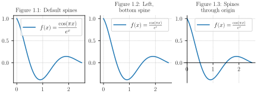
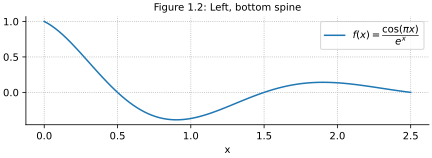
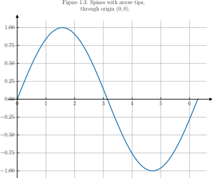
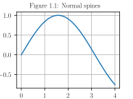
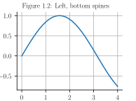
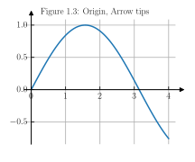
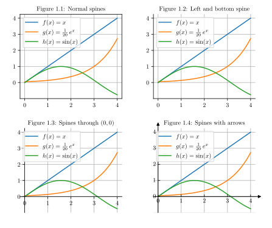

# Combines plots

See [figures for print documents (PDF)](./attachments/plot-spines.pdf) or figures for displays:



```python
import numpy as np
import matplotlib.pyplot as plt
plt.rcParams.update({'axes.grid':True, 'grid.linestyle':':',
    'figure.constrained_layout.use':True, 'axes.titlesize': 10})
def plot_with_default_spines(axes):
    x = np.linspace(0, 2.5, 100)
    axes.set_title("Figure 1.1: Default spines")
    axes.plot(x, np.cos(np.pi*x)*np.exp(-x), 
        label=r"$f(x) = \frac{\cos(\pi x)}{e^x}$")
    axes.legend()
def plot_with_left_and_bottom_spine(axes):
    x = np.linspace(0, 2.5, 100)
    axes.set_title("Figure 1.2: Left,\n bottom spine")
    axes.plot(x, np.cos(np.pi*x)*np.exp(-x), 
        label=r"$f(x) = \frac{\cos(\pi x)}{e^x}$")
    axes.spines[['right', 'top']].set_visible(False)
    axes.legend()
def plot_with_spines_at_zero(axes):
    x = np.linspace(0, 2.5, 100)
    axes.set_title("Figure 1.3: Spines\n through origin")
    axes.plot(x, np.cos(np.pi*x)*np.exp(-x), 
        label=r"$f(x) = \frac{\cos(\pi x)}{e^x}$")
    axes.spines[['right', 'top']].set_visible(False)
    axes.spines[['left', 'bottom']].set_position('zero')
    axes.legend()
    
# Generate graphic for displays
plt.rcParams.update({'svg.fonttype':'none'})
fig, axs = plt.subplots(ncols=3, figsize=(6,2.2))
plot_with_default_spines(axs[0])
plot_with_left_and_bottom_spine(axs[1])
plot_with_spines_at_zero(axs[2])
plt.savefig(@vault_path + '/attachments/plot spines.svg', transparent=True)

# Generate graphic for print documents
plt.rcParams.update({'text.usetex':True, 'font.family':'serif'})
plt.clf()
fig, axs = plt.subplots(ncols=3, figsize=(6,2.2))
plot_with_default_spines(axs[0])
plot_with_left_and_bottom_spine(axs[1])
plot_with_spines_at_zero(axs[2])
plt.savefig(@vault_path + '/attachments/plot spines.pdf', transparent=True)
plt.show()
```

Normal, default spines


```python
import numpy as np
import matplotlib.pyplot as plt
plt.rcParams.update({"text.usetex":True, 'font.family':'serif'})
x = np.linspace(0, np.pi*2, 100)
fig, ax = plt.subplots()
fig.set_figwidth(2.5)
ax.set_aspect(2.5)
ax.plot(x, np.sin(x), label=r"$f(x) = \sin(x)$")
ax.grid(True)
ax.set_title("Figure 1.1: Default spines")
fig.tight_layout()
export_plt_figure(fig, outfile="plot spine default", crop=True)
plt.show()
```

Only left and bottom spines



```python
import numpy as np
import matplotlib.pyplot as plt
plt.rcParams['text.usetex'] = True
plt.rcParams['font.family'] = 'serif'
x = np.linspace(0, np.pi*2, 100)
fig, ax = plt.subplots()
fig.set_figwidth(2.5)
ax.set_aspect(2.5)
ax.plot(x, np.sin(x), label=r"$f(x) = \sin(x)$")
ax.grid(True)
ax.set_title("Figure 1.2: Left, bottom spines")
ax.spines[['right', 'top']].set_visible(False)
fig.tight_layout()
export_plt_figure(fig, outfile="plot spine left bottom", crop=True)
plt.show()
```

Only left and bottom spines



```python
import numpy as np
import matplotlib.pyplot as plt
from mpl_toolkits.axisartist.axislines import AxesZero
plt.rcParams['text.usetex'] = True
plt.rcParams['font.family'] = 'serif'
x = np.linspace(0, np.pi*2, 100)
fig, ax1 = plt.subplots()
fig.set_figwidth(2.5)
ax = fig.subplots(1, 1, axes_class=AxesZero)
ax.set_aspect(2.5)
ax.plot(x, np.sin(x), label=r"$f(x) = \sin(x)$")
ax.grid(True)
plt.title("Figure 1.3: Spines with arrow tips,\n through origin $(0,0)$, \n", fontsize=10)
plt.grid(True)
for direction in ["xzero", "yzero"]:
    ax.axis[direction].set_axisline_style("-|>")
    ax.axis[direction].set_visible(True)
for direction in ["left", "right", "bottom", "top"]:
    ax.axis[direction].set_visible(False)
export_plt_figure(plt, outfile="plot spine arrrow tips", crop=True)
plt.show()
```

```python
import matplotlib.pyplot as plt
import numpy as np


fig, ax = plt.subplots()
# Move the left and bottom spines to x = 0 and y = 0, respectively.
ax.spines["left"].set_position(("data", 0))
ax.spines["bottom"].set_position(("data", 0))
# Hide the top and right spines.
ax.spines["top"].set_visible(False)
ax.spines["right"].set_visible(False)

# Draw arrows (as black triangles: ">k"/"^k") at the end of the axes.  In each
# case, one of the coordinates (0) is a data coordinate (i.e., y = 0 or x = 0,
# respectively) and the other one (1) is an axes coordinate (i.e., at the very
# right/top of the axes).  Also, disable clipping (clip_on=False) as the marker
# actually spills out of the axes.
ax.plot(1, 0, ">k", transform=ax.get_yaxis_transform(), clip_on=False)
ax.plot(0, 1, "^k", transform=ax.get_xaxis_transform(), clip_on=False)

# Some sample data.
x = np.linspace(-0.5, 1., 100)
ax.plot(x, np.sin(x*np.pi))

plt.show()
```

Normal spines



```python
import numpy as np
import matplotlib.pyplot as plt
plt.rcParams['text.usetex'] = True
plt.rcParams['font.family'] = 'serif'
x = np.linspace(0, np.pi*2, 100)
plt.figure(figsize=(2.7, 2), layout='constrained')
plt.plot(x, np.sin(x), label=r"$f(x) = \sin(x)$")
plt.grid(True)
plt.title("Figure 1.1: Normal spines", fontsize=10)
export_plt_figure(plt, outfile="plot spine 1")
plt.show()
```

Hide spines



```python
import numpy as np
import matplotlib.pyplot as plt
plt.rcParams['text.usetex'] = True
plt.rcParams['font.family'] = 'serif'
x = np.linspace(0, np.pi*2, 100)
plt.figure(figsize=(2.7, 2), layout='constrained')
plt.plot(x, np.sin(x), label=r"$f(x) = \sin(x)$")
plt.title("Figure 1.2: Left, bottom spines", fontsize=10)
plt.grid(True)
ax = plt.subplot()
ax.spines[['right', 'top']].set_visible(False)
export_plt_figure(plt, outfile="plot spine 2")
plt.show()
```

Spines through $(0,0)$ and with arrows



```python
import numpy as np
import matplotlib.pyplot as plt
from mpl_toolkits.axisartist.axislines import AxesZero
plt.rcParams['text.usetex'] = True
plt.rcParams['font.family'] = 'serif'
x = np.linspace(0, np.pi*2, 100)
plt.figure(figsize=(3, 2.5), layout='constrained')
ax = plt.subplot(axes_class=AxesZero)
ax.plot(x, np.sin(x), label=r"$f(x) = \sin(x)$")
plt.title("Figure 1.3: Spines with arrow tips,\n through origin $(0,0)$, \n", fontsize=10)
plt.grid(True)
for direction in ["xzero", "yzero"]:
    ax.axis[direction].set_axisline_style("-|>")
    ax.axis[direction].set_visible(True)
for direction in ["left", "right", "bottom", "top"]:
    ax.axis[direction].set_visible(False)
export_plt_figure(plt, outfile="plot spine 3")
plt.show()
```

# Collection for note preview


```latex
\documentclass{standalone} \usepackage{graphbox}
\begin{document}
\includegraphics[align=c]{plot spine 1}
\includegraphics[align=c]{plot spine 2}
\includegraphics[align=c]{plot spine 3}
\end{document}
```


# Modify spines

- [Spines — Matplotlib 3.10.0 documentation](https://matplotlib.org/stable/gallery/spines/spines.html#sphx-glr-gallery-spines-spines-py)
- [Spine placement — Matplotlib 3.10.0 documentation](https://matplotlib.org/stable/gallery/spines/spine_placement_demo.html#sphx-glr-gallery-spines-spine-placement-demo-py)
- [Axis line styles — Matplotlib 3.10.0 documentation](https://matplotlib.org/stable/gallery/axisartist/demo_axisline_style.html)



```python
import numpy as np
import matplotlib.pyplot as plt
plt.rcParams['text.usetex'] = True
plt.rcParams['font.family'] = 'serif'
x = np.linspace(0, 4, 100)
plt.figure(figsize=(3, 2.5))
plt.plot(x, x, label=r"$f(x) = x$")
plt.plot(x, np.exp(x)/20, label=r"$g(x) = \frac{1}{20}\, e^x$")
plt.plot(x, np.sin(x), label=r"$h(x) = \sin(x)$")
plt.title("Figure 1.1: Normal spines", fontsize=10)
plt.legend()
plt.grid(True)
plt.savefig(@vault_path + '/attachments/plot spine normal.pdf', transparent=True)
plt.show()
```

```python
import numpy as np
import matplotlib.pyplot as plt
plt.rcParams['text.usetex'] = True
plt.rcParams['font.family'] = 'serif'
x = np.linspace(0, 4, 100)
plt.figure(figsize=(3, 2.5))
ax = plt.subplot()
ax.plot(x, x, label=r"$f(x) = x$")
ax.plot(x, np.exp(x)/20, label=r"$g(x) = \frac{1}{20}\, e^x$")
ax.plot(x, np.sin(x), label=r"$h(x) = \sin(x)$")
plt.title("Figure 1.2: Left and bottom spine", fontsize=10)
ax.spines[['right', 'top']].set_visible(False)
ax.legend()
ax.grid(True)
plt.savefig(@vault_path + '/attachments/plot spine bottom-left.pdf', transparent=True)
plt.show()
```

```python
import numpy as np
import matplotlib.pyplot as plt
plt.rcParams['text.usetex'] = True
plt.rcParams['font.family'] = 'serif'
x = np.linspace(0, 4, 100)
plt.figure(figsize=(3, 2.5))
ax = plt.subplot()
ax.plot(x, x, label=r"$f(x) = x$")
ax.plot(x, np.exp(x)/20, label=r"$g(x) = \frac{1}{20}\, e^x$")
ax.plot(x, np.sin(x), label=r"$h(x) = \sin(x)$")
plt.title("Figure 1.3: Spines through $(0,0)$", fontsize=10)
ax.spines[['left', 'bottom']].set_position('zero')
ax.spines[['top', 'right']].set_visible(False)
ax.legend()
ax.grid(True)
plt.savefig(@vault_path + '/attachments/plot spine zero.pdf', transparent=True)
plt.show()
```

```python
import numpy as np
import matplotlib.pyplot as plt
from mpl_toolkits.axisartist.axislines import AxesZero
plt.rcParams['text.usetex'] = True
plt.rcParams['font.family'] = 'serif'
x = np.linspace(0, 4, 100)
plt.figure(figsize=(3, 2.5))
ax = plt.subplot(axes_class=AxesZero)
ax.plot(x, x, label=r"$f(x) = x$")
ax.plot(x, np.exp(x)/20, label=r"$g(x) = \frac{1}{20}\, e^x$")
ax.plot(x, np.sin(x), label=r"$h(x) = \sin(x)$")
plt.title("Figure 1.4: Spines with arrows", fontsize=10)
for direction in ["xzero", "yzero"]:
    ax.axis[direction].set_axisline_style("-|>")
    ax.axis[direction].set_visible(True)
for direction in ["left", "right", "bottom", "top"]:
    ax.axis[direction].set_visible(False)
ax.legend()
ax.grid(True)
plt.savefig(@vault_path + '/attachments/plot spine arrows.pdf', transparent=True)
plt.show()
```

```latex
\documentclass{standalone} \usepackage{graphicx,tabularray}
\begin{document}
\begin{tblr}{}
\includegraphics{plot spine normal} 
\includegraphics{plot spine bottom-left} \\
\includegraphics{plot spine zero}
\includegraphics{plot spine arrows}
\end{tblr}
\end{document}
```


