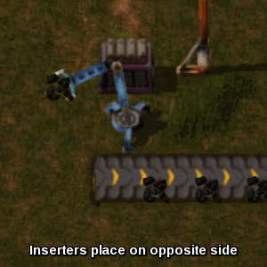

Ich bin ein Satz.

- Ich bin ein Stichpunkt
    - manchmal habe ich Unterpunkte
- Und manchmal hängt ein Codeblock an
    ```
    Wie hier zum Beispiel
    ```

2. Ich bin eine Aufzählung
3. mit weiteren Punkten

- Ich bin ein [Link](example.md) auf eine interne Notiz
- Ich bin ein [Link](https://google.com) auf eine externe Website
- Ich bin ein [Link mit #hashtag](https://google.com) auf eine externe Website
- Ich bin ein [Link #hashtag](https://en.wikipedia.org/wiki/Hyperlink#link) auf ein externes Kapitel


First Term
: This is the definition of the first term.

Second Term
: This is one definition of the second term.
: This is another definition of the second term.

<dl>
  <dt>First Term</dt>
  <dd>This is the definition of the first term.</dd>
  <dt>Second Term</dt>
  <dd>This is one definition of the second term. </dd>
  <dd>This is another definition of the second term.</dd>
</dl>


- 3D Objects (folder) 
```fancy
explorer "shell:::{0DB7E03F-FC29-4DC6-9020-FF41B59E513A}"
```

Add Network Location
```powershell
explorer "shell:::{D4480A50-BA28-11d1-8E75-00C04FA31A86}"
```

Administrative Tools
```powershell
explorer "shell:::{D20EA4E1-3957-11d2-A40B-0C5020524153}"
```


- [hallo](google.de)


---

regexreplace2

---
Sources:

Related:

Tags:
[Test (File) - Test syntax for quartz](./test%20file).md)