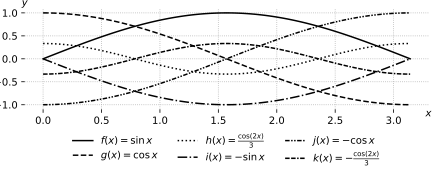
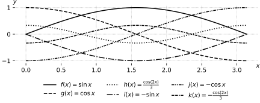
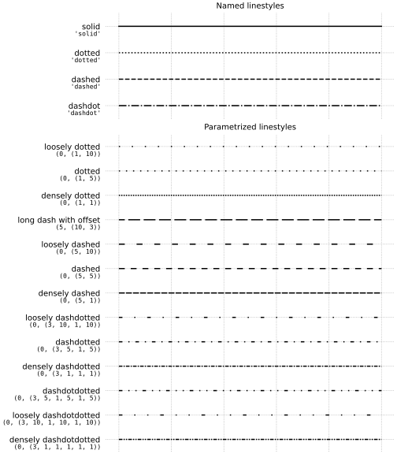

# Default color cycle

- Default color cycle: `C0`, `C1`, `C2`, `C3`, `C4`, `C5`, `C6`, `C7`, `C8`, `C9`
- [Changes to the default style — Matplotlib 3.10.0 documentation](https://matplotlib.org/stable/users/prev_whats_new/dflt_style_changes.html#colors-in-default-property-cycle)



```python
import numpy as np
import matplotlib.pyplot as plt
plt.rcParams.update({'savefig.transparent':True, 'svg.fonttype':'none',
    'figure.constrained_layout.use':True, 'axes.titlesize': 10,
    'axes.grid':True, 'grid.linestyle':':'})
plt.rc('axes.spines', left=False, top=False, right=False, bottom=False)
def plot_function_values(axes):
    x = np.linspace(0, np.pi, 100)
    axes.plot(x, np.sin(x), label=r"$f(x) = \sin{x}$")
    axes.plot(x, np.cos(x), label=r"$g(x) = \cos{x}$")
    axes.plot(x, np.cos(2*x)/3, label=r"$h(x) = \frac{\cos(2x)}{3}$")
    axes.plot(x, -np.sin(x), label=r"$i(x) = -\sin{x}$")
    axes.plot(x, -np.cos(x), label=r"$j(x) = -\cos{x}$")
    axes.plot(x, -np.cos(2*x)/3, label=r"$k(x) = -\frac{\cos(2x)}{3}$")
    axes.set_xlabel('$x$')
    axes.set_ylabel('$y$')
    move_xylabels_to_corners(axes)
def move_xylabels_to_corners(axes):
    axes.xaxis.set_label_coords(1, 0)
    axes.yaxis.set_label_coords(0, 1)
    axes.yaxis.label.set(rotation=0)
def show_legend_underneath(axes):
    axes.legend(loc='upper center', ncols=3, 
        bbox_to_anchor=(0.5, -0.15), frameon=False)

fig, ax = plt.subplots(figsize=(6,2.4))
plot_function_values(ax)
show_legend_underneath(ax)
plt.savefig(@vault_path + '/attachments/figure plot cycles color.svg')
plt.show()
```

# Cycle with line style

[Styling with cycler — Matplotlib 3.10.0 documentation](https://matplotlib.org/stable/users/explain/artists/color_cycle.html)



```python
import numpy as np
import matplotlib.pyplot as plt
plt.rcParams.update({'savefig.transparent':True, 'svg.fonttype':'none',
    'figure.constrained_layout.use':True, 'axes.titlesize': 10,
    'axes.grid':True, 'grid.linestyle':':'})
plt.rc('axes.spines', left=False, top=False, right=False, bottom=False)
def plot_function_values(axes):
    x = np.linspace(0, np.pi, 100)
    axes.plot(x, np.sin(x), label=r"$f(x) = \sin{x}$")
    axes.plot(x, np.cos(x), label=r"$g(x) = \cos{x}$")
    axes.plot(x, np.cos(2*x)/3, label=r"$h(x) = \frac{\cos(2x)}{3}$")
    axes.plot(x, -np.sin(x), label=r"$i(x) = -\sin{x}$")
    axes.plot(x, -np.cos(x), label=r"$j(x) = -\cos{x}$")
    axes.plot(x, -np.cos(2*x)/3, label=r"$k(x) = -\frac{\cos(2x)}{3}$")
    axes.set_xlabel('$x$')
    axes.set_ylabel('$y$')
    move_xylabels_to_corners(axes)
def move_xylabels_to_corners(axes):
    axes.xaxis.set_label_coords(1, 0)
    axes.yaxis.set_label_coords(0, 1)
    axes.yaxis.label.set(rotation=0)
def use_cycler_linestyle(pyplot):
    import cycler as cy
    linestyle_cycler = cy.cycler('linestyle',['-','--',':','-.',
        (0,(3,1,1,1,1,1)), (0,(3,1,3,1,1,1)) ])
    plt.rcParams['axes.prop_cycle'] = linestyle_cycler
def show_legend_underneath(axes):
    axes.legend(loc='upper center', ncols=3, 
        bbox_to_anchor=(0.5, -0.2), frameon=False)

use_cycler_linestyle(plt)
fig, ax = plt.subplots(figsize=(6,2.4))
plot_function_values(ax)
show_legend_underneath(ax)
plt.savefig(@vault_path + '/attachments/figure plot cycles linestyle.svg')
plt.show()
```

# Available line styles

| Description           | Code                         | Result |
| --------------------- | ---------------------------- | ------ |
| dashdot               | `'dashdot'`                  |        |
| dashed                | `'dashed'`                   |        |
| dotted                | `'dotted'`                   |        |
| solid                 | `'solid'`                    |        |
| densely dashdotdotted | `(0, (3, 1, 1, 1, 1, 1))`    |        |
| loosely dashdotdotted | `(0, (3, 10, 1, 10, 1, 10))` |        |
| dashdotdotted         | `(0, (3, 5, 1, 5, 1, 5))`    |        |
| densely dashdotted    | `(0, (3, 1, 1, 1))`          |        |
| dashdotted            | `(0, (3, 5, 1, 5))`          |        |
| loosely dashdotted    | `(0, (3, 10, 1, 10))`        |        |
| densely dashed        | `(0, (5, 1))`                |        |
| dashed                | `(0, (5, 5))`                |        |
| loosely dashed        | `(0, (5, 10))`               |        |
| long dash with offset | `(5, (10, 3))`               |        |
| densely dotted        | `(0, (1, 1))`                |        |
| dotted                | `(0, (1, 5))`                |        |
| loosely dotted        | `(0, (1, 10))`               |        |



```python
import numpy as np
import matplotlib.pyplot as plt
plt.rcParams.update({'savefig.transparent':True, 'svg.fonttype':'none',
    'figure.constrained_layout.use':True, 'axes.titlesize': 10})

linestyle_str = [
     ('solid', 'solid'),      # Same as (0, ()) or '-'
     ('dotted', 'dotted'),    # Same as ':'
     ('dashed', 'dashed'),    # Same as '--'
     ('dashdot', 'dashdot')]  # Same as '-.'

linestyle_tuple = [
     ('loosely dotted',        (0, (1, 10))),
     ('dotted',                (0, (1, 5))),
     ('densely dotted',        (0, (1, 1))),

     ('long dash with offset', (5, (10, 3))),
     ('loosely dashed',        (0, (5, 10))),
     ('dashed',                (0, (5, 5))),
     ('densely dashed',        (0, (5, 1))),

     ('loosely dashdotted',    (0, (3, 10, 1, 10))),
     ('dashdotted',            (0, (3, 5, 1, 5))),
     ('densely dashdotted',    (0, (3, 1, 1, 1))),

     ('dashdotdotted',         (0, (3, 5, 1, 5, 1, 5))),
     ('loosely dashdotdotted', (0, (3, 10, 1, 10, 1, 10))),
     ('densely dashdotdotted', (0, (3, 1, 1, 1, 1, 1)))]


def plot_linestyles(ax, linestyles, title):
    X, Y = np.linspace(0, 100, 10), np.zeros(10)
    yticklabels = []

    for i, (name, linestyle) in enumerate(linestyles):
        ax.plot(X, Y+i, linestyle=linestyle, linewidth=1.5, color='black')
        yticklabels.append(name)

    ax.set_title(title)
    ax.set(ylim=(-0.5, len(linestyles)-0.5),
           yticks=np.arange(len(linestyles)),
           yticklabels=yticklabels)
    ax.tick_params(left=False, bottom=False, labelbottom=False)
    ax.spines[:].set_visible(False)

    # For each line style, add a text annotation with a small offset from
    # the reference point (0 in Axes coords, y tick value in Data coords).
    for i, (name, linestyle) in enumerate(linestyles):
        ax.annotate(repr(linestyle),
                    xy=(0.0, i), xycoords=ax.get_yaxis_transform(),
                    xytext=(-6, -12), textcoords='offset points',
                    fontsize=8, ha="right", family="monospace")


fig, (ax0, ax1) = plt.subplots(2, 1, figsize=(7, 8), height_ratios=[1, 3],
                               layout='constrained')

plot_linestyles(ax0, linestyle_str[::-1], title='Named linestyles')
plot_linestyles(ax1, linestyle_tuple[::-1], title='Parametrized linestyles')
plt.savefig(@vault_path + '/attachments/plot cycles custom linestyles.svg')
plt.show()
```


# Figure collection for note preview

See [graphic for print documents (PDF)](../content/plot-cycles.pdf) or graphic for displays:


```python
import numpy as np
import matplotlib.pyplot as plt
plt.rcParams.update({'savefig.transparent':True, 'savefig.bbox':'tight', 
    'figure.constrained_layout.use':True, 'svg.fonttype':'none',
    'axes.titlesize': 10, 'axes.grid':True, 'grid.linestyle':':'})
plt.rc('axes.spines', left=False, top=False, right=False, bottom=False)
def plot_function_values(axes):
    x = np.linspace(0, np.pi, 100)
    axes.plot(x, np.sin(x), label=r"$f(x) = \sin{x}$")
    axes.plot(x, np.cos(x), label=r"$g(x) = \cos{x}$")
    axes.plot(x, np.cos(2*x)/3, label=r"$h(x) = \frac{\cos(2x)}{3}$")
    axes.plot(x, -np.sin(x), label=r"$i(x) = -\sin{x}$")
    axes.plot(x, -np.cos(x), label=r"$j(x) = -\cos{x}$")
    axes.plot(x, -np.cos(2*x)/3, label=r"$k(x) = -\frac{\cos(2x)}{3}$")
    axes.set_xlabel('$x$')
    axes.set_ylabel('$y$')
    move_xylabels_to_corners(axes)
    show_legend_underneath(axes)
def move_xylabels_to_corners(axes):
    axes.xaxis.set_label_coords(1, 0)
    axes.yaxis.set_label_coords(0, 1)
    axes.yaxis.label.set(rotation=0)
def keep_cycler_color(axes):
    axes.set_title("Figure 3.1: Colors")
def set_cycler_linestyle(axes):
    import cycler as cy
    axes.set_title("Figure 3.2: Line style")
    linestyle_cycler = cy.cycler(color=['k']) * cy.cycler('linestyle', 
        ['-','--',':','-.', (0,(3,1,1,1,1,1)), (0,(3,1,3,1,1,1)) ])
    axes.set_prop_cycle(linestyle_cycler)
def show_legend_underneath(axes):
    axes.legend(loc='upper center', ncols=2, 
        bbox_to_anchor=(0.5, -0.2), frameon=False)
def draw_figure(filetype):
    fig, axs = plt.subplots(ncols=2, figsize=(6,2.4))
    keep_cycler_color(axs[0])
    set_cycler_linestyle(axs[1])
    [plot_function_values(ax) for ax in axs]
    plt.savefig(@vault_path + '/attachments/figure plot cycles.' + filetype)
    
draw_figure('svg')
plt.clf()
plt.rcParams.update({'text.usetex':True, 'font.family':'serif'})
draw_figure('pdf')
plt.show()
```